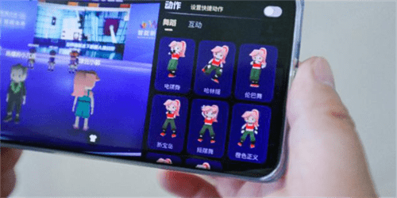
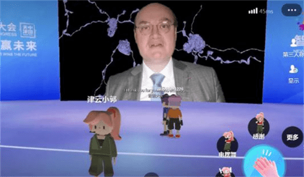
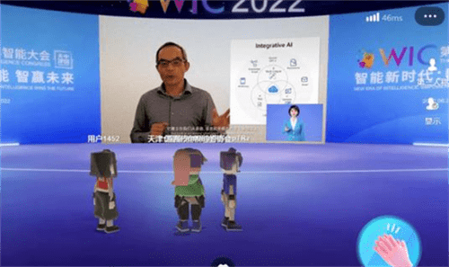

# 元宇宙体验！在世界元宇宙大会感受“全真互联网”

在曾经的科幻大片儿中，人们无数次幻想，在平行的世界中，也许还会有另一个自己。6月24日，在天津举办的一个元宇宙大会上，智能技术将畅想变为了现实。

此次元宇宙大会除了VR，虚拟展厅等数字技术，还带了全新的元宇宙体验，沉浸感十足。

用手机打开链接地址，登录后，用户不仅可以听到论坛嘉宾的精彩演讲，还可以为自己起一个可爱的昵称，换上个性化的服装，通过手指操作数字人偶行动，游览展厅。

除此之外，在元宇宙世界中，我们还可以通过20余种定制动作与小伙伴进行互动，与喜爱的嘉宾“隔空合影”。

据悉，此次的元宇宙大会会场由腾讯的首个音乐虚拟社交平台——腾讯音乐虚拟世界（TMELAND）搭建，采用国内首创的端云协同革新技术方案。它将线下的“现实会场”与线上“虚拟会场”通过跨次元的方式连接起来。

这种涵盖虚拟现实(VR)、增强现实(AR)和混合现实(MR)的XR技术，有望为我们带来互联网的下一个阶段“全真互联网”时代。
