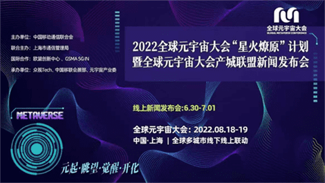

# 元宇宙大会最新消息2022上海 全球元宇宙大会产城联盟新闻发布会引爆全网

当前，元宇宙正以新理念、新业态、新模式促进数字场景爆发，而数字场景渗透及数据沉淀推动数据要素价值释放和价值再创造。

今年8月18-19日，2022全球元宇宙大会将于上海联合多城市共同举办，元宇宙大会将通过推动实体经济与数字经济深度融合，展现中国元宇宙发展优势及核心力量，协同上海科创带动力，加强关键核心技术攻关，推动虚拟与现实共生蝶变，带动上海市软件和信息服务业、电子信息制造业规模跃上新台阶，角逐元宇宙产业新赛道，开启全球元宇宙崭新里程碑。

6月30日 由中国移动通信联合会主办，上海市通信管理局联合主办；欧盟创新中心、GSMA 5G IN国际合作；众视Tech、中移联会展部、元宇宙产业委共同承办的2022全球元宇宙大会“星火燎原”计划暨全球元宇宙大会产城联盟新闻发布会于线上胜利召开。本次发布会以“元起·眺望· 觉醒·开化”为主题，正式启动“星火燎原”计划—点亮中国，重磅发布以北京、江西、浙江、海南等为起点首批一省一市一县一镇示范节点城市，从点到面全面覆盖中国各大城市，通过产城联盟融合落地的方式，让元宇宙全面赋能城市建设，为江西省、杭州市钱塘区、海南省临高县、北京古北口镇等地注入产业数字升级新要素、经济发展新动能。

新闻发布会上，中国移动通信联合会会长倪健中表示：“元宇宙'星火燎原'计划结合产城联盟模式，从中国一省一市一县一镇出发辐射亚太、点亮全球城市节点，共建全球人类数字命运共同体。”上海市通信管理局副局长王天广、江西省科技厅党组成员、副厅长陈金桥、BIC EURONOVA(欧盟创新中心) 大中华区总干事甘露、GSMA大中华区总裁斯寒、中国经济体制改革研究会副会长曹文炼等嘉宾为“星火燎原”计划带来精彩致辞，中国工程院院士 北京邮电大学教授张平、中国电信总经理李正茂、高通公司中国区董事长孟樸、中国移动研究院院长 黄宇红、中国电信研究院副院长李安民、阿里巴巴集团副总裁 阿里研究院院长高红冰、清华大学新闻学院教授博导 清华大学新媒体研究中心执行主任沈阳、复旦大学教授 国家智能评价与治理实验基地副主任赵星等嘉宾带来精彩主题演讲，聚焦元宇宙产城融合创新，共话元宇宙产业新未来。中国移动通信联合会副秘书长、全球元宇宙大会秘书长谢安娜表示：“元宇宙'星火燎原'计划产城融合落地行动，推动元宇宙产业链龙头企业，与各城市的地方政府紧密合作，打造产业链高质聚集的元宇宙产业圈。”

同时，全球元宇宙大会组委会聚集中国移动通信联合会元宇宙工委、中国指挥与控制学会城市大脑专委、北京信息产业协会元宇宙专委、中国民间科技实业企业家协会元宇宙工委、中国广告协会元宇宙工委等业界专业组织联合成立全球元宇宙大会产城联盟。全球元宇宙大会产城联盟执行秘书长 孙喜庆表示：联盟将秉承“产业+城镇化“理念，“先国内、再国际“的两步走策略，汇集国内国际优势资源，破除内卷，共同探索元宇宙产业落地的高效路径，构建城市级、国家级、世界级元宇宙产业生态。全球元宇宙大会产城联盟将踏实推进“星火燎原”计划，践行赋能元宇宙城市建设，推动元宇宙全球化发展，共建人类命运数字共同体的使命。同时本次新闻发布会强强联手高通、微软、Unity、HTC、阿里巴巴、中兴通讯、北京河图、黑镜科技、NVIDIA、芒果智娱、好莱坞（中国）、黑镜科技、蔚领时代、中文在线等单位共同深度探索元宇宙产城融合技术发展与创新应用方向，加块元宇宙产城融合推进速度，释放数字经济价值和社会价值，共赢元宇宙产业未来发展新机遇。
