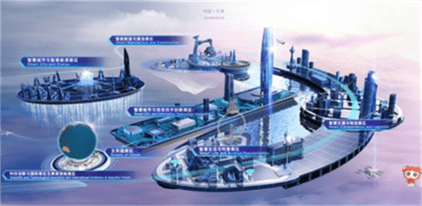

# 元宇宙大会直播：云上逛展，实现身临其境的元宇宙互动体验

6月24日至25日，元宇宙大会举行，与会专家、企业代表也对元宇宙产生了浓厚的兴趣，让元宇宙成为热议话题。

本次元宇宙大会一个亮点是此次大会通过XR、AI、3D、动作捕捉、区块链等前沿新技术，打破时空限制，实现身临其境的互动体验。

元宇宙大会设立的元宇宙虚拟会场，注册登录后，即可自定义生成个人的虚拟形象，还可更换不同的服装、发型等。这些“数字人”可以以真实的第一视角，在虚拟世界中参加大会，聆听大会内容，参与大会互动或与其他参会者互动。

据了解，元宇宙虚拟会场由腾讯打造的音乐虚拟社交平台腾讯音乐虚拟世界(TMELAND)搭建，采用国内首创的端云协同革新技术方案。

另外，元宇宙大会还设立了VR观展，打开世界智能大会官网“智能科技展”，即可360度无死角观展，如亲临会场一般，会场还有声音甜美语音解说，指示牌清晰可见，会场大小缩放自如，点击具体展台还有详细文字介绍，足不出户就逛了展，效率都提高不少。

了解到，云上智能科技展统筹划分为6个展区，包括科技创新与国际展区及美丽滨城展区、智慧城市与信息技术创新展区、智能制造与建造展区、智慧生活与科普展区、智慧交通与物流展区、智慧城市与智慧能源展区。同时，特别设立了英国主宾国展区。

不仅仅是应用在大会本身，值得注意的是，在元宇宙大会上，很多专家和企业代表对元宇宙表现出浓厚的兴趣。

世界工程组织联合会(WFEO)前任主席、中国新一代人工智能发展战略研究院执行院长龚克在大会上称，元宇宙引爆的虚拟现实融合技术东风劲吹，人工智能的硬件不断的创新，隐私计算、类脑模型蓄势待发。

旷视科技CEO印奇在大会上称，目前人工智能技术的应用大概分为两个流派，一个是让物理世界变得更美好，一个是让人类在虚拟世界里面能有更好的享受。

在东软集团董事长刘积仁看来，元宇宙在医疗设备领域大有作为，今天无论我们培养多少，最好的医生一定都跑到了大城市，这是人的选择。如果把人工智能、元宇宙的技术嵌入到医疗设备里面，可以把医疗方案设计做出来之后再拿到临床场景，这相当于乡镇里面不仅拥有一个好的医疗设备，还拥有一个好的大夫。

谈到了元宇宙商业化问题，商汤科技联合创始人、董事长兼CEO徐立认为，原先互联网的商业模式会在元宇宙中被完美复刻。下一阶段，只要用真正元宇宙原住民的认知重新定义商业模式，就可以有巨大的想象空间。

徐立称，在元宇宙中，我们的生产力、消费理念都发生了变化。例如在元宇宙中，开会、协作、面试都重新定义了“距离”，生产力大幅提升；有的元宇宙原住民几百万元买一个虚拟头像，这不是消费所看到的“物”，而是通过消费“虚拟标签”来寻找身份认同。
