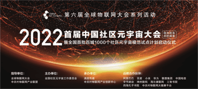
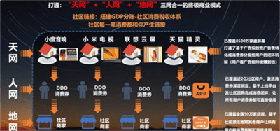
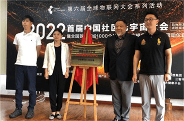
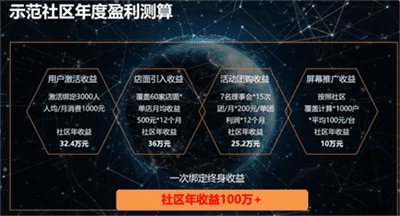
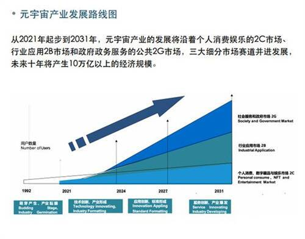
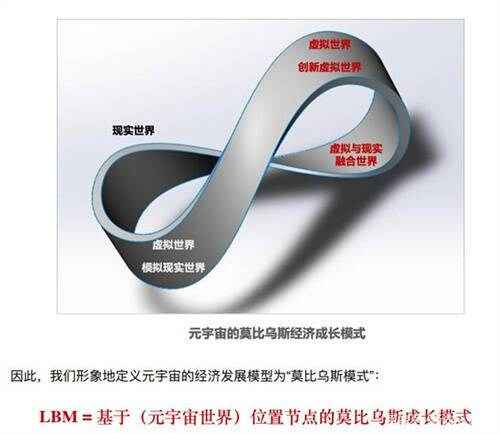

# 首届中国社区元宇宙大会完美落幕 未来将产生10万亿的巨量市场

6月29日下午，在北京西山脚下的四海书院，首届中国社区元宇宙大会隆重召开！本次大会将近来极为火爆的元宇宙从概念探讨的空谈拉回到现实，无疑将成为元宇宙发展历史上的一个重要里程碑。

本次元宇宙大会也是全面贯彻落实党中央、国务院部署，稳住全国经济大盘，确保中央经济工作会议和《政府工作报告》确定的各项政策举措。日前，民政部、中央政法委、中央网信办、发展改革委、工业和信息化部、公安部、财政部、住房城乡建设部、农业农村部等9部门印发了《关于深入推进智慧社区建设的意见》，明确了智慧社区建设的总体要求、重点任务和保障措施等。

按照新时代党的建设总要求，全面推动数字经济的快速发展，2022第六届全球物联网大会在5月28日启动会上，将元宇宙产业作为年度重点。这次由中关村物联网产业联盟发起，全国社区元宇宙工作委员会主办，滴度科技承办的首届中国社区元宇宙大会得到了各界的广泛支持和关注。

据不完全统计，本次元宇宙大会自发布通知以来，陆续有来自全国各地的上千家单位陆续咨询。来自中国亚洲经济发展协会产业创新发展工作委员会、中国社区发展协会社区文化专委会、中国城市发展研究院城市空间规划中心、中国优生优育协会新型家庭建设工作委员会等机构的领导参加了大会的致辞或演讲环节。

本次元宇宙大会同时得到了业界各大头部厂商和投资机构的大力支持，包括百度、小米、阿里巴巴、华为、联想集团、中国电信、字节跳动、神州数码、威盛集团、洛可可、神达集团、智城产融投资、苏州泛太资本、京西文旅投资基金、华兴资本等均派嘉宾到场或线上参会。包括三智书院、四海孔子书院等文化教育机构的领导也到会致辞并全程参加大会。

中国社区元宇宙大会以滴度(DDO)社区元宇宙北京旗舰社区成功运营的经验，在全国8500万家庭屏联网元宇宙的基础上，创新智慧社区新模式，综合运用元宇宙各项新数字技术，打通社区元宇宙最后一公里，做好社区元宇宙的发展，有力拉动经济消费，对于保就业、保民生、防风险及经济实现稳增长都具有重要作用。当前正处于决定全年经济走势的关键节点，必须抢抓时间窗口，努力推动经济重回正常轨道。

在29日的大会上，主办方还发布了“全国百城千区社区元宇宙模范试点社区计划”启动仪式，得到社会各界的热烈反响，很多单位都在积极组织申报。大会现场并展开了“99月赠55寸小米电视的抢位申报100个社区的活动”，最终得到有效报名共107个社区。会后，有关单位将组织社区元宇宙评审委对申报的社区进行全面的线上或线下审核，并遴选首批模范示范社区开展业务活动。

随着以互联网、物联网、大数据、人工智能、区块链等为核心的综合性产业元宇宙正在火热展开，与会嘉宾们一致认为，元宇宙绝不能成为空谈的概念，要务必结合实际，以真实落地和应用为核心，社区元宇宙就是当前最佳的应用场景。

相信在元宇宙概念火热而产业界混沌迷茫之时，首届全国社区元宇宙大会带给您一份信心，一份火热，一份激情！让我们携手用数字新技术真正带动数字新经济，让我们每个人居住在社区元宇宙下的新智慧社区中，享受美好生活！

大会上首次发布了《全国社区元宇宙产业发展报告》，提出社区元宇宙带来莫比乌斯经济爆发，助力社区消费新经济模型，未来将产生10万亿的巨量市场和解决千万级就业机会。

经过近两年的预热发展，全球产业界已取得新共识——元宇宙的兴起代表着互联网已经正式进3.0时代：

- 1.0时代，互联网链接世界；
- 2.0时代，物联网改变世界；
- 3.0时代，元宇宙体验世界！

元宇宙的幕已启，对于元宇宙的发展和实践都还处于摸索阶段，如何把握好产业机会，更好地参与元宇宙的发展，是摆在每个有志于此的产业参与者前的共同课题。同时，元宇宙的发展涉及的具体经济场景众多，中国社区元宇宙的发展必将是个巨的创新实践场景，是价值万亿级市场空间的重市场机遇领域。
