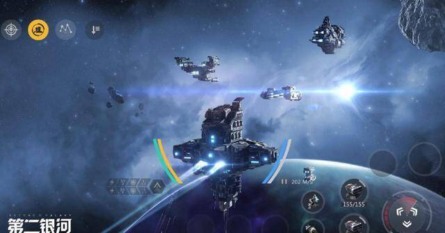
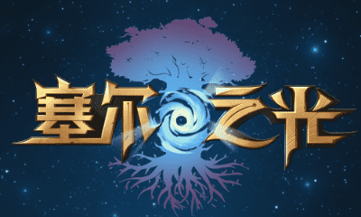

# 国内可以玩的元宇宙游戏有哪些?十大游戏推荐

元宇宙的概念最近相当的火，不过因为技术的限制目前真正的元宇宙游戏还没有开发出来。很多人来询问小编国内可以玩的元宇宙游戏有哪些2022，其实元宇宙里很重要的一个元素就是开放世界的设定，下面就给大家带来有开放元素的游戏推荐，大家可以先体验一下。

**1、《原神》** 

整个剧情的走向没有固定的设置或者套路，全都在玩家的选择。玩法非常的随意且简单，喜欢做什么都可以，游览大陆、惩奸除恶或者是找寻亲友。

**2、《我的世界》** 

在这个特别的沙盒世界里玩家将开始一场惊心动魄的旅程，可以自由创造自己想要的玩法和地图，不管是孤身作战还是邀请好友一起冒险都会很有乐趣。

**3、《伊洛纳》** 

喜欢养宠物的玩家可以挑选自己中意的物种进行培养，即使是喜欢种地的玩家也可以找到适合自己的玩法。不仅可以创建新的城市和国家，同时也可以毁灭和破坏。

**4、《创造与魔法》** 

在这个非常之开放的世界里玩家可以遇到来自不同地方、不同国家的人，功能强悍的聊天模式助力玩家在游戏过程中交到更多有相同价值观的好朋友。

**5、《第二银河》** 

在几千年后的世界里随着科技的高速发展，我们已经可以在太空中自由的航行。各种各样的太空船都被设计出来，玩家可以操控它们穿梭于太空中夺取生存资源。

**6、《像素冒险世界》** 

要想在段时间内将自己的等级提高并且获得充足的原材料，玩家必须尽可能多的击灭怪物，运气好的玩家还可以从怪物身上获得特殊装备，或者是可以合成装备的材料。

**7、《光明勇士》** 

画风十分的卡哇伊，每个角色的设计都是那么的呆萌，让人只是看着心情就能变得愉快。世界完全是自由和开放的，玩家可以大胆放心的进行冒险和探索。

**8、《塞尔之光》** 

希望什么都不做尽情享受悠闲生活的玩家可以去钓鱼、种地、养动物、采野菜等；想要生活来点刺激的玩家可以选择团战或者单挑模式，难易程度随心选择。

**9、《完美世界：诸神之战》** 

玩家可以将画面在横屏和竖屏里无缝切换，操作起来手感和视感都更加的舒适。前期选择的角色玩腻了的话还可以进入转生池，挑选中意的角色，之前的经验和装备都可以继承。

**10、《诺亚之心》** 

玩家将扮演诺亚星球里一名普通的冒险者，和有着相同理想和朋友们一起建立小队，携起手来抵抗将要入侵美丽大陆的邪恶力量，并且得到幻灵的加持。

