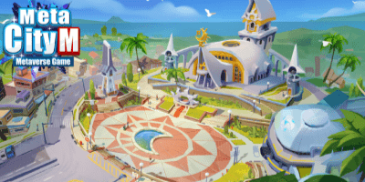
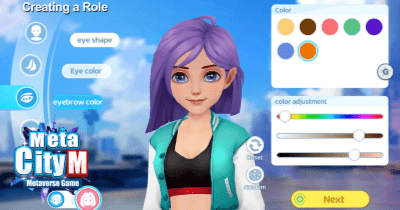
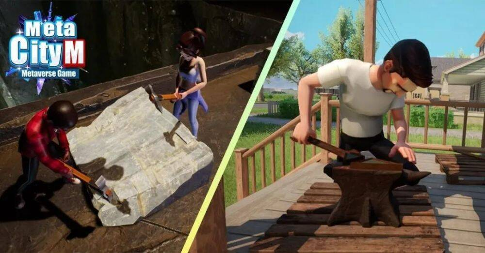
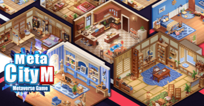
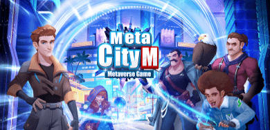
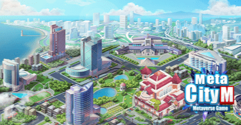

# 第一款真正的元宇宙手游来了？

元宇宙、虚拟形象、开放世界……在这些「大词」随处可见的今天，我们依然在其中寻找着那些真正在这领域做创新尝试的先行者们。最近一款出现在我们雷达上的产品是《MetaCity M》，游戏近日请来了红遍亚太欧美的女团BLACKPINK成员LISA担任全球代言人。

如此的大手笔和强劲入局势头，这个标榜为「开放世界元宇宙手游」的《MetaCity M》究竟有何来头？

**《MetaCity M》眼中的元宇宙大世界**

从目前可得的情报，《MetaCity M》是Gamamobi从2020年就开始开发的手机游戏，游戏会先开放第一颗有着5.1亿平方公里的「泰坦星球」，上面有着超过1600个小镇、690个二级城市、55个一级城市、共8160万平方公里的可开发土地。

游戏星球的发展将靠玩家共同建造起来，所有玩家必须靠采集、制造、建造来锻炼超过15种的生活技能，藉由生活技能的提升、职业选择、来创造发展城镇建设。居民可以跟朋友当邻居，每天开车、走路、搭飞机出门去各地探险、旅游，到各山巅秘境看着日出日落与春夏秋冬，还能搭上星际飞船去其它星球看看拜访不同视界环境的其它玩家们。

与市面上其他主打元宇宙游戏不同，《MetaCity M》有着更明显的「传统游戏性」。

(《MetaCity M》前所未有的元宇宙城市即将到来)

首先，每个人在元宇宙中都要有一个新的形象，《MetaCity M》自然也提供了自由的捏脸系统，游戏的美术风格采用的是类迪士尼动画的欧美风格，相对来说在全球通适性非常高。游戏中的服装风格也十分多变，无论是上班族还是流行酷，在潮文化盛行的Z世代当中，能激发他们的变装欲将会是游戏设计中十分重要的一部分。

(《MetaCity M》创造独家虚拟形象)

《MetaCityM》中没有传统的「角色等级」，提升伐木、採矿、种植、狩猎、捕鱼、烹饪、熔炼、零件加工、纺织等生活技能成为核心追求，玩家可以选定自己的技能专精、主副职业的修炼，来进行职业规划，到最后成为有一技之长的专家，在《MetaCity M》创造独属的价值。

《MetaCity M》15种多样化的生活技能)

「土地」和「房产」是《MetaCity M》中一个重要的玩法概念。在这款游戏中，土地是游戏进度发展的起始根本，每一颗星球都有将近一半土地会开放给玩家持有，剩余的则开放给玩家向系统缴租使用。每一片土地都会根据玩家个人房产的建筑进度等级来渐次开放可运用的土地大小，玩家间的土地则会相邻成为一个个社区，根据土地所在的位置不同，周边的景色和能开采的资源也会有差异。

(《MetaCity M》来元宇宙展现风格的独创性)

而房产则是建筑在土地上的「可搬迁」建物财产，分为个人房产、房产外观、职业商店、商业商店四大种类，每个房产都分有独立的户外外观与室内空间及可变化独立的露台视野窗景。无论是外墙材质、窗户、大门，还是内里的家具、摆设、壁纸等等，玩家均凭自己的喜好进行个性化设计，让自己的房子独一无二。

通过玩转「土地建设」的概念，《MetaCity M》可以说是将我们熟知的传统模拟经营类玩法跟元宇宙的特点结合了起来。

最后，在《Metacity M》中，能看见的土地、房产、汽车、私人飞机、家具、衣饰、宠物、庭园植物等均可以在游戏内进行市场交易。

据小编探询官方后期会开放银行金融、竞技类休闲娱乐等功能，未来也会开放专属城镇订制、动态环境广告系统等，还会有实体虚拟连动系统让更多社群、商家于游戏内创造专属形象，完成线上制作、线下兑现，这意味着玩家有多种途径可以让自己才华进行展现。

(《MetaCity M》与各式各样的人共创元宇宙未来)

总的来说，在保留传统的开放沙盒/模拟建造的游戏玩法的同时，《Metacity M》在元宇宙的概念下重构了游戏的整个经济结构，将虚拟与现实，现在与未来连接起来。从其内容丰富度和未来规划来看，都是一款相当有野心的产品。

**Gamamobi，何方神圣?** 

《MetaCity M》背后的开发商Gamamobi也并非游戏行业的「新手」，他们的团队遍布全球多个国家。已经有着超过15年以上港澳台、日本、东南亚及全球市场的代理发行经验，其核心人员均拥有10年以上主机、手游推广&运营经验。发行的代表作包括《圣斗士星矢：觉醒》《白夜极光》《新神魔大陆》《少年三国志2》《权力的游戏》等。

除了发行外，以「PLAY TOGETHER」为理念的Gamamobi还有全球代购业务、线下广告媒合平台、全球旅游应用平台、全球跨境协力厂商支付业务等，将「玩」的概念从游戏行业延伸到各个不同领域，在短时间内插旗了互联网市场的不少缺口。

而今，研发是其又一重点业务。Gamamobi的CEO黄继德就表示：“我希望做出款如同电影《头号玩家》的游戏，每个人都能在游戏中创造自己的世界，兼具真实世界元素及超脱现实想象，设定自己的外型、 创作自己的作品、拥有与现实生活中完全不一样的身份、各种娱乐体验、虚拟货币自由交易且完整经济体制的环境。”

长远来说，内容为先，始终以玩法乐趣为第一支撑《MetaCity M》更有机会创造一个健康的元宇宙生态系统。

(《MetaCity M》全球首款开放世界元宇宙游戏即将与大家见面)

作为一款「元宇宙」游戏，《MetaCity M》在传统游戏内容上的丰富和扎实反而是让人对它抱有信心的重要原因之一。在当下的技术标准下，它的目标是保证游戏娱乐玩法和整个元宇宙体系在逻辑上的融洽和完整，这让《MetaCity M》在如今还未有真正的元宇宙手游出现的市场情况下，有不小的机会能招揽一批传统游戏玩家和元宇宙爱好者。

游戏预计在2022年在全球多地区正式上线，目前尚未有大陆地区的代理信息。
