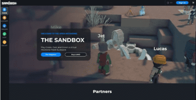

# 元宇宙和当今最活跃的三家元宇宙平台

25年前，尼尔·斯蒂芬森写的一本书，书名叫《雪崩》，它确实改变了人们的认知。这听起来很戏剧性，但这是真的。《雪崩》 引入了“**元宇宙**”的概念，这是一个虚拟世界，人们可以在梦幻般的3D环境中进行互动，成为他们想成为的人，过一种完全不同的生活。

相信看了《雪崩》的人感觉元宇宙离我们太遥远，然而这一切并没有我们想象的那么久。现在元宇宙出现了，而且已经出现了很多年，而且当时 Facebook/Meta 在这个领域还不是一个玩家。很明显，他们会的，但今天，当涉及到在元宇宙中交互的实际用户时，他们甚至不是雷达上的一个亮点。

**那么什么是元宇宙，人们现在在哪里积极使用它呢？** 

首先，先谈谈元宇宙是什么。在互联网的早期，人们使用一种称为BBS的东西，或公告板系统在聊天室中连接和交谈。快进一点到未来，IRC（互联网中继聊天）出现并推出了相同的东西，但更广泛，有更多的功能。它仍然是文本聊天，但现在有很多不同的服务器，这些服务器中的频道，还有更多的功能。

现在，更进一步地展望未来直到今天，好吧，我们实际上还没有走那么远。今天，人们使用Slack与同事进行文本聊天，也可以通过各种渠道，就像IRC一样。三十年后，我们仍然在频道中使用文本聊天，用户体验刚刚有了很大的改进，现在我们有了表情符号。

元宇宙是我们如何在线连接的下一个演变，最初由Neal在1992年的《雪崩》中定义。在元宇宙中，你有一个化身，你在一个虚拟世界中，你知道，你在用你的声音说话，而不是用2D个人资料图片进行文本聊天。元宇宙的早期版本现在和将来都会持续一段时间，有点像在卡通中四处走动，我们还没有到照片真实主义成为一种东西的地步，但这会到来。

那么今天谁是元宇宙的主导者呢？实际上有三家公司：Sandbox、Decentraland和Roblox。下面就来一起看看这三家公司的在元宇宙中的贡献。

### Sandbox

sandbox 算是是元宇宙的领跑者，因为它涉及到谁可能成为未来的元宇宙。上周， sandbox从软银筹集了9300万美元，以扩大其在元宇宙领域的影响。

早在九月份，斯努普·多格就宣布他将在 sandbox里重建他真实生活中的豪宅，六月份，无聊的猿猴游艇俱乐部也在那里购买了一大片土地。NFT投资者（包括我自己）很快买下了无聊的猿猴游艇俱乐部地块附近的土地，因为我们许多人相信，随着时间的推移，这片土地很容易变成梅塔维斯的比佛利山。

可以在 sandbox中购买土地作为NFT，在 sandbox中购买物品，也可以作为NFT，还可以使用 `SAND` 代币，许多人预计随着越来越多的人开始在 sandbox中构建并与之交互，该代币将增值。

### Decentraland

Decentraland是目前的亚军，这一观点在辩论中处于领先地位，因为分散化是第一位的，很多人一段时间以来一直认为这是一个更安全的赌注。

从技术上讲，Decentraland 是第一个基于以太坊的虚拟世界，在NFT风靡一时（即从今年5月开始）之前，Decentraland是希望接触Metaverse的加密投资者的首选。

像 sandbox一样，用户可以在虚拟世界中创建、探索和交易，其中土地和物品都是独特的NFT。就像 sandbox有`$SAND`，分散地有`$MANA`，它是虚拟世界中交易的代币。就像 sandbox一样，名人和大型NFT项目已经介入一段时间了，有很多人选择购买土地并在这两个地方建设。

### Roblox

如果说在今天的元宇宙中，有三分之一的玩家是大多数人都听说过的，那就是罗布罗克斯。Roblox 不同于 sandbox 和 Decentraland 的独特之处在于它专注于玩游戏，它的核心受众是孩子。

sandbox和Decentraland平台上的用户平均年龄超过20岁，而在Roblox上，可能不到15岁。Roblox所做的使他们取得如此巨大成功的事情是创建了一个易于使用且功能强大的游戏制作平台。

如果听说过Unity或Unreal，这些都是专业人士使用的视频游戏制作解决方案，Roblox 在许多方面使游戏制作过程民主化，并为这些游戏创建了一个完整的世界和用户群。

虽然可能认为 Roblox只适合孩子们玩，但越来越多的成年人也加入进来，发现在元宇宙中与他人交流和一起玩游戏带来的乐趣。此外，Roblox还宣布，它计划向更逼真的化身迈进，这可能会带来新用户，并为未来的创新打开更多的大门。

现在看来，元宇宙比预期的晚了20多年，但对许多人来说，它仍然感觉像是一个空想或一种时尚。有些人在听说元宇宙时会想到 Facebook/Meta，但现实是，Facebook甚至还没有出现在地图上，当涉及到实际使用元宇宙的人时。考虑到名称的变化和焦点的转移，很明显Facebook将在元宇宙上加倍努力，很可能会很快赶上，但他们还有一些事情要做。

2020年， Roblox的收入超过9亿美元，2021年，它的收入有望超过15亿美元，Facebook将其公司名称改为Meta，一些游戏和娱乐领域的大牌已经在 sandbox和Decentraland领域建立起来。如果认为元宇宙只是一种时尚，那么现在是时候决定想站在历史的哪一边了，正如二十多年来的情况一样，元宇宙将变得非常、非常巨大。
