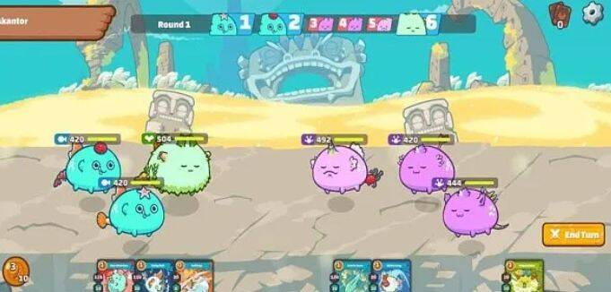
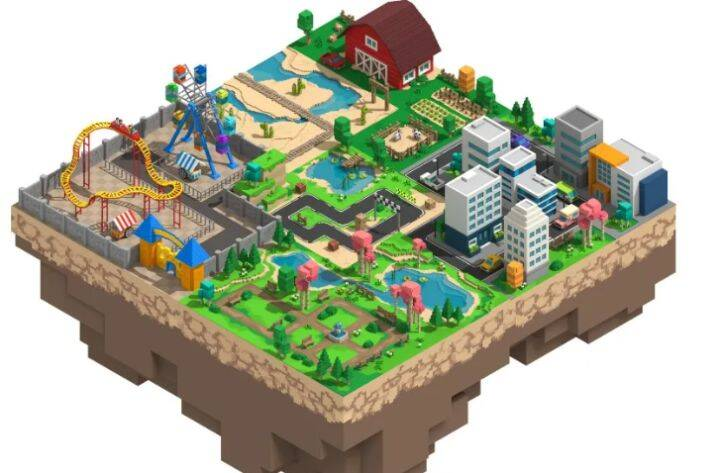
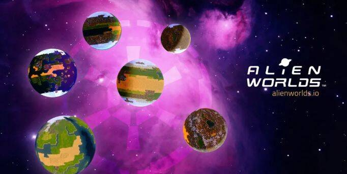

# 中文元宇宙游戏有哪些

2021年如果说有什么词在科技方面是非常火爆的应该离不开“元宇宙“这个概念吧。那么元宇宙这个概念是什么呢？

根据百度百科方面的的解释是说“**元宇宙**（Metaverse）是利用科技手段进行链接与创造的，与现实世界映射与交互的虚拟世界，具备新型社会体系的数字生活空间。

”也就是说的是人类在未来将会生活在由科技创造和链接的虚拟社会之中，它拥有这时空性、真实性、独立性、连接性四大特征。当然在目前也是一个相对理想的概念，在未来也会有很多相关的衍生问题会发生。

在游戏领域也是很多大厂纷纷介入元宇宙，相信很多关注此概念的小伙伴一定会想要了解中文元宇宙游戏有哪些？小编就为大家介绍下最近的中文元宇宙游戏。

**一：AXS** 

Axie Infinity是在以太坊区块链上构建的，受神奇宝贝启发的数字宠物世界，任何人都可以通过熟练的游戏玩法和对生态系统的贡献来获得代币奖励。为了创建更好的用户体验并提高可伸缩性，Axie Infinity团队正在构建名为Ronin的第2层侧链。

该AXS令牌是ERC-20实用令牌的平台，用于：

1、治理：AXS令牌持有者将能够放权其令牌并参与治理投票。

2、放样：玩家将能股份的AXS赢得每周奖励。

3、付款：玩家可以使用AXS令牌玩游戏并进行付款。

**二：MANA** 

Decentraland是一个基于区块链的虚拟世界平台，旨在为去中心化的开源项目解决平台商赚取中间平台利润的问题，从而达成内容创造者和游戏玩家之间的低价格支付模式;项目使用区块链技术去获取并转移虚拟产权，并让用户永久性持有这些虚拟产权，甚至对其进行经营，为自己的内容创造获取利润;没有中介费用的存在，这是Decentraland最大的特性。

 

**三：SAND** 

The Sandbox是一个虚拟游戏世界，通过基于以太坊的功能型代币SAND，玩家可以创建和拥有不同的游戏体验，并从中获得收益。游戏玩家可以通过The Sandbox Game Maker，来创建数字资产(非同质化代币，也称NFT)，将其上传到商店，并通过简单的拖拉方式来创建游戏体验。The Sandbox已经与包括ATARI，Crypto Kitties加密猫，Shaun the Sheep等50多个合作伙伴建立了合作关系，来建立由玩家创作和拥有的“边玩边赚”的创意游戏平台。

 

The Sandbox旨在通过区块链技术所带来的真正的所有权、数字稀缺性、盈利能力和互操作性的优势，来吸引更多的加密和非加密游戏爱好者，将区块链带入主流游戏世界。

**四：ILV** 

Illuvium是基于以太坊网络构建的开放世界GameFi游戏。该游戏的原生货币ILV用于通过游戏的游戏赚取功能奖励游戏玩家，并作为项目的治理代币。

 

Illuvium利用以太坊第 2 层扩展解决方案Immutable X来显着降低交易NFT所需的gas费用。与其他流行的GameFi游戏一样，游戏玩家完全拥有他们的Illuvials并可以在二级市场上交易NFT。Illuvium为玩家和投资者提供了一个非常独特的机会，收集、交易、战斗并获得稀有价值资产。

**五：ALICE** 

《My Neighbor Alice》是一款多人合作的农场游戏。玩家在游戏中建造自己的虚拟土地，与邻居互动，进行刺激的日常活动，并获得奖励。任何人都可以通过购买一块土地加入这个世界，并参与各种活动，如种植、钓鱼、捉虫和养蜂。活动、共享任务和比赛带来宝贵的奖励，提升玩家在游戏中的地位。

受《动物森友会》(Animal Crossing)等成功游戏的启发，该游戏为想要享受游戏体验的普通玩家提供了有趣的情节，也为想要收集和交易非同质化代币(NFT)的玩家提供生态系统。

My Neighbor Alice通过区块链，让玩家参与游戏并获得奖励，和对游戏资产进行分发。基于NFT资产的去中心化所有权：对游戏中资产(例如岛屿，房屋，宠物等)的去中心化所有权。

社交功能：游戏内置聊天模块，允许玩家与同一岛上的玩家进行交流，并在聊天中将代币和资产转移给朋友。玩家可以参观彼此的岛屿并一起完成小组任务。

市场：允许用户买卖资产的游戏内市场。它为游戏玩家购买和创建游戏中的物品提供了更多的流动性和经济激励。

**六：TLM** 

Alien Worlds是NFT DeFi的元宇宙，可以模拟玩家之间的经济竞争与合作。通过激励玩家争取Trilium(TLM)，用户可以控制自治组织(Planet DAO)并获得更多游戏玩法所必需的。

在Alien Worlds的宇宙中，玩家可以获取NFT(数字游戏物品)来挖掘TLM，进行战斗并完成游戏中的任务。根据他们的策略，玩家可以购买和组装最适合其游戏玩法的NFT。此外，玩家可以通过选举六个Planet DAO的委员来参与管理，从而影响游戏的方向。

Trilium(TLM)是Alien Worlds宇宙中的原生功能型代币，并具有以下用例：

1、星球治理：TLM持有者可以下注TLM参与星球的治理和其他潜在的回报。

2、抵押：玩家可以将TLM抵押在选定的星球上，以参与TLM和NFT采矿。

3、游戏中货币：TLM代币是Alien Worlds 中的代币，玩家需要TLM购买和升级物品，参加任务和战斗以及与游戏相关的活动。

4、游戏上的激励措施：活跃的用户可能会获得TLM作为参与奖励，以开发游戏内生态系统和活动。

5、购买NFT：将游戏内物品铸造为NFT，这有助于玩家挖掘TLM，参与战斗并完成游戏内任务。

**七：SLP** 

SLP(Small Love Potion)是一种可以在以太坊区块链上使用的ERC-20代币。Axie Infinity是一款在以太坊区块链上运行的游戏(dapp)，用户可以在这里收集、饲养、繁殖和战斗名为axies的虚拟生物。Axies和现实生活中的宠物非常相似，每一个都有自己独特的特征和外表。

**八：STARL** 

星链是以太链上一个100%由社区拥有的去中心化的虚拟空间元宇宙+nft项目。Starl是星链元宇宙生态系统的唯一治理代币。虚拟太空游戏、NFT拍卖、交易虚拟卫星、航天器、购买卫星土地、交易宇宙空间中的生活用品，通过社交来探索整个宇宙。探索未来，即

**九：GHST** 

GHST是作为DAICO(DAO治理的代币销售)发起的，这意味着所筹集的资金由社区管理。GHST被描述为启用了DeFi的加密收藏品项目，使用户可以收集、竞争和组合他们的Aavegotchis，以获得游戏化的DeFi体验。

GHST是Aavegotchi生态中的ERC-20原生功能型代币，并有以下用例：

1、支付: GHST被用作购买各种数字资产的基础货币，例如Aavegotchi Portals，可穿戴装备，消耗品和收藏品等。

2、抵押: 玩家需要抵押GHST代币以生成REALM(其代表Aavegotchi王国的土地)，以表明对生态系统的经济投入并防止恶意行为。

3、治理: GHST将会被奖励给参与AavegotchiDAO内治理行为的用户。

**十：DPET** 

My DeFi Pet是一款虚拟宠物游戏，将DeFi、收藏品和玩家个性相结合。My DeFi宠物在支持的网络上运行，包括币安智能链和KardiaChain。

DPET代币是游戏中的主要货币，用于交易、交换、改善宠物和它们的特殊品质，主要流通于在第一阶段。
