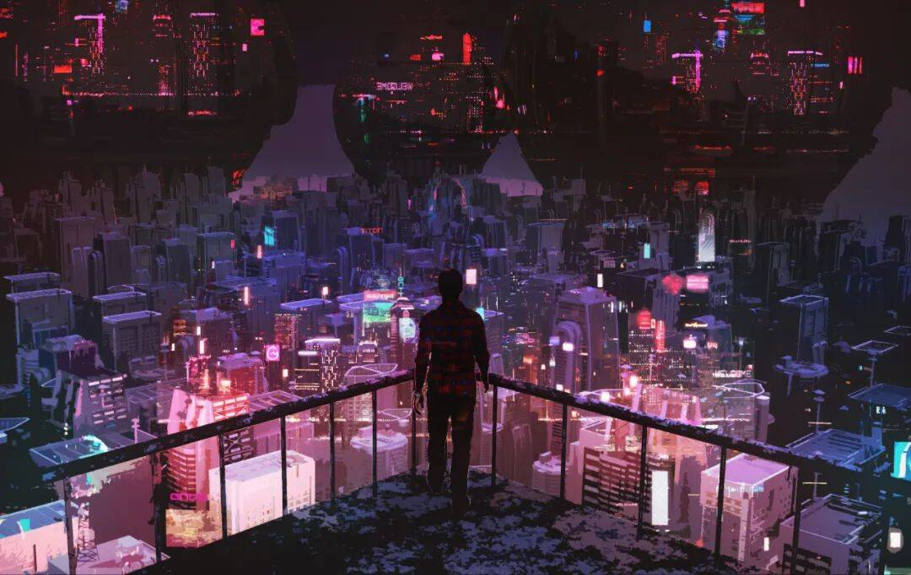

# 「元宇宙十万个为什么」：市面上的元宇宙游戏？

我们来探讨目前市场上有哪些类似于《头号玩家》中“绿洲”的元宇宙游戏。

元宇宙游戏称不上，但虚拟类游戏有不少。

其中，发布于2003年的《Second Life》（第二人生）是第一个现象级的虚拟世界。在游戏中，玩家可以社交、购物、建造、经商，甚至是吃饭、跳舞、开车、唱K，所以，它是网络游戏+社交网络+Web 2.0的组合。据说，IBM曾在游戏中购买过地产，建立自己的销售中心。另外，在中国，也有类似于Second Life的游戏，比如HiPiHi、uWorld以及Novoking。

此外，《堡垒之夜》是一款第三人称射击游戏，已登陆Play Station 4、Xbox One、Nintendo Switch、PC、iOS、Android等平台。游戏虽然以传统的模式展开，但是，在此基础上还不断添加了社交、经济等元宇宙要素。

和前两款游戏不同，《Roblox》一开始并不是一款游戏，而是提供开发平台和社区服务，通过创作激励机制吸引用户，实现完全由用户打造的去中心化世界。随着演变，《Roblox》已经成为世界最大的多人在线创作游戏，它兼容了虚拟世界、休闲游戏和自建内容的游戏，游戏中的大多数作品都是用户自行建立的。从FPS、RPG到竞速、解谜，全由玩家操控虚拟世界的“数字人”参与完成。

除此之外，《Minecraft》（我的世界）在国内也很受欢迎，它由网易代理，玩家可以在虚拟空间创造和破坏各种各样的方块，打造精美的建筑物，创造物和艺术品，体验各类活动，包括采集矿石、与敌对生物战斗、合成新的方块与收集各种在游戏中找到的资源的工具。

更有趣的是，在虚拟世界，你不仅能盖房还能“炒房”，比如《Decentraland》就是一款能“炒房”的游戏。最近，歌手林俊杰在推特上宣布，自己买了Decentraland平台上的三块虚拟土地，花费大约12.3万美元。

虽然元宇宙“风口”来势汹汹，还是要提醒大家“宇市有风险，投资需谨慎”。
