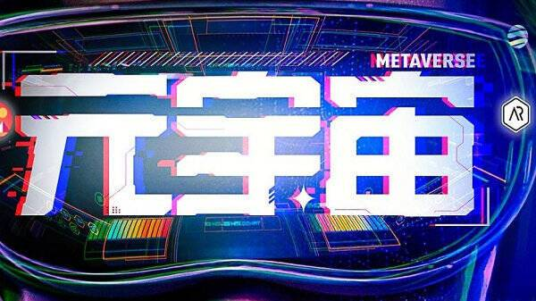

# 当你真正了解“元宇宙”的奥秘时，你会深陷其中

元宇宙是大型3D虚拟游戏？

未来的人，将会在游戏里生存吗？

让我们带着这些问题进入到一个新的领域中探索和发现，打开你的一片新宇宙，你会发现其中的奥秘，并深陷其中。

人们往往对不了解的事情不感兴趣，因为它与你无关；人们又往往对不了解的事充满好奇，因为好奇是驱动人类进步的源动力。

当一件新事物既与每个人息息相关，又能满足我们每个人至死方休的好奇心，我们就不如早点探索和发现其中的奥秘，做第一波吃上螃蟹的人。

 

**元宇宙，不仅仅是游戏，更是人生** 

元宇宙目前的呈现方式主要是游戏，这无可厚非，毕竟实现元宇宙的硬件设备还没有完全落地，各个巨头科技公司纷纷布局，投入大笔资金，那么它就一定会实现。

元宇宙到底是什么？能够驱动巨头科技公司“facebook”改变 ,能够让腾讯、百度、字节纷纷押宝，疯狂占位，它是未来。

**回顾互联网的几次革命：** 

互联网1.0是单向信息的传输和读取，在这个阶段，传统媒体纷纷建立网站，制作电子报、手机报，把信息放到互联网上，但传播依然是单向的。

互联网2.0带来了双向互动、内容消费和社交，其最大的变化在于由用户主导生成的内容成为互联网产品模式，同时传播极度依赖社交转发

而即将到来的互联网3.0媒体融合最终要实现的“你就是我、我就是你”目标，意味着传统媒体和新兴媒体不是取代关系，而是迭代关系；不是谁主谁次，而是此长彼长；不是谁强谁弱,而是优势互补。

确实很抽象。就像我们古代从来没有坐过飞机的人，被人说你会有一天飞上天，穿越几万公里到达西半球，还能与东半球的人通过一个叫电话的东西交流互动一样抽象。

在元宇宙的世界，虚实结合，万物互联，无边无际，现实世界和电子世界逐渐变得没有边界，你是现实世界的你，或许还是元宇宙的你。

在现实世界的你，或许躺在床上摆弄着什么；在元宇宙的你，已经开上了宇宙飞船，像飞鸟一样，穿梭在元宇宙的每一片角落，自由而安逸。

这是一种“主体身体化”的情形，元宇宙将提供与现实一模一样的场景，我们借助头盔进入元宇宙，在全仿真的世界中，与现实世界交汇，产生互动和交流。

就像我们现在身在北京，却能够在元宇宙中看到埃菲尔铁塔，高高地耸立在你眼前，你看着他，摸摸它，眺望它，在塔下游玩，你仿佛就置身其中。

**元宇宙，不仅仅是人生，更是未来** 

元宇宙的英文是 Metaverse，前缀 meta 意为超越，词根 verse 则由universe 演化而来，泛指宇宙、世界。

那么，让我们的眼睛和思想变焦一下，聚集在未来，让我们去思考，到底未来我们的世界将会怎样呈现？

**1、数字与实体经济深度融合** 

在元宇宙中，身处世界各地的人可以高效沟通与协作，全面联网的智能设备将有效联动，产业链协作将变得更加透明和高效。

“万物互联”将会逐步走向“万物互信”，再到“万物交易”和“万物协作”，人与人，人与机，机器与机器，都能够频繁交易，人从出生到结束，都是一串固定的数字。

在这个世界中，或许你只需要说出你的数字，你的身价就在其中，货币就是你的身份数字。

**2、数据成为核心资产** 

数据的价值日益凸显，呈现指数级增长。

那时，需要有一种“确权的机器”承载数据，就像服务器承载电脑中的所有信息一样，那么确权的极其，用户的数据将会成为稀缺和核心的资产。

**3、经济社群崛起** 

元宇宙世界中，所谓的信息差已经不再会出现，开放、公平、透明、共生的“经济社群”有望成为主流的组织形态。

**4、重塑自我形象和身份体系** 

数字形象综合反映了一个人的兴趣、审美、情怀、梦想等诸多心理因素，它比我们的大脑更认识自己。

数字身份，让我们拥有独立性，隐私性，通用性，识别性。

**5、数字文化大繁荣** 

元宇宙时代也将是数字文化大发展、大繁荣、主流化的时代。因为他离不开人，人与人之间的交流互动，人与人之间的交流互动产生的文化交融。

元宇宙，也会带来重重的危机

当汽车来临时，马车就少了；当电脑来临时，收音机就少了；当智能手机来临时，电池充电器就少了；

**元宇宙的新，必然会淘汰一批旧职业，催生一批新职业。** 

当然最热门的要数技术型人才、内容型人才、设备类人才、AI类人才和基础技术人员，这些技术人员，才能应对未来的新的挑战。

年轻人，都要居安思危，既要脚踏实地，又要仰望星空，看清楚未来在哪里，在趋势中寻找到新的机会，必然你会成为出彩的人。
