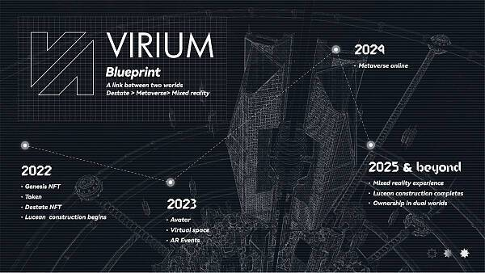
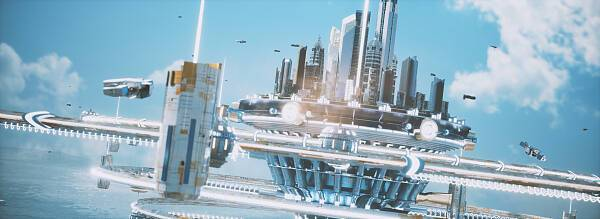

# 泰国元宇宙项目Virium：结合实体房产的NFT新玩法

　　作为一家探索社区、房地产和虚拟世界领域的 Web3 公司，旨在「重新定义房地产交易的可能性」的Ionia Lab 推出其新项目 Virium（virium.io），核心愿景是探索元宇宙结合现实房产和 NFT，从而实现现实房地产资产的全新商业化模式。

　　随着 Web3 及元宇宙的发展，未来如果把现实生活看作每个人的「第一世界」，那元宇宙就等于是每个人的「第二世界」。

　　在这个「第二世界」里，每一个人日常工作、生活、学习、娱乐等所有的经济行为，都能被记录在链上，包括吃喝玩乐在内的一切经济行为数据化、价值化。

　　而 Virium 作为世界上第一个混合现实元宇宙项目，就旨在探索社区、房地产和虚拟世界的领域结合，让投资者和用户同时享受虚拟空间和真实空间。

　　旗下对应的元宇宙公寓项目 Lucean位于泰国芭堤雅，由泰国著名高端公寓开发商Lunique Real Estate co., ltd, 该项目另一栋为Lunique和悦榕庄合作开发芭提雅地标项目SkyPark。距离著名的芭提雅中天海滩只有 200 米远，每个单元都配备了家具和集成，可以直接俯瞰大海。公寓单元类型包含开间、一居室、二居室、以及顶层豪宅。配套包括两个无边游泳池、天空健身房、儿童俱乐部、共同工作空间、图书馆、游戏室、天空花园、慢跑跑道等，除此之外提供酒店式 24 小时服务，与物业租赁管理等。

　　每个 NFT 都将为其持有人提供两套公寓，第一套为在泰国真正的海景公寓，持有人拥有公寓的居住权，租赁权和交易权。第二套为元宇宙中的3D公寓，持有人可以通过VR进入探索，用户在数字世界中创造的内容也会和现实世界实现无缝桥接转化。

　　该项目具体可以分为三个关键阶段：

　　1. 在第一阶段：数字孪生

　　Virium 计划实现物理世界的基础建设在元宇宙数字时间的反映，灵感来自于物理建筑和我们周围的现实世界；

　　2. 在第二阶段：数字原生

　　Virium 将专注于构建数字原生，在元宇宙平台中和用户共同搭建虚拟世界；

　　3. 在第三阶段：虚实共生

　　Virium 将在前两个阶段创建「双重世界」，将把在数字平台中创建的内容带入现实世界，反之亦然，从而弥合物理体验和虚拟体验之间的差距；

　　简言之，Virium 的核心是将现实世界的资产，例如地产，与虚拟世界进行桥接，在现实和虚拟世界同时进行商业化运作，从而打通二者的界限，在降低参与者房产投资门槛的同时，将地产持有者的利益最大化。

　　将元宇宙世界与现实世界进行联通的 Virium 要做的，是「元宇宙里的房地产生意」：

　　1. 一方面将现实中的房地产生意借助 NFT 与元宇宙的形式简化流程，降低普通投资者的参与门槛；

　　2. 另一方面则是探索元宇宙地产的全新维度商业可能（元宇宙广告位等等）；

　　Virium将通过三种玩法分发真实房产，抽奖，十连抽，以及碎片化。Virium社群每周会抽取一套价值45E-160E的海景房给到NFT持有者。购买10个NFT的大户则可以直接获得价值80E以上的大户型海景房。除了抽奖外，项目方还预留了12套房产用于碎片化给到没能获得房产的VID持有者，持有者可任意支配这些房产的用处，如出租或轮流居住。

　　创始人也表示，随着市场波动，Virium希望提供的是一种能够让普通人放心的资产，通过绑定实体资产降低泡沫化带来的价格浮动和宏观市场影响带来波动。

　　普通投资者在现实世界中对着房子「买买买」很困难，除了常规的资金门槛限制，更主要的是不同地域的法律、投资风险等因素难以逾越，譬如我们就很难参与国外优质地产项目。

　　Virium 的愿景正在于此，它的核心思路便是将优质的东南亚房地产项目放入该土地项目中，并通过各种管理手段，打通现实资产与映射的元宇宙地产之间的联系，实现土地的货币化增值，以不到实际房产1/10的价格获得现实优质房产加虚拟房产。

　　除此之外，Virium 通过映射在元宇宙里的房地产，持有者也可以作为「元宇宙里的新房地产商」进行全新维度的商业场景开发：

　　• 房产服务。房产NFT持有者可以通过Virium提供的平台对真实房产进行转售，出租，或居住。同样对应的元宇宙房产也可以进行转售或出租。

　　• 商业服务。企业可以在元宇宙搭建自己的公司，或在元宇宙中展出自己的广告。除此之外还可以在元宇宙中复刻真实的产品在元宇宙中销售。如销售NFT服装给元宇宙中的虚拟人穿着，现实生活中会得到一件同样的真实的服装。

　　• 混合虚拟现实社区打造。与其他元宇宙平台不同，Virium的社区会融入现实建筑的设计，专业元宇宙设计师的设计，以及Virium社区的会员设计，画质和画风上会更加精良。其元宇宙中搭建的社区未来会在现实中映射，如元宇宙商场最终会复刻实现在现实生活中，现实生活中的商场设计和贩售的物品将会和元宇宙中一样，且同样可以运用Virium的token支付。

　　从这个角度讲，Virium 可以成为一个致力于促进元宇宙商业广告模式创新的组织，能最大限度地利用社区拥有的元宇宙房地产资产进行商业运营，并与土地所有者分享广告等商业利润收入。

　　在此基础上，Virium 的 NFT 后续可以扩展的落地场景也足够丰富，普通投资者在持有 NFT 后，可以在东南亚实体房地产的本身价值以及附加价值进行多维度开发。
