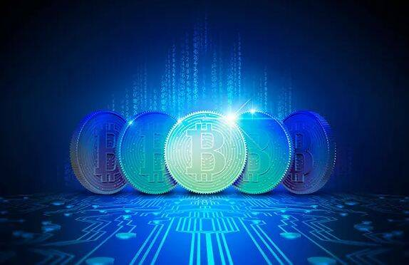
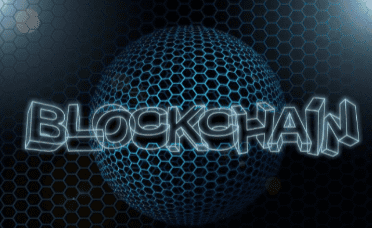

# 元宇宙游戏席卷全球：什么是元宇宙？

在网络发展飞速的21世纪，我们获得了越来越身临其境的科技体验感。虚拟现实不再是属于未来的东西，它就在我们面前，并且变得越来越流行。电子游戏作为全球最受欢迎的娱乐形式之一。到目前为止，电子游戏在很大程度上依赖于传统的计算机或游戏机。然而，随着区块链技术和元宇宙等平台的出现，这一切将发生改变。今天，比特安网络安全中心将带大家了解如何使用元宇宙为下一代电子游戏提供动力。

**什么是元宇宙游戏？**

元宇宙游戏是一款大家一起玩社区型的游戏，如果你对它感兴趣但还没有听说过它，我们想让你尽可能的了解一切。笔者最喜欢的就是元宇宙游戏里的社区。它的目标是建立一个平台，让用户可以在上面玩游戏、赚钱、玩得开心。它由虚拟人组成的虚拟现实游戏社区。它是下一代电子游戏的化身，它可以让现实世界变得更加有趣。

**元宇宙在电子游戏行业中的作用**

元宇宙一直是电子游戏行业不可或缺的一部分。第一个使用元宇宙设计的游戏是“在线元宇宙”（Metaverse Online），它允许用户为其虚拟形象购买私人定制产品，并在游戏中购买数字资产。它作为一个虚拟现实平台，允许用户以真正身临其境的方式创建、体验并且货币化他们的物品。它基于区块链的虚拟现实平台。它是首批允许用户和开发人员通过区块链上的智能合约创建和体验增强现实的平台之一。元宇宙提供了创建、分发和体验虚拟宇宙的最佳方式。

并且可以把它看作是一个开源的公共区块链，旨在改善我们在线共享和联系的方式。例如，它将允许用户在没有任何第三方干预的情况下创建他们的虚拟世界（或游戏）。

元宇宙是一个可以通过共识来改变的现实。它还有自己的经济体系，这就意味着用户不必担心真实货币会妨碍元宇宙中的娱乐享受。它也是最新的区块链项目之一，具有很大的潜力。他们正在构建一个虚拟世界，每个人都可以在其中创建自己的虚拟形象并且做任何他们想做的事情。

 

**元宇宙游戏的市场规模和数据统计**

元宇宙游戏的市场规模约为2000亿美元，预计2020-2024年的复合年增长率为10%。2018年，中国市场占全球收入的最大份额为34%，其次是日本（25%）和韩国（14%）。在地域分布方面，亚太地区无论是在创收方面还是在用户数量方面都占据主导地位。仅在游戏行业，到2020年为止，VR/AR游戏的收入估计达到54亿美元。毫无疑问，元宇宙是下一代虚拟现实这是一个身临其境的互动世界，用户可以通过多种不同方式进行探索和互动。

到2020年，预计每年有120亿美元的交易是通过元宇宙系统进行的。目前元宇宙平台注册用户超过1500万，预计到2025年这一数字将跃升至9000万。

当前虚拟商品交易市场规模30亿美元，虚拟商品交易数量近五年增长500%以上。虚拟商品销售占游戏收入的40%，高于2008年的25%手游正在推动这一增长，因为它们现在占所有游戏收入的50%

元宇宙将凭借其跨平台功能和可访问的开发环境为下一代电子游戏提供动力。因此，开发人员可以在任何连接到互联网的设备上创建自己的私人定制游戏体验。

这意味着游戏玩家无需等待游戏机或PC端上的新版本即可享受游戏。取而代之的是，全世界的所有玩家都将同时进行实时游戏，因为一切都发生在一个名为The Metaverse的共享虚拟现实空间中。

不过在文章的最后，比特安网络安全中心也要提醒大家，任何娱乐或是投资的前提，一定要是在安全的情况下进行。在你参与或者开发元宇宙项目的同时，必要的安全排查和审计意识一定要有，比特安衷心的希望元宇宙的发展能越来越好。
