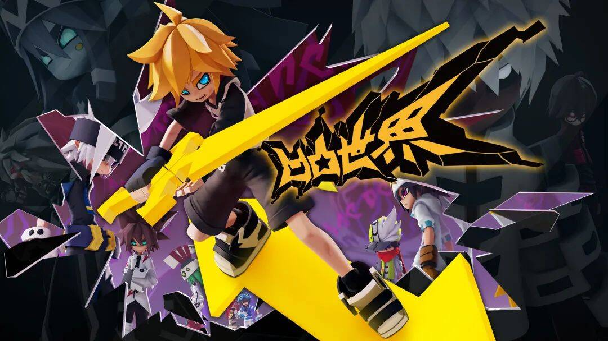

# 凹凸宇宙来了！七创社牵手小冰，打造元宇宙娱乐大作

时隔两年，《凹凸世界》第四季终于在大家的热爱与期待中回归，首日播放量高达1000万，我们坚信，2022年的夏天会与大家一同创造新的辉煌。

第四季如火如荼播出之际，我们也达成了一个令人鼓舞的合作意向：

《凹凸世界》已与全球领先的完备人工智能小冰框架达成合作，七创社×小冰公司将联手推出基于《凹凸世界》IP的元宇宙游戏新作。

本次开创性的跨界合作，《凹凸世界》的世界观、剧情和角色将由领跑中国虚拟人行业的小冰框架（Xiaoice Framework）完全驱动，我们计划为广大凹凸粉丝以及更多Z世代年轻人创造一个高度自由、轻松愉快、充满创意的凹凸元宇宙。

### 拥有天然优势的凹凸“元宇宙化”

从第一季至第四季，故事逐渐在大家面前铺开，凹凸的世界观架构严谨完整、细节丰富、可延展性极强，这为搭建元宇宙提供了天然的便利。
同时，凹凸世界动画中的角色们也将以凹凸元宇宙中众多虚拟AI人物的形式与大家见面。

除去官方设定的契合外，《凹凸世界》的同人社群，也给了我们探索元宇宙领域极大的勇气。
长久以来，我们与大家的共同努力构建起了一个独一无二的强大的同人创作氛围， 这一创造理念也与元宇宙精神完美契合。

### 让元宇宙活起来的关键技术：小冰框架

小冰框架，以自然语言处理（NLP）为基础，持续推动完备迭代发展，目前是全球承载交互量最大的完备人工智能框架之一，技术覆盖自然语言处理、计算机语音、计算机视觉及人工智能内容生成。其中，在开放域对话、多模态交互、超级自然语音、深度神经网络渲染和人工智能内容生成领域，居于全球领先。
小冰框架已孵化出数以千万计的超级自然虚拟人（AI being），而在此次与《凹凸世界》联手进行的“凹凸元宇宙”探索项目中，小冰框架将在角色赋能、平台交互搭建、内容创作产出等方面起到关键性作用。
例如，小冰框架将为凹凸世界的众多角色“注入灵魂”，让角色与大家的交互更加真实、丰富；动画中只能完成规定动作的角色，将变成能够通过交互自主学习，提供更多交互反馈的鲜活对象，元宇宙将能够真正地“活起来”。

### 创造新的元宇宙可能

在“凹凸元宇宙”中，玩家将可以体验沉浸式的凹凸世界生活，与自己喜爱的角色互动。但与其他元宇宙不同的是，在这里，玩家与角色的日常交互，都将帮助训练丰富多彩的AI being。
小冰框架将基于玩家在交互中自主产出的海量信息，将信息变为大量有价值的数据进行不断学习，用来指导和优化AI角色的反馈，这会让元宇宙中的角色越来越鲜活，越来越接近凹凸世界官方设定本身。
某种程度上来说，搭建凹凸元宇宙的全过程都有大家参与其中，这也是动画IP在元宇宙领域的一次全新探索。

### AAA级全平台的下一代娱乐作品

作为面向未来的元宇宙作品，凹凸元宇宙将是一款用最先进的Unreal引擎打造的AAA质量的娱乐作品，横跨手机、PC、主机、VR、云端等平台。
对于此，七创社和小冰一致坚信，只有应用最先进的技术、支持更多的设备和体验方式，才能确保凹凸元宇宙呈现出最佳的体验效果。

《凹凸世界》与小冰此次梦幻联动，是两个在不同领域内最契合“元宇宙”概念产品的一次大胆碰撞，“凹凸元宇宙”也将是动画IP在元宇宙领域的一个全新的探索。
创新与技术不止，我们将与大家一同见证“凹凸元宇宙”的未来。
