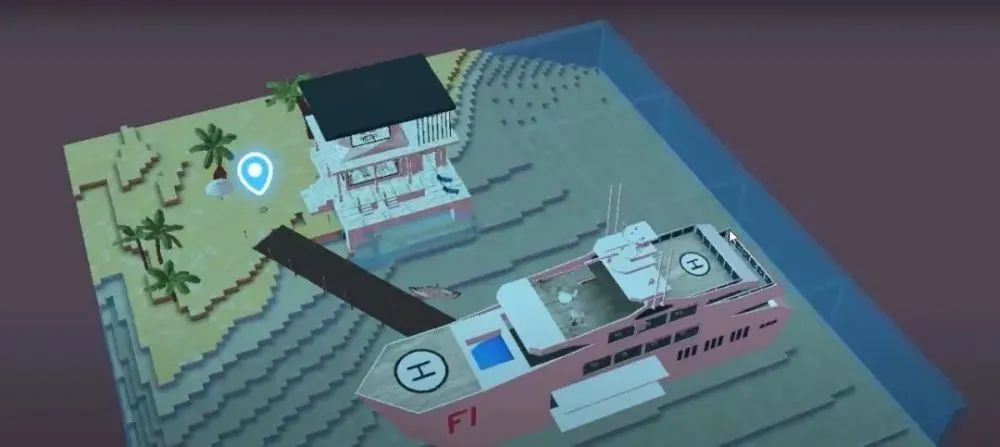
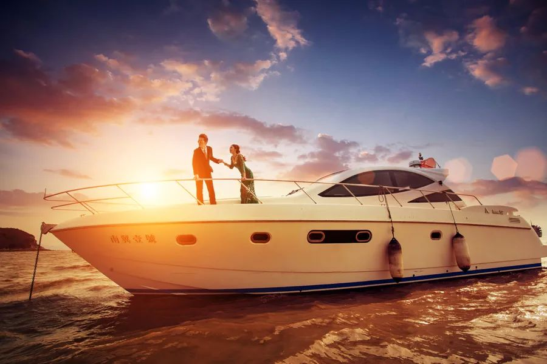
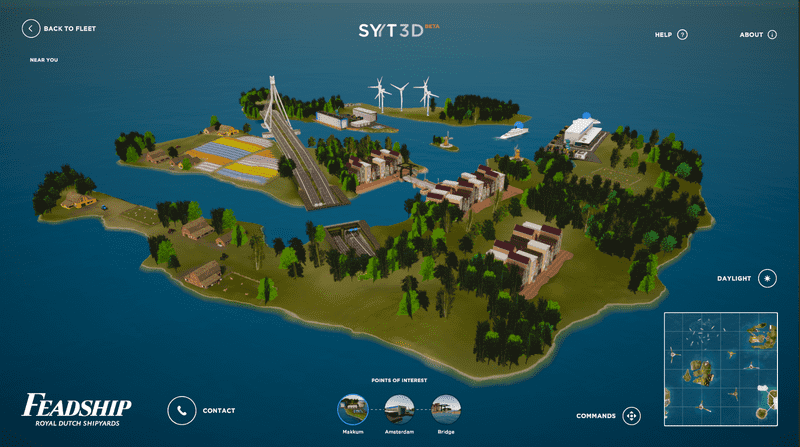

# 元宇宙买房热还没结束，65万美元豪华游艇又来了

有人在元宇宙买了房，有人在元宇宙买了游艇。

最近，元宇宙概念大火，竟然掀起了一股“炒房热”。11月23日，虚拟世界平台Decentraland一块数字土地被卖出**243万美元(约合人民币1552万元)**。

据了解，这已经不是第一次出售虚拟房产了，相较之前最高虚拟房地产价格纪录**91.3万美元**，这次的成交价**高出了一倍多**。如果换算到现实生活中，这一房价不仅远高于美国其他行政区的平均价格，**相比美国最富有的曼哈顿区的平均房价也要略高一筹**。

元宇宙购买房产的热度还没过去，近日，虚拟游戏平台Sandbox Metaverse售出了其平台上迄今为止最昂贵的NFT资产：一艘超级游艇。**有人为此支付了149枚以太坊，按照传统货币计算，相当于65万美元(约合人民币415万元)**。

据悉，这艘超级游艇名为Metaflower。从图片来看，这艘豪华游艇共4层，拥有一个按摩浴缸、一个舞池、多个休息室、以及两架功能齐全的直升机与停机坪。

目前，市面上的游艇可以分为大中小三类。长度在360英尺（110米）以下为小型游艇、360-600英尺为中型游艇、600英尺以上（约183米）为大型豪华游艇。

一艘全新的大型豪华游艇价格一般都上千万元，中型游艇在200万元以上。如此看来，**相较于元宇宙房产，元宇宙游艇竟然还算“性价比”产品**。

另外，现实生活中，游艇多为租赁的形式。购买游艇需要上牌、船检、航行、保险等一系列服务。除此之外，后续的护养、泊位、清洁及水电也是不小的开销。

相较而言，**元宇宙游艇则是“一劳永逸”的**。

Metaflower是元宇宙开发商Republic Realm为沙盒游戏（Sandbox）设计的发布“梦幻系列”的一部分。这一系列，包括私人岛屿、水上摩托艇、快艇，超级游艇以及会员制的海滩俱乐部和梦幻码头。

“梦幻系列”是Republic Realm“梦幻岛屿”的延伸，由100个私人岛屿组成，这些岛屿由建造在NFT土地上的别墅组成，**不到24小时就已售罄**，目前的底价为63.9ETH(约28万美元)。

目前，Metaflower只是Republic Realm“梦幻系列”中发布的众多豪华资产之一，后期会有更多更新。

在元宇宙的世界里，每个人都是数据源。用户是否能够穿越数字世界、享受虚拟游艇带来的生活方式，现在还未可知。
