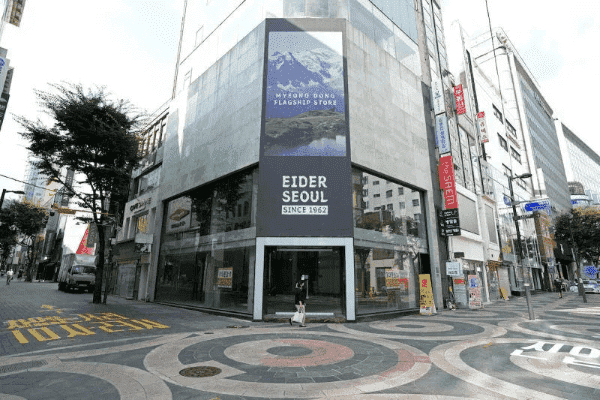
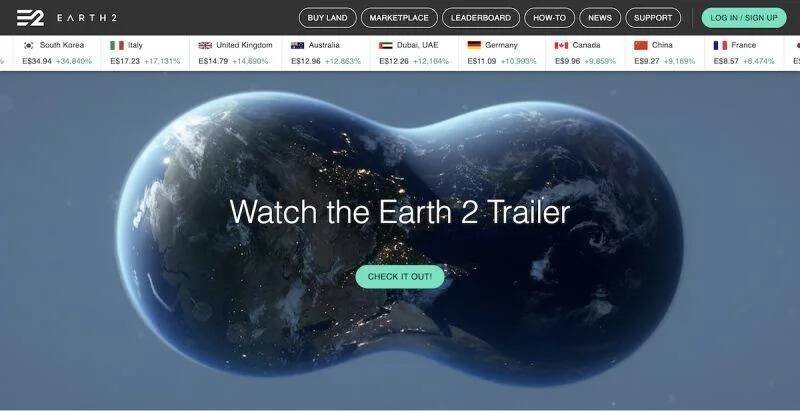

# 韩国房价飙涨 年轻人疯买虚拟土地

▲韩国房价频频飙升，让不少年轻人不敢奢望买房。 （图/美联社/达志影像）

韩国房价频频飙升，高房价以及高保证金的租屋制度之下，让人不敢奢望买房，但现在韩国不少年轻人都转往元宇宙平台（metaverse）购买虚拟土地，一圆买房梦，也让韩国超越争国以及日本，成为热衷投资虚拟土地的国家之一。

根据《The Korea Herald》报道，因为韩国房价飙升，使不少年轻人感到沮丧，千禧一代也开始转往购买虚拟土地赚钱。 一名28岁的韩国年轻人Park曾向朋友开玩笑的表示，他以不到4万韩元（约台币950元）的价格在首尔江南区买了一块10平方米的土地。 不过根据市场价格，该地区每平方米的交易价格超过3千万韩元（约台币71万元），其实Park所购买的土地，正是处于虚拟世界当中。

虽然土地是虚拟的，但是利润却是真实的。 Park表示，今年2月在元宇宙平台上，购买了位于首尔的两块土地，价值将近17万韩元（约台币4000元），但是在短短两个月内，价格飙升至46万韩元（约台币1万900元）。 Park指出，就像有些人在加密货币盛行前投资，因而大赚一笔，他认为在房价高涨的韩国，虚拟土地是小资族长期投资的不错选择。

像Park这样的「虚拟地主」也越来越多，他们将钱投资在「Earth2」等元宇宙平台，在平台中购买土地，而Earth2将世界地图分割成10平方米的小块土地，就连平常不作为房地产的土地，例如光化门广场，也能够进行投资。

▲韩国年轻人近来热衷于投资虚拟土地。 （图/截取自Earth 2官网）

根据[Earth2](https://app.earth2.io/#leaderboard)的交易数据，截至7月为止，韩国拥有的虚拟土地总价值估计约70亿韩元（约台币1亿6千万元），远高过日本以及中国。

随着元宇宙的概念兴起，对于虚拟土地的需求也不断增加，再加上受到新冠肺炎（COVID-19）疫情大流行的影响，也越来越受到欢迎。

韩国嘉泉大学教授Jeon Seong-min认为，疫情导致韩国房市以及股市过热，资产接近泡沫化，推动了虚拟货币市场的发展，近来兴起的加密热潮也促使投资者转往跳入投资虚拟财产的领域。

虽然虚拟土地交易越来越盛行，但是部分专家也相当怀疑是否能够像加密货币一样有同样的致富能力。

江原国立大学工业工程教授金相均表示，在现实世界中，土地价格取决于土地的用途，然而在虚拟土地交易平台，投资者无法为他们的土地找到经济用途，这也让人质疑投资活动的可持续性。
