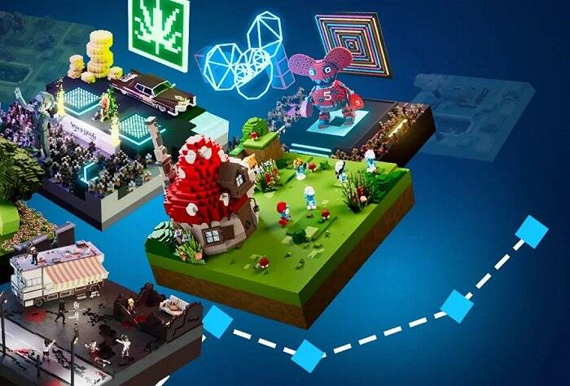
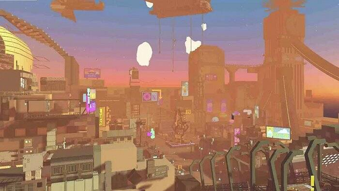
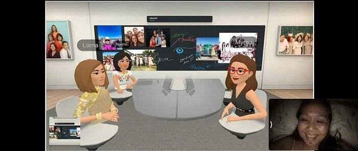
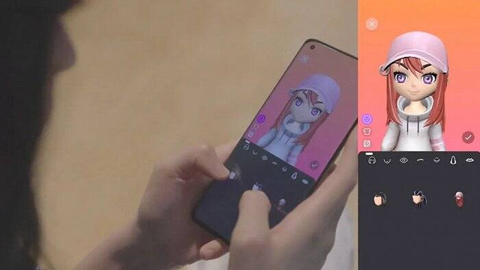
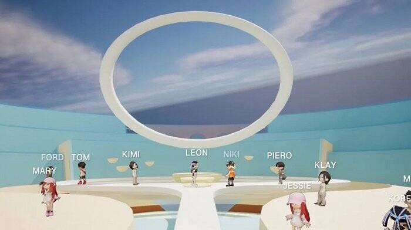
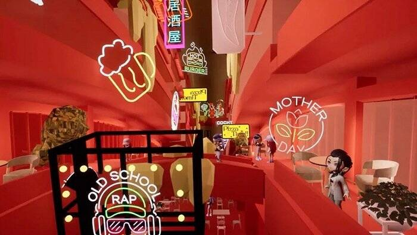

# 元宇宙地产，终于要落地了？

**买房送元宇宙“户口”?**

元宇宙自诞生以来，一直被看作是构建未来数字世界的重要方式。人们畅想着未来在现实世界的一切，都能够在元宇宙的虚拟世界得到复制，甚至获得超越时间、空间限制的独特体验。由此也引发了普华永道香港公司、Adidas Original等知名企业和品牌，为了抢占资源，在元宇宙世界争夺虚拟房产的盛况。

不过，在人们疯抢虚拟地产NFT的同时，元宇宙在现实生活场景的实际应用却鲜少有人关注。实际上，要构建未来数字世界，必然离不开居家、社交等最常见的生活场景。直到疫情的反复再次让人们被“困”在家里时，大家才对社区生活有了更多的感悟和思考，而这又给了房地产企业重新思考元宇宙落地应用的启发。

#### 元宇宙+地产只能炒地皮？

刚刚过去的2021年堪称元宇宙元年，资本持续追捧，全球科技巨头纷纷下场布局，A股市场的元宇宙概念股也持续收获暴涨。有券商预测，预计到2025年，元宇宙在社交、游戏、短视频、移动办公等领域合计国内市场空间将达到3400亿元至6400亿元。被元宇宙“新风口”吹过的领域，不断涌现出新的概念产物，而地产领域也因此迎来了虚拟世界的一轮“炒房热”。

2021年2月，区块链游戏Axie Infinity中的9块虚拟土地，以888.25枚以太坊代币（约合150万美元）成交，创下了当时虚拟土地的最高单笔交易。6月时，Decentraland平台上的259块土地，被数字房地产NFT投资基金Republic Realm以91.3万美元的价格购入，刷新了该平台的历史成交纪录。

*Sandbox的虚拟土地概念*

5个月后，Decentraland上的一块数字土地，被卖出了243万美元（约合人民币1552万元）的高价，这一价格已经超过了现实世界美国曼哈顿的平均单套房价。去年12月，元宇宙平台Sandbox上的一块虚拟土地以约人民币3200万元的成交价格，创下元宇宙房地产交易价格的新纪录。

虽然虚拟地产在元宇宙“炒房团”的推波助澜下一时吸引无数目光，但在更多人的眼里，它不过是被投机者们看中的又一个炒作工具。歌手林俊杰曾在去年11月斥资近12.3万美元（约78.72万元人民币）购买了Decentraland平台上的三块虚拟土地，宣布正式进军元宇宙。一个月后，其中一块虚拟土地的最高估价距离购买时的价格已经腰斩。显然，在虚拟世界“炒地皮”的行为，并非元宇宙在地产领域的真正应用。

*Sandbox里的虚拟建筑*

另一个不被觉察到的变化是，疫情爆发后，经历过隔离的人们开始注意到居家生活空间的重要性：从日常居住的安全问题，到居家隔离时的物资供应，又或者是在无法外出的情况下，也能拥有不被距离阻碍的社交体验。换句话说，人们已经意识到，自己需要的不只是一间大房子、一个好小区，而是一个更便捷、更安全的居住环境，以及更亲切的邻里社交生活。所以，面对当下出现的新需求，被元宇宙“风口”吹过的房地产行业，也得到了新的启发和新的机会。

#### 不玩虚的，元宇宙需要接“地”气

事实上在“炒地皮”之外，一些海外科技公司已经开始尝试将元宇宙概念运用在实际场景中，这为“地产+元宇宙”项目的实质落地提供了参考。

Facebook更名为Meta后，推出了办公协作平台Horizon Workroom，为居家办公的人们在虚拟世界提供群聊、会议、文件共享等功能和服务。另外，在Horizon Workroom的VR端，还可以拥有自定义的虚拟形象，以及借助手柄交互进行操作的虚拟白板等特色功能，实现对手势、语音嘴型的跟踪，还原真实的社交形态。这意味着，即便是散落在世界各地的人们，也可以在Horizon Workroom上得到媲美现实的沟通体验。

*Meta推出的办公协作平台Horizon Workroom*

而在产业端，英伟达通过Omniverse平台高度逼真的物理模拟引擎以及高性能渲染能力，将现实中的工业环境复制到了元宇宙中。宝马的高度自动化工厂使用Omniverse搭建了一比一还原真实工厂的数字孪生场景。如此一来，遍布全球的宝马工程师、设计师们，都可以直接在虚拟空间的数字孪生工厂中，一同参与产品的规划、设计和模拟等复杂的工作，由此使制造速度得到提升，也帮助企业提高经营效率。

至于社交领域，在今年年初吸引了大批年轻人尝鲜的啫喱App，在满足互联网原生用户“弱社交”需求的同时，提供了AI捏脸、3D形象状态展示等多种社交玩法。特别是基于地理位置进行互动的特色功能，在虚拟场景中打造了一个融合现实维度的社交空间，用户能够通过该功能看到身边的朋友们此时在做什么或者在什么地方，这让许多年轻用户得到了前所未有的新奇社交体验。

#### “脱虚向实”中的无尽想象

从用户需求的角度来看，日常社区生活主要以自住空间为主，但是线上空间的拓展，让用户有机会享受到更多服务。比如日常生活中，人们外出前通常需要查看天气预报、查询路线导航，或者是使用打车服务，而目前这些需求是在不同的第三方平台上得到解决的。但是作为这些需求产生时的场景，家居环境本身也可以借助数字化工具来同时满足该场景下的全部需求。

未来用户不必在手机上分别打开好几个App来查天气、查路线和打车，只需要在类似旭辉元空间的数字化系统中提前安排好的行程，即可享受到天气提醒、自助打车等智能化的服务，由此享受到更便捷的家居体验。

*元空间的个性化装扮定制功能*

此外，元宇宙也可以在家居场景中打造自由可切换的社交体验。例如旭辉CIFI元空间项目就会在用户入住时为其量身打造一个虚拟化身，用户既可以在元空间里广交朋友，也能以虚拟化身的身份来参加多种多样的社区活动。不论是“社恐”还是“社牛”，都能够在虚拟空间获得自己想要的社交体验。

值得一提的是，在疫情反复的当下，很多时候人们会面对现实世界里社交受限的情况。但是在虚拟社区，人们随时随地都可以在数字孪生的虚拟社区中任意畅游，也可以放心邀请邻居到虚拟空间的家中做客。故而这种线上社区的生活体验彻底打破了物理上隔阂，让用户的社区生活在元空间里不再受限，将现代社会的邻里关系回到“街坊时代”，人们不只生活在各自独立的空间，邻里之间关系变得更密切，让社区生活多了一些人文关怀。

*元空间的社区神坛场景*

不光为用户提供更多服务，元空间的落地也为地产项目本身带来了更多的商业价值。2021年12月，香港房地产巨头、新世界发展集团CEO郑志刚用500万美元（约3200万元人民币）买下了The Sandbox中最大的数字地块之一，并计划在这块虚拟土地上展示10家特色公司，这也被看作是一次虚拟地产广告价值的体现。而现实生活中常见的楼宇电梯广告，不但可以在虚拟社区一比一复制产生更多广告位资源，在表现形式上也拥有更大的发挥空间。

更值得关注的是，元空间将原本以各自房间为生活范围的用户们集中到了一起，构建了私域流量池，并且因为与业主在现实世界中的牢固关系，使得流量集中且稳定。以旭辉CIFI元空间为例，虚拟社区的“消息广场”作为流量入口，会及时发布包含日常管理相关的服务内容，用户们也可以在这里获得最新的活动信息，而无论是直接将流量变现，还是提供更多线上增值服务，都能带来新的商业收益，“元宇宙+地产”的商业价值，也因此充满无限想象。

*元空间中复刻真实商场的数字商业场景*

举一个简单的例子，现实生活中人们经常会去电影院买票看电影，而在虚拟社区同样可以开设一家虚拟电影院，并且在新片上映时，可以直接推送消息为用户推荐感兴趣的影片，让用户在家就能够感受到沉浸式的观影体验。实际上旭辉的CIFI元空间项目中，除电影院之外，还加入了营地、会所、竞技馆等多种体验场景，并且接入了演唱会、综艺节目、线上课程等丰富的内容资源，只需要消耗积分就可以在虚拟空间来一场沉浸式娱乐体验。

按照旭辉的畅想，未来的虚拟社区生活解决方案，将融合智慧家园、社区交互、城市互联、物业服务等不同场景下的智能化需求，而旭辉的元空间项目基于原有的“HUMAN智慧健康2.0操作系统”，已经结合现实设计出社区神坛、全龄聚场、秘境花园、37℃空间、星趣露营、假日广场、萤之森林、健身Space、云上剧院、微笑街区等不同的功能化元社区空间，在线上虚拟社区完美解决“邻里社交”、“社群活动”两大生活场景的用户需求。

*元空间内围绕不同业态构成的九大星球*

自2016年提出“房住不炒”以来，房地产行业连续面临多次政策调控，而眼下高杠杆、高周转、高负债的房地产行业，正迎来历史性的转折时期。回顾房地产行业的发展进程会发现，人类在物理层面改善了居住环境，提供了更现代的生活方式，但也因此忽略了邻里之间的关联，距离“群体”越来越远。

如今，房产对于用户而言，不仅是资产也是生活方式，疫情更让人们重新意识到，人类作为群居动物，在独立空间之外仍然需要在社区生活空间内，与其他同胞保持适当亲近的稳定关系。而当元宇宙为房地产行业打开进入行业新阶段的大门，“元宇宙+地产”又将书写怎样的行业前景？

可以肯定的是，在元宇宙概念的启发下，房地产行业或许即将迎来新的转折，在用数字化手段提高服务效率、提升用户体验的同时，也将因为创造属于未来的美好生活方式重新出发、获得新的增长。
