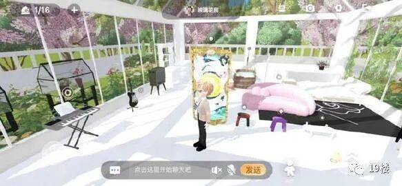
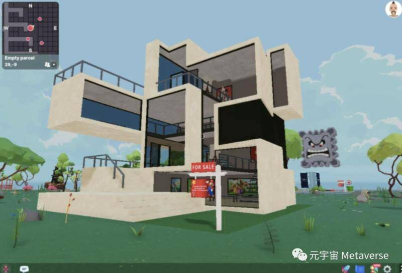

# 知名歌手花78万在“元宇宙”买了三块地！

如今，元宇宙成了最热的概念和话题

**连明星**也开始

**在**元宇宙里“买房”了

11月23日，歌手林俊杰在推特上宣布，自己买了Decentraland平台上的三块虚拟土地，正式涉足元宇宙世界。**他购买这三块“地皮”据估算花了大约12.3万美元，约合人民币78.3万。**

换个好理解的比喻，就是有人真的花真金白银在大富翁游戏里买了地，有可能会在上面盖房，也有可能会在上面开店。

之后林俊杰在推特上晒出了自己的地皮，并号召网友“有没有人一起？”

这或许也是个追星新思路：

**没钱和明星住在一个小区，**

**但可以想办法和明星买同一区的地皮。**

Decentraland是个啥？

Decentraland是一个在线的虚拟世界平台，在平台上购买“虚拟土地”之后，可以在上面建造自己的虚拟房屋，也可以建立自己的品牌，或者展示自己非功能性的游戏收藏。**总之，作为“业主”，你可以将这块地翻新成任何你喜欢的样子，后期也可以同真实的房屋、地皮一样，在开放的市场上转售。**

图片来源：Decentraland

花费将近百万在虚拟世界里买看不见摸不着的地皮，听起来不切实际，但总有你想不到的更高阶玩法。就在同一时期，**11月25日，Decentraland上的另一块地块以243万美元（约1552万元人民币）的价格售出——创下了元宇宙迄今为止购买最昂贵的虚拟房地产记录。**

这块地位于Decentraland地图的“时尚街”区域，被公开上市的公司收购，目的是经开发后用作时装表演和商业用途。这块土地由116个较小的地块组成，每个地块的面积为52.5平方英尺，整片土地相当于6090平方英尺（约565.7平方米）**。折算下来，Decentraland每平方英尺房价大约为400美元，而旧金山实体房屋的单价则为1200美元/英尺。**

**当然，也不止Decentraland一个平台可以购买虚拟土地，11月25日，另一块数字地块以约合2339.97万美元的价格在axy Infinity的虚拟游戏环境中售出。**这种像素风的画面仿佛梦回开心农场。

卖课、卖书、卖流量…

元宇宙已经开始赚钱了

元宇宙的热度可见一斑，

但尽管有的人已经开始

在虚拟世界里投资，

**有的人却仍旧需要花钱**

**才能搞明白元宇宙的概念。**

“元宇宙”概念的爆火，越来越多的“割韭菜”手段出现，有人叫卖元宇宙概念的付费培训课，有人将“杀猪盘”包装成元宇宙项目，还有很多如非法的NFT、区块链，以及杀猪盘也都披上了“元宇宙”概念的外衣。**现在市面上充斥着元宇宙还没到，割韭菜先来的荒诞场景。**
