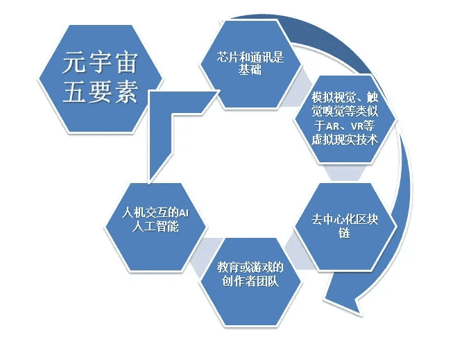

# 元宇宙概念股龙头 元宇宙上市公司

**元宇宙概念股有以下：**

- 芯片：全志科技、瑞芯微、北京君正。
- 显示：京东方A、深天马A、维信诺。
- 光学：蓝特光学、联创电子、水晶光电、欧菲光、蓝思科技、舜宇光学、联合光电、中光学、福晶科技、永新光学。
- 传感器：韦尔股份。
- 存储：兆易创新。
- 代工（ODM/OEM）：歌尔股份、闻泰科技、欣旺达、领益智造、鹏鼎控股、兆威机电、国光电器、长盈精密。
- 封装：晶方科技、环旭电子。
- UI/OS：中科创达。
- 技术支持：数码视讯、万兴科技、超图软件。
- 游戏：完美世界、宝通科技、盛天网络、中青宝、顺网科技、天神娱乐、吉比特、三七互娱、世纪华通。

**一、元宇宙概念股的定义**

元宇宙(metaverse)这个概念最早由美国科幻作家尼尔・斯蒂文森在1992年的小说《雪崩》中创造。元宇宙就是指虚拟世界的空间，会为用户提供丰富的消费内容和交互体验等等，对应国内云游戏、VR 等产业，是互联网的终极形态。而元宇宙概念股就是指与元宇宙概念相关的股票。

**二、元宇宙上市公司所属行业：**

1、元宇宙就是指虚拟世界的空间，会为用户提供丰富的消费内容和交互体验等等，国内的元宇宙的上市公司主要是做云游戏、VR 、5G、GPU、云计算、AI、算力与网络等一系列专业技术的公司，元宇宙是互联网的终极形态。

2、元宇宙是整合多种新技术而产生的新型虚实相融的互联网应用和社会形态，它基于扩展现实技术提供沉浸式体验，以及数字孪生技术生成现实世界的镜像，通过区块链技术搭建经济体系，将虚拟世界与现实世界在经济系统、社交系统、身份系统上密切融合，并且允许每个用户进行内容生产和编辑。

**元宇宙十大龙头股**

根据构建元宇宙的四大板块是：内容体验、交互方式、数据传输以及价值传输。十大龙头股：Roblox；Unity；动视暴雪；Facebook；Sony；微美全息；歌尔股份；舜宇光学；京东方。

**股票简介**

1. Roblox（RBLX.N）：是元宇宙概念股第一大股，游戏UGC平台；作为一个UGC平台，Roblox向玩家提供游戏的同时，还提供创作游戏的开发者编辑器，允许玩家自行制作游戏并且上传，并且还能与平台分成。之所以说这个平台是元宇宙概念的第一股，是因为实现元宇宙的畅想，一个公司或者是一个研发团队必然是力不能及的。而当游戏参与者也是游戏研发者，游戏平台由所有参与者共同搭建的时候，游戏才能够真正拥有海量的内容，趋近于真实的世界。
2. Unity（U.N）：是一家世界领先的游戏引擎公司，在苹果和谷歌商店，排名前1000名有超过50%的游戏都是用Unity制作的；可以用于创作、运营以及变现任何实时互动的2D和3D内容，支持的平台包括手机、PC、平板电脑、游戏主机、增强现实以及虚拟现实设备。
3. 动视暴雪（ATVI.O）：动视暴雪是全世界最大的游戏开发商以及发行商，拥有魔兽世界以及守望先锋等一系列顶级游戏IP。
4. Facebook（FB.O）：Facebook在2014年的7月宣布以20亿美元的价格收购了Oculus，Oculus公司成为了整个VR耳机市场的顶级的供应商，占据了整个VR市场的25.9％。
5. Sony（SONY.N）：是索尼电脑娱乐公司（SCE）推出的VR头显，PlayStation VR的出货量是42.9万部，市场份额是18.8%。
6. 微美全息（WIMI.O）：在2020年的4月1日，微美全息正式登陆纳斯达克，发行价是5.5美元，正式成为了“全息AR第一股”。微美全息的收入包括AR广告服务收入、AR娱乐收入以及半导体业务的收入。
7. 歌尔股份（002241.SZ）：是声学龙头，为Oculus和psvr提供精加工的服务。
8. 舜宇光学：是全球领先的综合光学零件以及产品制造商，在2007年的6月在香港联交所主板成功上市，目前，公司已经形成了手机行业、安防行业、汽车行业、显微仪器行业、AR/VR行业、机器人行业、工业检测行业以及医疗检测行业八大事业板块。
9. 京东方A（000725.SZ）：京东方可以提供VR/AR显示模组以及系统解决的方案，具有高画质、高刷新频率以及快速响应等特点，带来清晰流畅的虚拟世界的体验。
10. 维信诺（688127.SH）：是国内最高像素密度VR显示的技术。
