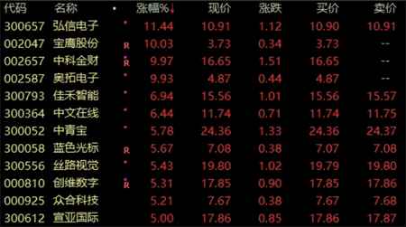

# 元宇宙概念股走势爆发 超跌龙头业绩持续高增长 

**腾讯重磅动作**

近期腾讯传来大消息。据报道，腾讯控股周一向其员工宣布正式成立“扩展现实”（Extended Reality，简称：XR）部门，正式将赌注押在虚拟世界的元宇宙概念上。据VR陀螺报道，腾讯官方证实了上述消息。

扩展现实，是虚拟现实（VR）和增强现实（AR）等沉浸式技术的统称，这些技术被认为是元宇宙的构建模块。事实上，早在2020年末，马化腾就首次强调了“元宇宙”的重要性，他将之称为“全真互联网”（all-real internet）。

互联网大厂进军元宇宙，不算什么新鲜事。去年底，脸书宣布更名Meta Platforms，引发A股市场元宇宙概念股大幅飙涨。这次腾讯的动作，也同样给A股元宇宙概念带来了“升机”。截至收盘，元宇宙概念股上涨1.71%，弘信电子涨逾11%，宝鹰股份、中科金财等个股涨停。

**超跌龙头业绩持续高增长**

政策也在支持元宇宙。6月15日上海发布元宇宙等四大“新赛道”投资促进方案，并表示将努力实现2025年全市3500亿元的元宇宙产业规模。实际上，自中纪委21年12月发文定调后，上海、三亚、厦门、广州、北京等多地政府已持续布局元宇宙赛道。

华泰证券认为，政府主导投资有望刺激需求，叠加下半年稳增长政策推进、疫情缓解，元宇宙行业有望健康发展，建议关注：定位元宇宙虚拟世界建筑师的展览展示龙头风语筑；数字虚拟人相关的蓝色光标、芒果超媒；投资虚拟现实产业链并上线元宇宙游戏艺术馆的三七互娱；VR/AR及工业元宇宙布局的宝通科技。

A股市场上元宇宙概念股有50多只，合计总市值近3万亿元。超跌低估值高成长股值得关注。数据显示，5家以上机构评级且今年、明年及2024年机构一致预测净利增速均超20%的个股中，有12只个股预测市盈率低于30倍且最新价较近一年高点跌幅超过30%。
