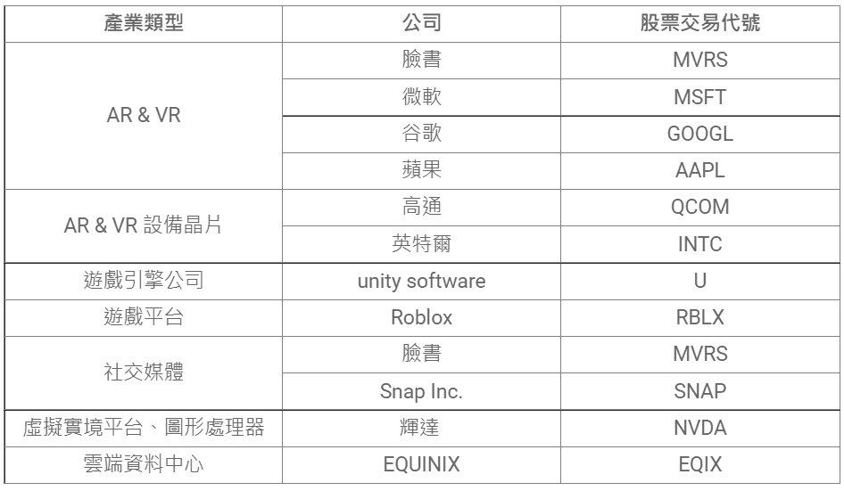

# 元宇宙概念股上市公司 元宇宙概念股美股

随着元宇宙概念的持续升温，国内外的元宇宙概念股也在持续上涨，频频传出利好消息，这与各大科技巨头对元宇宙的关注离不开关系。

### 元宇宙产业趋势：科技巨头和「元宇宙」关系？

**趋势 1：转型发展元宇宙，「脸书 Facebook」正式改名**

已成立 17 年的脸书（Facebook），在 2021 年 10/28 的年度开发者大会上正式宣布将公司名称改为「Meta」，还计划未来 5 年在欧盟招募 1 万人，协助建构「元宇宙」。由此可见 CEO 祖克柏（Mark Zuckerberg）正把经营目标放眼「元宇宙」发展。
另外，还将斥 5,000 万美元投入延展实境计划与研究，并测试虚拟现实会议程序「Workplace」，及社交空间程序「Horizons」。在设备方面，收购了 VR 开发商「Within」，同时将抛弃 VR 设备品牌名称「Oculus」，预计以 Meta 的名称来取代。

**趋势2：「辉达」自建平台抢元宇宙商机**

辉达（Nvidia）自建一个连接 3D 虚拟世界的平台「Omniverse」，用途包括图像、建筑设计等。公司期盼让各界艺术家将来都能用 3D 动画工具来创作。
凭借着技术实力，在 AI 算法、资料中心、云端运算等领域发展多年，辉达近年获得市场青睐。周五（11/5）盘中股价狂飙至 314 美元，写下历史新高价，终场涨幅 16.37% 至 297.52 美元，市值冲上 7438 亿美元，成为美国市值排名第 7 大的上市公司。

**趋势 3：虚拟结合现实，游戏公司搭热潮**

美国电子游戏开发公司 Epic Game 融资 10 亿美元，将用于拓展元宇宙相关业务，旗下游戏《要塞英雄》扩充内容（e.g. 允许用户影音聊天、虚拟世界里办演唱会）
此外，其他游戏公司象是游戏创作平台 ROBLOX、跨平台的游戏引擎 UNITY、云端运算软件公司 Autodesk 等公司，也纷纷投入开发游戏设计或虚拟世界软件，也可望跨足元宇宙。

**趋势 4：元宇宙商业化，「微软」将推新软件**

微软 11/2 宣布将推出元宇宙相关的商业应用，目前新版视讯会议软件「Mesh for Microsoft Teams」处于测试阶段，预计明年上半年推出。软件允许用户使用 3D 虚拟替身开会、互动、做 PPT、Excel 等简报、共享 Office 档案等。可透过自家的头戴式装置「HoloLens」体验扩增实境（AR）和虚拟实境（VR）。
而 CEO 纳德拉也看好元宇宙商机，认为每个实体世界的事物，将来可能会有「数位双胞胎」，不过他也提到，虽然商业应用可望成真，但元宇宙能真正落实在日常生活应用还遥远。

**趋势 5：头戴式装置上市，「宏达电」拚再起**

曾创下股价 1,300 元台币辉煌纪录的宏达电，在手机部门的市占率逐渐被取代后，股价也从巅峰一路走上爆跌的命运，最终 2017 年出售手机代工部门给 Google。2015 年宏达电开始将发展重心转至切入 VR、AR 领域。
近年来，随着 5G 世代来临，更加速串联整合 AR、VR 与 AI、区块链技术，坚定迈向虚拟实境的愿景。10/15 宣布推出重量 189 公克，能折叠收纳的虚拟实境头戴装置「VIVE Flow」，并于 11/1 上市，结合 Android 手机使用情境，同时提供完整 VR 应用内容。宏达电的股价一路从 35.7 元涨到最高价位 74.8 元，涨幅逾 100％，也带动台厂相关的供应链商机。

### 元宇宙概念股美股有哪些？

除了上方提到的微软、脸书、辉达外，还有哪些美股元宇宙概念股？整理于下表提供参考：

