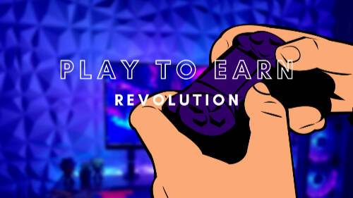
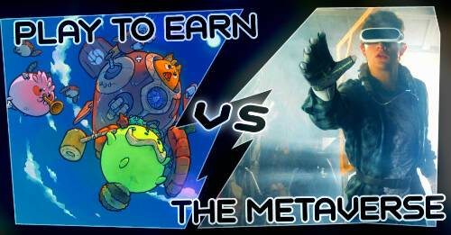
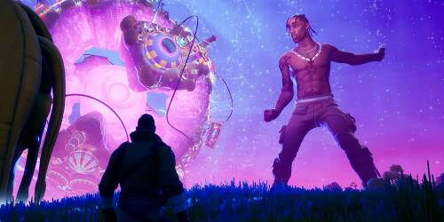
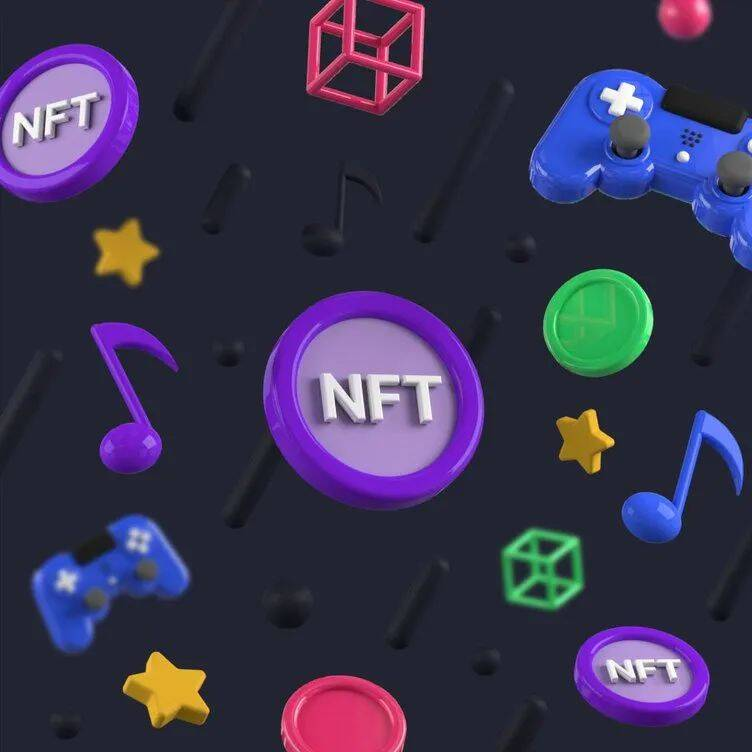
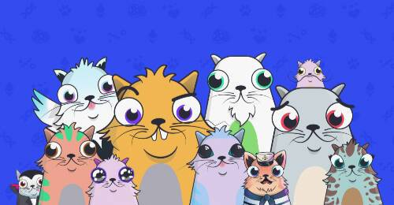
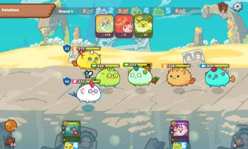
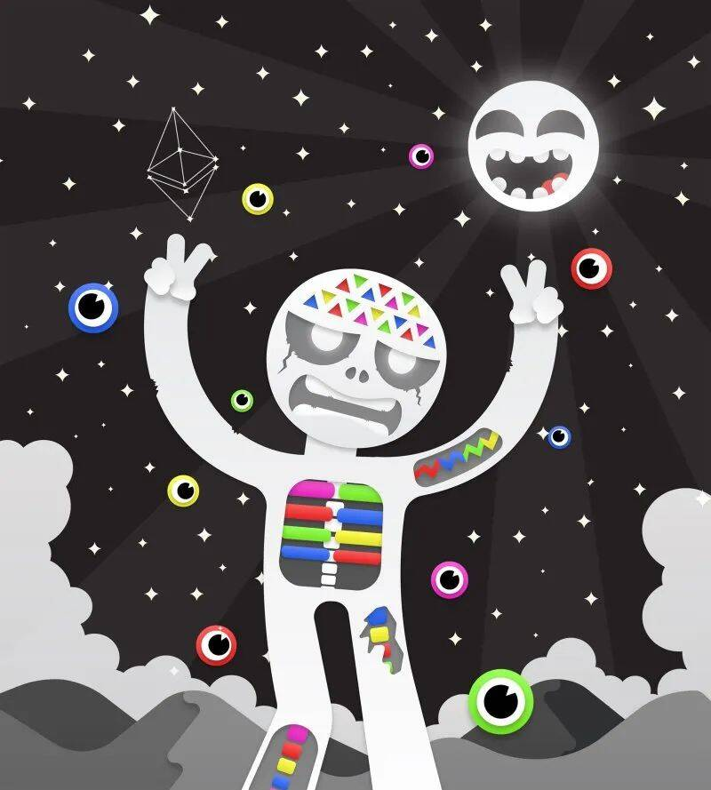

# 2022年元宇宙游戏：搞钱和玩游戏真的可以全都要？

打游戏可以赚钱？

也许对于百分之九十的玩家来说，这两件事如同爬山与举重，倒也不是不能一起做，只是未免太难了些……赛道的局限加上游戏本身难以预测的寿命，没有谁想做把气球吹破的那个人。

但是现在，有人说：

“未来，游戏公司为玩家付费将成为游戏行业的标准收益模式，玩游戏将成为低技能劳动力的重要收入来源；游戏工资将是富人的极端收益流向穷人的主要手段。”

#### 最后一块拼图

把时钟拨回 2008 年，当金融危机又双叒席卷全球，人们对传统金融体系和银行机构的质疑达到高峰。

同年 10 月 31 日，中本聪在“metzdowd.com”网站的密码学邮件列表中发表了一篇论文，题为《比特币：一种点对点式的电子现金系统》。在论文中，他为金融危机提供了颠覆性的解决方案，让数字资产和区块链技术走进了人们的视野。

很难想象这篇论文的影响会如此深远。十多年后的今天，吸引了无数人眼球的元宇宙因为这篇论文得以实现：区块链发展至今，终于为元宇宙补上了最后一块拼图。

元宇宙整合了拓展现实、数字孪生、区块链等技术，以保证每一个用户都能“生活”在这个平行于现实生活的虚拟世界。区块链正是其中最核心的底层技术，也是这一切的基础，它的出现为虚拟与现实建立双向通道，让“虚拟世界”变成了可以与现实映射、交互的“平行宇宙”。

一切准备就绪，元宇宙的闭环已然形成。紧接着，它需要一个应用场景，一个“落地”的领域，于是无数人的目光投向了游戏行业。

#### 从链游到元宇宙游戏

在元宇宙游戏之前，区块链早已涉足游戏领域。区块链游戏（gamefi，简称链游）打出“play to earn”（P2E）的旗号，在传统游戏行业掀起浪潮。

“P2E”游戏中的代表作品：Axie Infinity

游戏经历了商业形式的迭代，从售卖游戏软件，到付费游戏，再到免费游戏。而加密游戏阶段，则是 P2E 的形式，即玩游戏能够赚取收益。

最早的链游可以追溯到 2017 年的 CryptoKitties（加密猫），玩家可以购买、交易和繁殖可爱的数字猫,游戏给每只小猫都设置了 256 组基因和一些隐性基因，以确保每只猫都是独一无二的。基于区块链技术，所有玩家都可以自由交易自己的数字喵咪。

这款游戏很快引发热度，吸引了无数用户涌入，上线仅一周就产生了近 3.5 万次交易，数字猫咪的均价曾高达 117.5 美元。但很快，玩法单一的加密猫就过气了。

取而代之的是第二代链游 Axie Infinity。这款类似精灵宝可梦的游戏由越南游戏开发商 SkyMavis 推出，立项于 2018 年，此后沉寂了两年多的时间，却在 2021 年一跃成为最热门的 NFT 游戏之一。

在疫情的冲击下，Axie Infinity 已经成为许多菲律宾民众养家糊口的工具。Axie Infinity 宣称每天两小时左右的游戏时间可以带来 500—750 美元的月收入，这比当地的最低工资标准要高出两三倍。据媒体统计的数据显示，访问 Axie Infinity 官网的 IP 有超过 20%来自于菲律宾。

国内大厂也纷纷想要上车，自 2017 年以来网易、百度、腾讯等公司先后推出链游项目，但受限于环境的管控最终不了了之。

**那么元宇宙游戏与链游又有什么联系？** 

链游最大的弊端不外乎其游戏性太差。对于如今的游戏玩家来说，链游简单甚至枯燥的游戏内容实在令人兴致缺缺，被吸引来的用户大多是以赚钱为目的的投机者。在很多玩家和游戏行业从业者眼里，链游根本称不上是游戏。

再加上“边玩边赚”这不符合大众印象的口号、虚无缥缈的概念与币圈频出的负面消息……一切的一切总让人怀疑这是什么新型骗局。当然，最重要的原因还是隐约藏于云间的达摩克利之剑——谁也不知道什么时候就会被监管之锤打得血本无归。

但区块链技术无疑具有与游戏结合的优势特征。在NFT诞生之前，绝大部分游戏厂商都把游戏账号设置为“使用权”，该账号的玩家并不是这个账号的主人。

“腾讯起诉 DD373 平台索赔四千多万”一案中，腾讯方表示：DNF（网游《地下城与勇士》） 玩家的游戏币、装备与角色本身都归腾讯所有，玩家无权私自进行交易买卖。

而区块链技术的引入，不仅可以确保玩家资产的所有权和流通，且能有效解决游戏数值膨胀问题。

以区块链技术为“地基”打造的元宇宙世界在继承了区块链技术应用于游戏的优势之后，整合了拓展现实、数字孪生等技术，无疑可以实现更为优质的游戏内容。对于很多人来说，他们对于元宇宙的印象正如电影《头号玩家》中呈现的“绿洲”那样，是一个足够广阔、真实而又天马行空的游戏。

电影《头号玩家》中的“绿洲”

没有玩家能拒绝跨越屏幕，亲身走进 GTA、巫师系列的世界中，体验幻想人生的诱惑，更何况是玩家在游戏里买的跑车可以“开进”现实，打造的武器可以换成真实货币的情况下呢。
