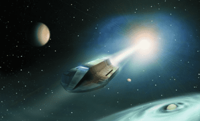

# 元宇宙游戏开发一款需要多久。《元宇宙》：元宇宙的“航行图”是什么？

2020年是元宇宙时代，大伙儿早就开始关注第三代大数据技术——元宇宙的卓越社会转型升级。

元界（元宇宙世界）是一个大家都会参与的数据信息世界，将来，每个人的日常生活、娱乐游戏、社会媒体、工作中都将在世界中展开。该书给读者提供了一幅元宇宙的“航行图”，不仅讨论了企业如何应对元宇宙的转型升级指导方针，而且还探讨了在元宇宙阶段的职业发展和创业机会。

另外，书中结合目前全球范围内对元宇宙的重大突破、企业形象惟妙惟肖，通过对未来展望的视角，对元宇宙发展趋势的发展趋势进行了深入分析。对读者来说，正确看待行业发展趋势，寻找机遇给予了很好的指导。目前我们团队致力于元宇宙游戏的发展，当下来说链游作为元宇宙的前身，我们这边技术目前来说是已经相对成熟，很有潜力。

在游戏研发方面，元宇宙的要塞与手工艺、程序流程、规划三个层面相匹配。移动游戏提倡的是虚幻世界，从这个角度来看，元宇宙和游戏具有一定的同质性。但是，元宇宙已经渗透到人们日常生活的方方面面，不仅仅局限于手机游戏；元宇宙对于手工艺、程序流程和计划规划提出了更好的规范，更接近真实世界。

在这个阶段，元宇宙看起来和云游戏平台比较接近，所以游戏股上涨了一些，但其实元宇宙是个很大的定义。元界，通常是每个人在工作中的一段时间，一般叙述都是指在虚幻的太空中长期存在、共享的三维网站空间。

“元世界”并非全新定义，它更像是对经典的更新，是在扩展现实(XR)、区块链技术、云计算技术、数字孪生等新技术应用下的定义具化。

作为一种多项电子信息技术的综合应用，元宇宙场景从定义到真正正向落地式必须完成XR、数字孪生、块链技术、人工智能技术等单项工程技术的提升，从来不一样层次完成立体视觉，深层沉浸，虚似分身等元宇宙运用的基本作用。

如今，元宇宙还处于市场经济发展的产业体系中，这也代表了元宇宙相关产业链可延伸的室内空间，也被创投圈视作新的出风口。““宇宙”也变得虚幻(VR)，提升(AR)，拓展现实(XR)产业链较大的应用利好消息。

长期以来，“元宇宙”这个概念都只存在于文学和影视剧之中。这个术语Metaverse最早源于1992年的幻想小说《雪崩》。

近30年来，“元宇宙”这一概念已经在黑客帝国“头号玩家”“西部世界”和“模拟人生”等影视剧中得到了一些体现。

随着技术的进步，越来越多的领域接受了对元宇宙的定义，同时对元宇宙定义在不同领域中的介入和落地式进行了催化反应。Metworks概念出现之前，5G基础设施建设，用于移动智能终端显示器、AI集成ic等技术迅猛发展，与此同时，工业物联网、互联网经济、数字孪生、VR手机游戏等也在不断完善。而且当元宇宙概念出现之后，就能很好地运用并充分发挥自主创新的技术特性，把智能引导到深层。

回顾20年来，互联网技术早已深刻改变了人们日常生活和产业结构；展望20年后，元宇宙将更广泛地危害人类社会，重构数字经济的管理体系。中国的元宇宙通向真实与虚幻世界，是人们数字化生存传递的媒介，提高感觉与高效，延伸了想象与想象空间。西西弗斯的网站称，玩家可以建造终极主题公园、作为职业赛车手参加比赛、在时装秀中出演明星、成为超级英雄、或者只是设计一个梦想中的家，和朋友一起出去玩。开发者可以依靠Roblox提供的游戏引擎开发游戏，并发布到Roblox平台，供玩家游玩。由于游戏开发难度极低，开发者就算不会编程也能做一个简单的小游戏，因此吸引了大量小型开发者。

历史的发展总是惊人的相似，从游戏历史上第一款电脑联机网络游戏的诞生，让全球无数玩家为之疯狂，再随着技术的迭代，由3d类的游戏更是让体验感欲罢不能，当下的元宇宙游戏更是把游戏内的经济体系社区化，从传统的游戏开发商独裁管制，参与游戏的玩家通过充值把金钱通通让游戏开发商赚走，让游戏开发商赚得盆满钵满。在元宇宙游戏的诞生，已经进化到让游戏内玩家自治的演变过程，让无数玩家都可以参与到这财富盛宴中。这是一次史无前例让普通人进行阶层跳跃的一次不可错失的良机。

首先，MPC公链的模块设计能让开发者低成本、高效率地进行DAPP开发。通过部署便捷的插件，开发者无需在底层技术上花费过多的精力，只需将团队的创意和想法通过简单的程序语言，桥接在MPC公链即可推出全新的DAPP。

游戏开发商盈利的持续转变是这一增长的关键动力。越来越多的玩家放弃了付费游戏，转向免费游戏。开发者通过向玩家出售游戏内道具来盈利，以提高在这些虚拟世界中的游戏玩法和社会地位。

如今，许多游戏玩家在Web2.0封闭的企业元宇宙世界中花费了他们的⾦钱和时间来积累数字财富。Web2.0的问题是，⼤多数游戏开发⼈员不允许玩家将他们的投资和努⼒货币化。开发者禁⽌玩家与其他玩家交易物品，并关闭这些世界，使得玩家⽆法将其游戏内财富转移到实体经济中。

游戏只是价值已经开始⾃然转向Web3.0的最直接解决的部分之⼀，但是元宇宙的机遇不仅仅局限于游戏领域。元宇宙估计是数万亿美元的收入机会，涉及广告、社交商务和数字活动、硬件和开发者/开发者盈利。

针对下一步规划，Roblox宣布，将投资1000万美元开发三款面向初中、高中和大学学生的教育类游戏，把教育视频游戏植入到学校教育当中。公司此次布局主要在于继续为该公司的元宇宙战略扩大用户基础。

针对元宇宙应用的核心痛点，MPC希望构建一个高性能、高可信、高安全的元宇宙协同空间，扫清人们进入元宇宙的障碍，帮助开发者、游戏爱好者、艺术家、KOL在区块链上轻松创建有价值的内容，并与任何人发生互动从而获得收益，最终推动元宇宙大规模应用。

字节跳动此前以近1亿元投资“元宇宙”游戏开发商代码乾坤布局元宇宙；近期近期表示其业务布局跟元宇宙概念没有关系。不过，Pico依然提交了“Pico元宇宙”商标的注册申请。对此，字节跳动产品和战略副总裁朱骏如表示，相关商标的注册，主要是为了防止Pico品牌被抢注用于“元宇宙”概念炒作，属于保护性注册。

游戏参与者经济：元宇宙游戏里的体验和内容需要持续更新、不断降低创作门槛，并提供开发工具、素材商店、自动化工作流和变现手段，其中的高度自由开放的经济体系得以让我们参与到当中来发掘财富。
