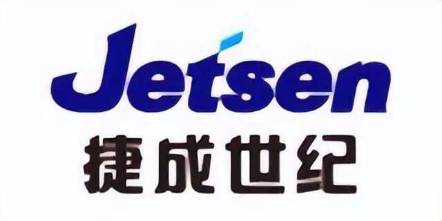
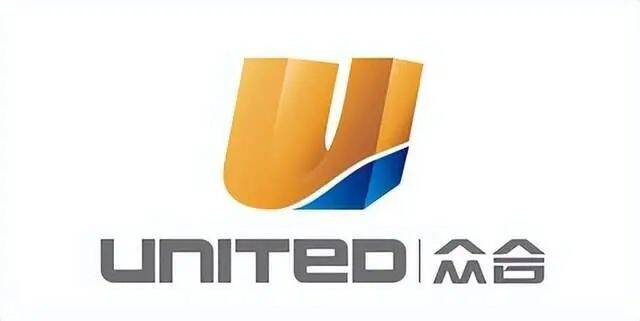

# 元宇宙概念股有哪些股票？被低估的3大元宇宙概念股，主力吸筹85亿，有望翻倍！

中国移动通信联合会发布消息，2022年全球元宇宙大会8.18—19日将在上海举办。大会协同上海元宇宙发展战略规划，将重磅发布《元宇宙世界宣言V1.0》及《元宇宙产业计划V1.0》等五大产业助推计划，启动元宇宙产业基金，协同上海科创带动力，加强关键核心技术攻关，抢占未来产业新高地。

元宇宙概念股板块刚刚落地，板块就迎来大幅上涨，是9月份以来最火的一个板块，板块内个股动不动就掀起涨停潮。前一段时间元宇宙概念股板块随大盘一起调整，调整幅度也比较大，大盘触底后，元宇宙概念股板块连续发起进攻，一度时期又掀起了涨停潮。在大盘加速上涨的这段时间，元宇宙概念股板块却早于大盘开始了调整，又一次消化了获利盘，受利好消息刺激，下周这个板块或将迎来大幅上涨。

**捷成股份**

公司参股世优科技，世优科技官网内容显示是一家致力于快速动画技术（AR&VR）研发与应用的科技公司，提供虚拟IP打造业务。公司是一家专业从事新媒体版权运营、影视内容制作与发行、音视频技术服务和数字教育云平台建设的企业。公司主要产品包括媒体资产管理系统解决方案、高标清非编制作网解决方案、全台多元异构一体化网络解决方案和全台统一监测与监控解决方案。

**众合科技**

公司主要从事智慧交通及泛半导体业务。智慧交通领域的主要产品为全自动列车运行控制系统、自动售检票系统、列车智能化、综合智能运维、智慧工务、时空大数据平台等。公司发布的一苇数智平台在技术层级架构和工业元宇宙相匹配，目的都是为了提高实际工业生产的效率与效益，总体技术特点上契合，可以看做是工业元宇宙在轨交行业的探索者和实践者。一苇数智平台为用户提供了大数据服务、图形化开发引擎、智能算法仓、以及全景可视和数字孪生等功能，致力于实现城市轨道交通业务的敏态化、平台化和服务化。

**中文在线**

 借助5G、AI、AR/VR等技术的发展，公司的沉浸式互动阅读将会借助技术的赋能加速延展，构建一个互动性更强的平行世界。作为数字内容公司，本质是生产内容、打造IP、连接人群、丰富娱乐、学习和社交。文字创作和阅读仅存在于2D，但随着元宇宙的到来通过AR/VR等技术可以让人沉浸式体验新世界，而公司拥有海量的库存将会有力地支持构建平行的互动阅读世界。

