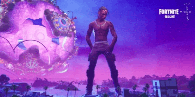

# 元宇宙——另一个精彩世界

想象一下，若干年后，你戴上VR眼镜，进入一个数字世界。

在那个世界中，你身强体健、英俊潇洒，有美若天仙、容颜不老的女朋友作伴。你们一起看电影、逛公园，参加各种聚会，还可以去虚拟的商场购物，而所购商品会被送往现实的家中。

听起来像做梦，其实不然，这个数字世界就是元宇宙。元宇宙既不是一个平行世界，也不是完全的虚拟世界，它是现实和虚拟的结合，是一个与现实世界相互连通、各自精彩的世界。

元宇宙基于虚拟现实技术，提供沉浸式体验，并通过相关技术生成现实世界的镜像。它是一个永不离线的数字空间，人们可以聚在一起互动和交易。

电影《黑客帝国》、《头号玩家》、《失控玩家》等都能让我们发现元宇宙的影子。

元宇宙的最佳切入点是游戏，因为游戏天然拥有娱乐属性、用户互动、充值交易等丰富的虚拟场景。

2020年4月，美国说唱歌手Travis Scott在游戏《堡垒之夜》中举办了元宇宙演唱会，同时在线玩家超过1200万。这种沉浸式虚拟演唱会通过不断强化玩家的在场感，使玩家更加清晰地感知到与其他玩家、演出嘉宾的连接与共鸣，从而大获成功。

2020年夏季，加州大学伯克利分校的学生在游戏《我的世界》中举行了毕业典礼，其中有校长致辞、扔帽、礼成等环节。除了毕业典礼，学生们还可以浏览学校，欣赏游戏中的美景风光。

2020年美国的ACAI科技大会选择在游戏《动物森友会》中举办。在会议开始前，所有的参会者提前飞到了主持人的小岛上，并进入主持人的房间做演讲准备。休息期间，参会者还可以参观其它岛屿，讨论不同的主题。

**元宇宙的发展，还催生了各种新兴职业，比如“捏脸师”、“服饰师”、“建造师”等。在淘宝上，好的捏脸师月入十万以上。** 

元宇宙既然是真实世界的镜像，自然也拥有用户身份、社交、经济与文明等特性。它不仅是对移动互联⽹的延伸，更是对⼈们⼯作，社交，娱乐等⽣活⽅式全⽅位的变⾰。

然而，想要实现产业化还有很长的路要走，因为元宇宙的发展还存在法律风险、技术限制和基础服务设施不足等诸多问题。

2021年被称为元宇宙的元年，微软、Meta、腾讯等各大企业均已布局元宇宙，元宇宙产业将迎来腾飞，期待另一个精彩世界早日诞生！
