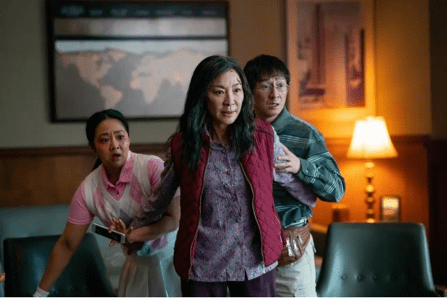

# 全球票房超7800万美元 这部“元宇宙电影”能带来新风口吗？

若要票选近两月最具热度的电影，《瞬息全宇宙》一定榜上有名。

由独立电影公司A24制作、杨紫琼主演的《瞬息全宇宙》自3月底上映后便迅速冲至电影圈头排位置，票房口碑双丰收。据Box Office数据，截至6月5日，制作成本仅2500万美元的《瞬息全宇宙》全球票房已超7800万美元，位列2022年全球电影票房榜第19位。

在关于这部电影的讨论中，多元宇宙的设定无疑是被津津乐道的一点。同时，被冠以“元宇宙电影”的标签，电影似乎也拥有了更多的讨论空间。

元宇宙并非该片的开创性构思，漫威电影等就常用这一设定。《蜘蛛侠：平行宇宙》和《奇异博士2：疯狂多元宇宙》等作品均以此为核心展开叙事。即使是元宇宙概念，《头号玩家》《失控玩家》等也已率先试水。

当下，元宇宙概念风头不减，电影产业能从中汲取什么？6月5日，北京文化产业投融资协会电影专委会秘书长朱玉卿接受《每日经济新闻》记者微信采访时表示：“技术理念创新很好，但只是一方面，就像《阿凡达》曾带火3D，后来的3D电影少有超过它的。对电影而言，技术只能改变局部，改变不了电影讲故事的根本属性。”

## “元宇宙”标签只是一个吸引点

在杨紫琼身上，始终离不开她的“打星”标签格外亮眼。

作为华裔女星中闯荡好莱坞的代表，杨紫琼受到过好莱坞的认可，也有过荣誉时刻。但在《瞬息全宇宙》之前，她一直没能在一部好莱坞电影中担纲绝对主演。这和其身上瞩目的“打星”标签不无关系。在现实世界中，杨紫琼30多年来享受着这一身份的光环，也时刻承受着其所带来的局限性。

该片原定的主角并非她，而是成龙，但“因缘际会”之下，导演转变思路，重新将剧本为杨紫琼进行了量身打造。

片中，杨紫琼饰演的主人公是位美国华裔移民，中年时家庭事业双双陷入危机，她却意外获得了在多个平行宇宙间来回穿梭的能力，影片叙事也随着她的旅程穿插交互。她突然发现，自己的人生似乎拥有无限可能，甚至可以拯救世界。

讨巧的结构设定只是吸引观众进入电影的一把钥匙，如何让观众在跟随主角穿越不同宇宙时保持沉浸感和内容体验的连贯性，剧本的扎实度和演员表演的丰富性才是“宫殿”。

朱玉卿认为，形式只是表面的，要想吸引观众走进影院，电影方首先得向观众表达一种诚意。“这个诚意就是内容端的创新。要让观众能对内容产生共鸣，这是核心。单纯想指望技术和形式创新吸引观众，解决不了根本问题。”

就《瞬息全宇宙》而言，观众的好评也验证了这一点。社交媒体上对于该片的赞誉大多集中于剧情内容和演员表演。

虽然该片被冠以“元宇宙”标签，但在朱玉卿看来，元宇宙对于观众而言只是一个吸引点。“概念性的东西都是辅助，属于锦上添花，做不到雪中送炭。电影产业的雪中送炭还得靠创作端和制作端。”

或许杨紫琼本人愿意出演这样一部设定复杂、概念性强的小成本电影，正是因为她看到了《瞬息全宇宙》在创作端的“雪中送炭”。

在接受杂志媒体采访时，60岁的杨紫琼动情地说：“当我读剧本的时候，我想这就是我等了太久的角色。我终于有机会向我的观众和家人展示我的能力，那就是我也可以搞笑、真实、悲伤。终于有人明白我也可以做到这一切。”

## 《阿凡达》的成功不只是3D，元宇宙不是电影救世主

元宇宙火爆之下，营造虚拟内容产品的电影，也被视作发挥元宇宙想象力的一大领域。

《头号玩家》的全民热议，《瞬息全宇宙》的黑马式成功，似乎都验证了元宇宙与电影能够创造出新的价值和市场。

朱玉卿并不否认概念创新和技术创新的重要性。他表示：“我觉得非常好，就像当年3D创新引起了电影的一场革命，元宇宙概念也很有吸引力。”

提及3D电影在国内的兴起，便绕不开《阿凡达》。2009年，耗资近五亿美元的3D电影《阿凡达》横空出世，随后便被引入国内市场，奇幻的设定和精妙的内容点燃了观众的热情，也刺激了一众院线负责人，随后国内的3D银幕数量迅速增加。

随后，《少年派的奇幻漂流记》《地心引力》延续了3D电影的火热。在这之后，3D似乎成为大制作电影的技术标配。但除非物超所值，观众并不会心甘情愿购买更贵的3D电影票。例如，去年一些影院只提供3D版《沙丘》就曾引起众多观众不满。

看来，电影创作团队的内容制作如果不达标，把粗制滥造的电影投放进市场，某种程度上其实是在“得罪”观众。“观众一看电影都这么差，可能就不愿意进影院了。”

元宇宙之于电影的价值之所以被广泛讨论，或许离不开当前电影市场面临的困境。

自3月中旬起，全国多地影院出现休市。多部国产电影撤档，票房收入锐减。随着疫情防控态势走向平稳，复工的院线却面临着“缺片”的尴尬。

以刚刚结束的端午档为例，全国3天累计票房约1.79亿元，仅有《暗恋·橘生淮南》《夺宝联盟》《遇见你之后》三部新片上映，降低了观众进影院的期待值。

“从票房走势来看，说明观众对观影还是有需求的，但内容没那么有吸引力，所以后续就不去了。电影业当前的核心问题是疫情防控常态化之下，电影市场缺乏有吸引力的优质内容。”朱玉卿称。

回到由《瞬息全宇宙》引起的元宇宙电影讨论的话题，朱玉卿认为，技术一定是锦上添花。“就像《阿凡达》之后虽然出现了很多3D电影，但基本没有超过它的。所以我认为元宇宙也一样，它只是技术创新，最终电影想要吸引人，还得要靠故事、人物和情感。”
