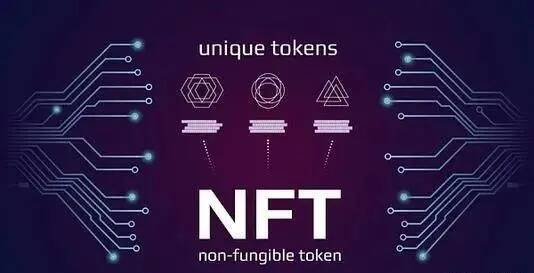

# 元宇宙卡牌盲盒游戏开发

随着元宇宙概念的逐步完善，元宇宙链游概念也逐步兴起，早在去年十月以后，链游这边便开始已经火了一波，链游作为元宇宙的一个重要的门户，可以这么讲，链游就相当于一个小型元宇宙，去年我们团队就有帮助一些海内外客户这边去开发链游项目，所以对元宇宙链游项目这块目前来讲的话经验还是蛮丰富的。

元宇宙链游系统开发，元宇宙链游软件开发，元宇宙链游模式开发，元宇宙链游dapp开发，元宇宙链游平台开发，元宇宙链游系统定制，元宇宙链游源码开发，元宇宙链游系统源码。

一般来说，链游融合了元宇宙室内空间设计的界定，因而务必更为关心下列主要作用：虚拟现实、企业品牌形象、社交媒体作用和更强的游戏互动。因而，与其说是将宇宙空间元室内空间设计视作链游发展前景的几率，初始元宇宙室内空间设计的情形很可能是将其视作信息新闻媒体的必要性，进而使游戏开发商与消费者中间有越多的沟通交流，进而进行初始元宇宙室内空间设计的状况。

总而言之，我们可以预测分析，元宇宙室内空间设计与链游戏中间的互相影响将更为紧密，这两个室内空间设计很可能一同推动NFT全产业链的扩大。

从开发商的营运能力看来，不论是拷贝的道具或是售卖的点卷，民间游戏都彻底由开发人员控制。玩家可以网上充值，游戏玩家可以为开发人员挣钱付钱。

在链游设计开发中，开发人员的盈利来自于玩家交易手机游戏中资产导致的额外的花费。区块链应用链游戏的全部的游戏资产全是由玩家造就的，而Token的升值取决于玩家的总产量和她们主题活动中的行为。链游开发人员和玩家尽可能和谐相处，链游全球是nga论坛操纵的方法。
