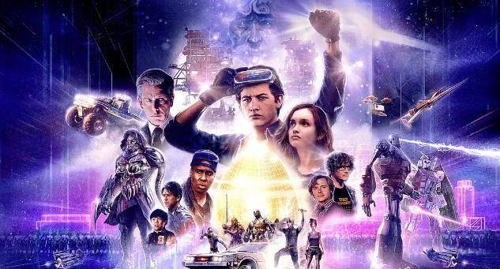
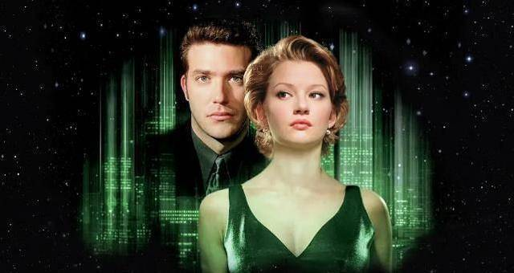
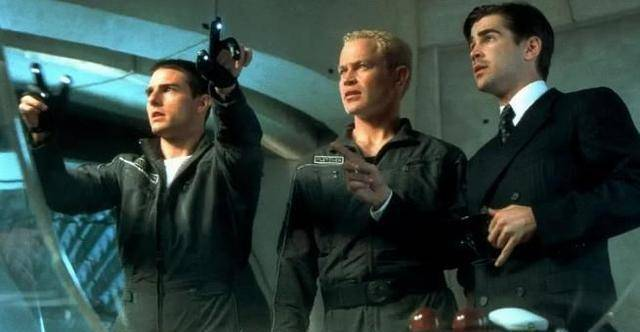
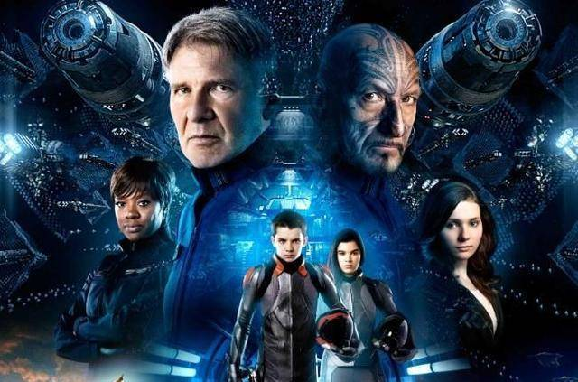
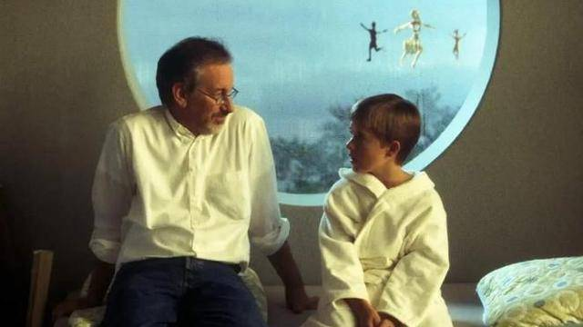
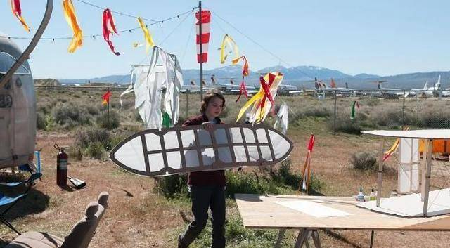

# 十大“元宇宙”电影，震撼又美丽，虚拟世界很棒 

1、《头号玩家》

《闪灵》那一段真的是想起了一些不美好回忆，作为如今大火的“元宇宙”的前身，生动的揭示了在另外一个平行世界里我们是如何存在的。虚拟世界很棒，拯救人类也很棒，只要你想要的都有，主要还是要看你的想象能力咯。不能沉浸在虚拟世界，现实世界才是最真实的，不是么？

2、《阿凡达》

无比震撼又美丽奇特的世界，快三小时的电影一点都不冗长，我完全沉浸在故事里了。战斗场面热闹和精彩，但谈不上震惊，整体只能说，整体符合预期，这是它的优点，但没有意想不到的亮点是它的遗憾之处。开头真的不尽如人意，故事美但不完美。

3、《异次元骇客》

故事简单细节粗糙，玩的是概念。作为二十年前的电影很精彩，可能这期间电影套路改变很小，看了个开头就猜到结尾了。虽然这样的题材在多年后已经很常见，但在1999年这样的idea还是挺吸引人吧并且会被后来的片子借鉴。

4、《少数派报告》

当我们知道未来的时候，未来就已经改变了。阿汤哥的电影质量都很高，所描绘的未来世界和悬浮汽车还有垂直公路，蜘蛛机器人都让人大开眼界，特效做的很真，剧情也是脑洞大开，很难想象这是02年的电影。软科幻影片，剧情反转为悬疑片。

5、《失控玩家》

爆米花电影，但里面的游戏设定还是很新颖，NPC自我意识的觉醒，没有人甘愿被设定，没有成长，只愿意陪玩家高兴，每个人都是主角。分不清虚拟还是现实。少有的一部各种元素喜剧爱情动作剧情都触我心弦的电影，在大屏幕上观影会更具有视觉效果和代入感。

6、《安德的游戏》

电影看过，印象还很深刻，尤其是前半段。他们在太空训练的那个失重的大圆球空间太帅了，想玩。这个干瘦的小男孩，主角光环加身，成立了自己的飞龙队，训练学校战无不胜了。原著看到最后发现一切都是真实的，感觉很震撼。电影没有交代出为什么孩子要玩个游戏，小时候看了之后只觉得主角很帅，看了书才发现这么多故事。

7、《超体》

关于大脑和生命纬度的思考是这部电影最引人入胜之处。可以当做一次人类的脑力开发到100％后会发生怎么样的剧情无限畅想，剧本没有多么繁琐，主要为了看个爽，斯嘉丽演的女主也还不错。看过好多遍了，反正我觉得挺好看的。

8、《人工智能》

很难想象这是20年前拍的科幻电影，拍的太好了。有点太煽情。坠入海底可以的一遍遍说no，一遍遍对着雕像祈祷，很孩子气。正如电影海报所展现的那样，爱是真真正正的核心，不管你是机器人或者有血有肉的大活人，首先并没有丢失那份心。

9、《感官游戏》

本片依旧柯南伯格味十足，冰冷迷离。有趣的是对于游戏中科技的展现，器官组成的科技道具，这一点我估计直接启发了《蔑视》这个游戏的开发设计。盗梦空间般的层层现实感，对游戏形式和影响有非常大胆的展望和思考性，很难想象这竟是一部这么早的片子。

10、《未来学大会》

动画和真人部分其实结合的不好。动画部分有点像今敏，但我觉得可以做的更cult，现在有点不够。看到一半时觉得剧情断裂，知道罗宾选择回到现实世界时，才知道这个反乌托邦式的寓言之震撼——她最终选择了幻想，但却是回到曾经拥有的生活。

**十大“元宇宙”电影，震撼又美丽，虚拟世界很棒！**
