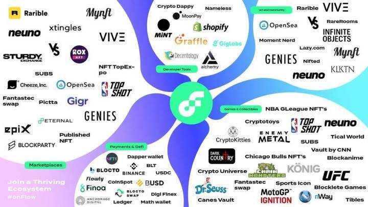
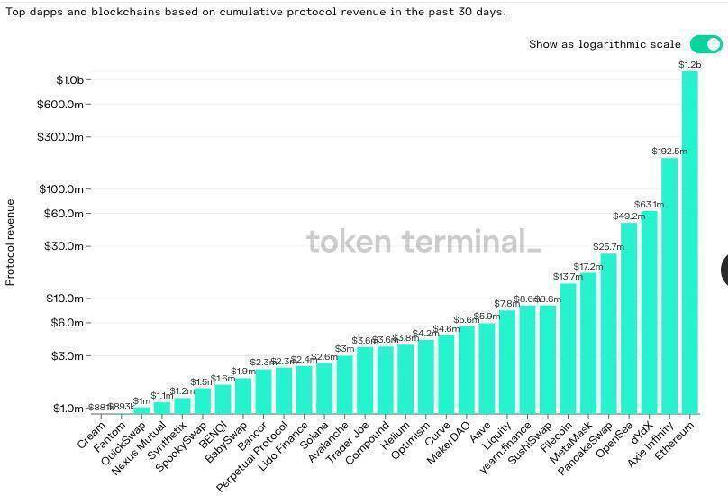

# 从底层到应用，一文纵览热门元宇宙概念区块链项目

元宇宙无疑是当下炙手可热的「当红炸子鸡」。除了社交巨头 Facebook 毅然换「脸」更名「Meta」外，腾讯、谷歌、字节跳动、微软和百度等科技巨头也纷纷「上头」，争相奔赴元宇宙赛道。与此同时，闻风而动的资本也「沸腾」了，斩获高额融资的现象亦比比皆是。

尽管元宇宙的定义和场景仍相当模糊，但其被塑造的方式却是多种多样，社交、游戏、文娱等赛道均与元宇宙产生梦幻联动，各类应用似有「乱花渐欲迷人眼」之势。在元宇宙成为乐此不疲的谈资之际，本文 PANews 将盘点区块链领域中主打元宇宙概念的部分热门项目。

### 底层设施

**Flow**

作为加密猫、NBA Top Shot 等热门链游背后的开发团队 Dapper Labs 专为游戏打造的区块链平台，Flow 以快速和低成本交易等优势吸引了很多合作方，包括 NFL、UFC、华纳音乐、NBA 和 Ubisoft 等世界顶级品牌。同时，Flow 也被 a16z,、Coinbase Ventures、DCG、USV 等知名投资机构投资。发展至今的 Flow 已吸引超 650 家公司，覆盖艺术、时尚、藏品、DeFi、游戏和体育等诸多领域，且 2021 年建立在 Flow 上的项目已筹集超 7 亿美元。值得一提的是，Dapper Labs 不久前还完成了 Coatue 领投的 2.5 亿美元融资，估值高达 76 亿美元。

此外，Flow 和 Dapper Labs 还在元宇宙项目 Matrix World 上各申领了 108 块土地，以建立虚拟总部。

**Enjin**

Enjin 的愿景是为玩家打造游戏多元宇宙。早期的 Enjin 是为游戏玩家提供网站创建和托管服务的公司，后推出了首个 NFT 创作平台，并将代币 ENJ 作为其铸造 NFT 的原材料。同时，Enjin CTO Witek Radomski 还创建了具有半同质化特性的 ERC-1155 代币标准。
Enjin 开发的 Efinity 则是一个建立在波卡网络上可拓展的 NFT 跨链网络，用户可在链上铸造和交易 NFT。

11 月 4 日，Enjin 宣布成立 1 亿美元 Efinity Metaverse 基金，该基金旨在支持 Enjin 和 Efinity 开发者建设元宇宙，将对 Enjin 生态、元宇宙、链游、去中心化基础设施、NFT DApps，以及更多开拓性项目提供支持。 而据 Enjin 官网显示，目前平台上运行的商业项目达 2.7 万个，产生的 ERC-1155 资产价值为 11.6 亿美元，钱包的安装数量则超 170 万。

**Ronin**

Ronin 是专门为链游龙头项目 Axie Infinity 于 2020 年底构建的以太坊侧链，由验证者运营的 POA 网络，验证者由该游戏核心开发工作室 Sky Mavis 任命。区块需要获得三分之二的验证者的批准才能获得批准。验证者负责编写和验证区块，更新价格语言机，并处理往返于 Ronin 的资产（ETH、ERC20 和 ERC721）的存放和转移过程等事务。其中，首批验证者包括育碧、币安、Animoca Brands 和 Nonfungible 等。目前，Ronin 已上线主网。

**Rangers Protocol**

Rangers Protocol 是由链游发行商 MixMarvel 孵化，集成了跨链、NFT 和 EVM 协议，旨在为 DApp 和资产提供与多条不同链（已支持以太坊、BSC 和 Tron 等）进行无摩擦交互的功能，成为元宇宙的区块链基础架构。此前大火的 HyperDragons Rocket Arena 和 HyperSnakes 等项目均采用了 Rangers Protocol。目前，Rangers Protocol 已正式上线测试网，如固定利率借贷协议 BlueStone 已成功迁移。

今年 6 月，Rangers Protocol 以 6300 万美元估值完成了融资，投资者包括 Framework Ventures、Alameda Research、Hashkey Capital 和饿了么前联合创始人等。

### 中间件

**Chainlink**

加密和现实世界的沟通需要预言机，Chainlink 是连接两个不同世界的中间件的代表项目之一。目前，Chainlink 已开发出联通其他链上服务和其他代码的智能合约，用户不仅可以灵活选择应用所运行的核心的区块链，还可以灵活地访问任何所需的链下数据，以及计算资源。

过去一段时间，Brokoli、NASH Metaverse、XCarnival、Metasaurs 和 FireStarter 等元宇宙项目均相继集成了 Chainlink。

**Mask Network**

Mask Network 是一个帮助用户从 Web2.0 无缝过渡到 Web3.0 的门户，允许用户在传统社交巨头的平台上，无缝发送加密信息、加密货币，甚至是去中心化应用（比如 DeFi 、NFT 和 DAO）。

目前，Mask Network 已在推特上实现了无缝发布加密推文、支持 BSC 和 Polygon 等多链、收发加密红包、Gitcoin 捐赠、接入 Uniswap、SushiSwap 和 QuickSwap 等 DEX、支持对 OpenSea、Rarible 等 NF 交易平台内作品 URLs 的识别和展示，yi ji NFT Gallery、 NFT Avatar、NFT 红包功能等。此外，当前 Mask Network 生态已涵盖社交、存储、DeFi、DAO、NFT、交易和隐私等领域。

### 身份

**Spruce**

从「不是你的密钥，不是你的币」到「不是你的密钥，不是你的身份」，数字身份认证公司 Spruce 是构建加密货币原生工具，可帮助用户管理身份和跨平台数据。今年 9 月，Spruce 中标以太坊基金会 (EF) 和以太坊名称服务 (ENS) 联合发起的项目，可通过以太坊账号登录第三方应用的技术。

近日，Spruce 完成了 Ethereal Ventures 和 Electric Capital 领投的 750 万美元融资，其他投资方包括 BITKRAFT、Coinbase Ventures、Alameda Research、A.Capital Ventures、SV Angel 和 Protocol Labs 等。

**Litentry**

Litentry 是波卡上的首个去中心化跨链身份协议，能兼容不同的 DID 标准提供可靠的去中心化身份聚合计算服务，简单来说就是跨链身份聚合器。早在 2019 年，Litentry 就拿到了 Web3 Grants。

实际上，Litentry 今年 8 月推出了元宇宙身份应用 My Crypto Profile，通过关联以太坊身份与推特账户让用户在推特上展示自己的 NFT 藏品，该游戏还与元宇宙项目 The Sandbox 等建立了合作。值得一提的是，近期 Litentry 还宣布参与波卡前 5 个插槽拍卖，并将代币总供应量的 20% 作为奖励。

**BrightID**

BrightID 是一个匿名的社交身份网络，通过创建和分析社交图谱来解决身份唯一性问题，用户可通过该平台向各类应用证明自己的独特身份，而应用也无需收集可识别个人身份的信息或与中心化组织合作。BrightID 曾在开源软件资助平台 Gitcoin 的第七轮捐赠活动中取得了不俗的捐赠成绩，并获得以太坊创始人 Vitalik Buterin 的称赞。

### 游戏

**Axie Infinity**

Axie Infinity 是一款菲律宾游戏公会 Yield Guild Games （YGG）带火的 P2E 游戏，并频摘市场交易额桂冠。ultrasound.money 数据显示，自 EIP-1559 正式上线后，Axie Infinity 销毁了超 1.4 万枚 ETH，领先于 1inch V3、Sushiswap 等主流应用。同时，Token Terminal 也显示，过去 30 天，Axie Infinity 的收入达 1.9 亿美元，在所有区块链和 DApp 中排名第二，仅次于以太坊。

值得一提的是，Axie Infinity 背后的越南开发商 Sky Mavis 近期还完成了 1.52 亿美元 B 轮融资，其他知名投资机构包括 Paradigm、Accel、Konvoy Ventures、FTX、Libertus Capital 等，而该笔资金将被用于 Axie Infinity 和 Ronin。

**Illuvium**

Illuvium 是基于以太坊构建的去中心化 NFT 集合与自动战斗游戏，核心机制在于玩家通过打怪升级来捕获野兽，并将其铸造成 NFT 再转至交易市场中进行出售。由于 Illuvium 与 Layer 2 可扩展性方案 Immutable-X 第二层解决方案进行了集成，因此玩家和开发者均无需为铸造或交易 NFT 支付任何 Gas 费。今年 4 月，Illuvium 通过 Balancer LBP 筹集到了 3800 万美元。目前，目前 IIlluvium 尚未上线，将于 2022 年一季度推出公测版本。

**Alien Worlds**

Alien Worlds 是一款太空探索游戏，可为玩家提供土地所有权、部署工具、士兵和武器，并定制专属游戏角色，并融合 DeFi、NFT、元宇宙和 DAO，目前已支持以太坊、WAX 和 BSC。 Dappradar 数据显示，Alien Worlds 的用户数已超 24 万，每天有逾 1200 万笔交易发生。

**Treeverse**

Treeverse 是一款部署于以太坊上的 2D 像素风的大型多人线上游戏，由 NFT 投资者 Loopify 和联合创始人 Aizea 创立，旨在成为 NFT 聊天场所，将社交体验游戏。Treeverse 内置了交易市场、公会、NPC、小游戏和宠物等玩法。在首次公开发售中，Treeverse 的 10,000 枚地块 NFT 以 0.125 ETH 的价格在 1 小时之内就全部售罄。

今年 10 月，Treeverse 以 2500 万美元估值完成种子轮融资，IdeoCo Labs 和 Animoca Brands 领投，其他投资者包括 SkyVision Capital、Stani Kulechov 和 Krybharat 等。

**Star Atlas**

Star Atlas 是一款基于 Solana 的太空多人在线元宇宙游戏，玩法与 EVE Online 相似。玩家共分为三个阵营，在星舰交战中，胜利方可获得战利品奖励，失败方的部分资产将被随机销毁。如果玩家的星舰在战斗过程中被摧毁，那么对应的资产也将会被销毁。

今年 1 月，Star Atlas 完成了由 Serum 和 MoonWhale Ventures 领投的种子轮融资，其中 FTX 和 Alameda Research 是 Serum 基金会的核心生态系统顾问。此外，官网显示，Star Atlas 的合作伙伴还包括 Sino Global Capital、Crypto、Animoca Brands、LD Capital、Yield Guild Games、Solstarter 和 Mechanism Capital 等。虽然 Star Atlas 尚未上线，但将会在 2022 年第一、二季度发布 Alpha 版本。

### 虚拟世界

**Decentraland**

Decentraland 是一个基于以太坊的元宇宙平台，由社区以 DAO 的形式进行管理，用户可用其代币 MANA 在此平台上创建、体验和货币化内容、游戏和应用程序，这些都是在虚拟的三维空间土地上完成的。

NFT 交易平台 Opensea 数据显示，在所有虚拟世界分类中，Decentraland 以超 15.7 万枚 ETH 的销售额稳居第一。

**The Sandbox**

The Sandbox 是游戏开发商 Animoca Brands 旗下的虚拟游戏世界，通过基于以太坊的功能型代币 SAND，玩家可以创建和拥有不同的游戏体验，并从中获得收益。The Sandbox 凭借着与美剧《行尸走肉》、蓝精灵、爱心熊市、雅达利和努比狗等知名 IP 的合作，取得了很强的「出圈」效果。

不久前，The Sandbox 获得了由软银 Vision Fund 2 领投的 9300 万美元融资，这笔资金将被该平台用于拓展游戏外的时尚、建筑和虚拟音乐会等领域。 而据 Opensea 数据显示，The Sandbox 的销售额超 3.2 万枚 ETH，持有者超 2.3 万名。

**Cryptovoxels**

CryptoVoxels 是一个基于以太坊的元宇宙世界，类似于《MineCraft》，用户可使用自定义的像素单色块在街道上建造、开发和销售数字资产。与其他项目不同，CryptoVoxels 是由创始人、前 Decentraland 成员 Ben Nolan 独立开发。截至 11 月 4 日，CryptoVoxels 的销售额已近 2 万枚 ETH。

今年 10 月，Cryptovoxels 宣布已支持有着 27 亿用户的 Facebook 登陆。不仅如此，根据 CryptoVoxels 官方还曾透露考虑支持推特。

**Somnium Space**

Somnium Space 是 2018 年推出的一个基于以太坊的开放且社会化的虚拟现实世界，致力于将 VR 技术应用到游戏中，最终愿景是成为类似于电影《头号玩家》中所营造的虚拟现实世界。在 Somnium Space 中，用户可以购买土地、建造或设计建筑，构建或导入对象以创建共享的虚拟世界。

目前，Somnium Space 已从可扩展性解决方案 Loom 网络转移到 Matic 网络来增强其可扩展性。

**Matrix World**

Matrix World 是一个开发的虚拟世界，用户可在多条区块链之上构建 3D 沉浸式应用，NFT 则在以太坊和 Flow 等链上永久保存。同时，Matrix World 能够为元宇宙世界提供信标，通过代码融合多元宇宙空间，为元宇宙的创新提供丰富的场景和合作资源。

### 社交

**Friends with Benefits**

Friends with Benefits 是一个基于 Discord 有着逾 2000 名会员的私人俱乐部，加入该组织不仅要通过严格的身份审核（需书面申请），还需购买近 1 万美金的门票，以及需持有一定量的原生代币 FWB。不过，从 10 月份开始，Friends with Benefits 引入城市 subDAO 概念，有意愿者可以 600 美元的门票价格申请成为城市会员。

Friends with Benefits 除了推出了世界各地的一系列派对外，还推出了「token-gated events」应用程序、NFT 画廊、以 Web3 为中心的编辑业务、虚拟音乐工作室等。近期，a16z 宣布投资了 Friends with Benefit，并将为其下一阶段发展提供指导，并将通过授权关键社区成员积极参与治理。

**Rally**

Rally 是一个创作者驱动网络，数字创作者、加密影响者、品牌和名人可在平台上建立自己定制化的个人代币。通过个人代币，创作者可以获得激励，粉丝则可通过使用代币 RLY 购买喜爱的创作者代币进行支持，并获得限量版内容和商品、直接交流和参与私人活动等独特体验和内容，如 Portugal the Man 乐队和 Twitch 主播 Alliestrasza 都已发行了个人代币。

### DAO

**Yield Guild Games**

Yield Guild Games 是个成立于菲律宾、由玩家和投资者组成的 DAO 和游戏公会。在 Yield Guild Games 中，所有参与成员均为为投资者和玩家。其中，投资者负责其生态系统中不同游戏的 NFT 资产，并将这些资产出借给社区的游戏玩家，玩家负责参与游戏打金，公会盈余又被再进行投资以购买游戏内的虚拟资产与土地。根据 Yield Guild Game 9 月资产报告，公会学员总数量达 4710 个，YGG、学员以及社区经理累计赚取了 1013 万美元。

除了带红 Axie Infinity 外，Yield Guild Games 还投资了 ZED RUN、Star Atlas、Guild of Guardians 和 Ember Sword 等。除了投资链游外，Yield Guild Games 今年完成了三轮融资，除了今年 3 月完成由 Delphi Digital 领投的 132.5 万美元种子轮中，以及 6 月获得由电子竞技基金 BITKRAFT 领投的 400 万美元 A 轮融资外，今年 8 月，Yield Guild Games 再次完成 a16z 领投的 460 万美元 A 轮融资，其他投资者包括 Kingsway Capital、Infinity Ventures Crypto 和 Atelier Ventures 等。

**WHALE**

WHALE 是由 NFT 最大个人买家之一 WhaleShark 创立，代币价值维度由其本人持有的 Gods Unchained、The Sandbox 等 NFT 资产。代币 WHALE 除了可被用于购买 NFT 作品外，还可租用链上房产或艺术品、参与投票、流动性挖矿等。

### DeFi

**XCarnival**

XCarinval 是一款针对元宇宙资产的抵押借贷平台，提供包括各类 NFT 资产以及长尾资产的抵押借贷服务，为流动性匮乏的资产提供了有效的价值释放。XCarnival 的首创革命性的限时拍卖清算机制致力于建设非标资产的租赁、典当、借贷业务，且其还提供各种灵活可调的合成资产模板，帮助用户快速创建金融产品，从而获得收益。 目前，XCarinval 已获得 CertiK 四轮安全审计，且其主网也已上线。

**Aavegotchi**

Aavagotchi 是一个结合 DeFi 的 NFT 数字收藏品，每一枚 Aavegotchi NFT 代币既是收藏品，也是能够产生收益的资产，而 NFT 的属性取决于其在 Aavegotchi 宇宙中的价值和稀有性。

11 月 2 日，Aavegotchi 的元宇宙游戏 Gotchiverse 完成第一轮土地拍卖，竞价数额约 4060 万枚 GHST，价值约 1 亿美元。

**Vera**

Vera 是一个开放金融平台，旨在为 NFT 资产提供去中心化金融功能，用户可使用平台代币 VERA 在 NFT 应用程序上获得融资、租赁、融资和资产验证等金融服务，无需通过任何中心化的中间人或中介机构。

今年 8 月，Vera 完成了由 Animoca Brands 领投的 300 万美元种子轮融资，其他投资机构包括 OKEx Block Dream Fund、Genesis Block Ventures、Krypital Group 和 Shima Capital 等。

### 体育

**Chiliz**

Chiliz 是一家币安投资的面向体育和娱乐产业的区块链服务提供商，旨在帮助传统体育行业内的粉丝和俱乐部的交流和沟通，为体育俱乐部提供粉丝经济化方案。目前，Chiliz 的合作伙伴巴塞罗那、尤文图斯、巴黎圣日耳曼、AC 米兰、OG、Heretics 战队等，并已推出了粉丝代币。其中，如 OG Fan Token （OG）、AS Roma Fan Token （ASR）、和 Atlético de Madrid Fan Token （ATM）等均已上线币安。

**REVV**

REVV 是拥有全球最大的赛车运动的授权许可的游戏平台 REVV Motorsport （REV 赛车运动)）的实用型代币，被用作 Animoca Brands 发布的多款赛车游戏的游戏货币，包括包括 REVV Racing、F1® Delta Time 和 MotoGP™Ignition 等。

### 音乐

**Opulous**

Opulous 是由全球最大的数字分销和唱片公司之一 Ditto Music 推出的音乐融资平台，帮助音乐艺术家绕过银行等传统机构直接获得融资。今年 4 月，4 月，英国说唱歌手 Big Zuu 和美国音乐人 Taylor Bennett 分别通过该平台成功出售了未发行唱片的大部分股份；6 月，Opulous 还与知名音乐人 Lil Yachty 和 Kyle 等合作在币安 NFT 平台发行音乐 NFT 作品。

目前，Opulous 已获得 650 万美元融资。而在不久前，日本通讯巨头 LINE 旗下的区块链及加密业务部门 Tech Plus (LTP) 还与 Opulous 达成合作，双方将共同开发 NFT 产品。

**Audius**

Audius 是一个去中心化的音乐共享和流媒体协议，旨在促进听众和创作者之间的直接交易，使每个人都可以自由分发，商业化和流媒体化任何音频内容。通过原生代币 AUDIO 能够让用户参与投票权重、增值服务等。目前，Audius 拥有 deadmau5、3LAU 和 Zed's 等知名音乐厂牌的曲目。

今年 9 月，Audius 获得 500 万美元融资，投资者包括 Katy Perry、The Chainsmokers、Nas、Jason Derulo、Pusha T、Mark Gillespie 和前索尼音乐 CEO Martin Bandier 等。

值得一提的是，Audius 不久前还与短视频平台 TikTok 达成了合作，将允许平台上音乐人将作品直接上传并分享至 TikTok 的 Sound Kit，同时音乐人还可以将 TikTok 上的关注者链接引回 Audius。

**Rocki**

Rocki 是一个基于币安智能链搭建的音乐流媒体服务和数字支付生态系统，旨在解决音乐行业棘手的平台可玩性和参与者收益分配问题。Rocki 在平台上推出了两个独特的音乐 NFT ERC 721「版税收入权」NFT 和 ERC 1155「独家收听权」NFT。

今年 10 月，ROCK 与币安、1001 Tracklists 合作启动 100 万美元艺术家救济基金，旨在帮助受疫情影响的艺术家正常开展艺术创作。

### 交易平台

**Opensea**

Opensea 是规模最大的 NFT 交易平台，用户可任意交易收藏品、艺术、音乐、游戏内置道具等 NFT。据 ultrasound.money 数据显示，截至 11 月 4 日，Opensea 销毁了超 9.4 万枚 ETH，位列榜首。同时，Dappradar 数据显示，Opensea 的总成交额超 101.4 亿美元，总用户数超 62 万。

今年 7 月，OpenSea 完成由 a16z 领投的 1 亿美元 B 轮融资，投后估值高达 15 亿美元。

**Rarible**

Rarible 是一个运行在以太坊上的 NFT 交易平台和铸造平台，任何用户都无需编码技能即可创建和销售数字收藏品。而用户可以通过 Rarible 铸币，购买和出售数字收藏品，不需要任何编码技能。Rarible 推出的代币 RARI 可被用于平台升级投票、作品管理和审核等。
Dappradar 数据显示，Rarible 的总交易额达 2.6 亿美元，总用户数超 8.3 万。

**Ethernity Chain**

Ethernity Chain 是一个 NFT 慈善平台链，致力于通过 NFT 探索数字艺术世界，并提供参与慈善事业、社会公益的机会。至今为止，其中包括球王贝利、穆罕默德·阿里、莱昂内尔·梅西、梅西、前 NBA 球员奥尼尔等均在平台发行了 NFT。

### 商业

**Highstreet**

Highstreet 是由基于计算机视觉的 VR 零售公司 LumiereVR 公司创建的商业元宇宙平台，旨在为品牌打造了游戏体验 shopify，让品牌可以 MMORP 世界中建立存在感。其通过与现有电子商务系统的直接集成，让玩家可以购买物理产品以在游戏中使用，也可以选择在现实生活中兑换在 Highstreet 中购买的物品。

今年 8 月，Highstreet 完成了由 Mechanism Capital、NGC Ventures、Palm Drive Capital、Cherubic Ventures、 Jump Trading、GBV、Panony 和 Shima Capital 等投资的 500 万美元融资；今年 10 月，Highstreet 再次获得 Binance Labs 和 Animoca Brands 领投的第二笔种子轮战略投资。

### AR/VR

**OVR**

OVR 致力于打造首个基于以太坊区块链的 AR 开源元宇宙平台，被称为「精灵宝可梦 Go 进化版」，旨在成为任何人想要创建或探索地理定位的 AR/VR 内容时首选的空间网络参考平台。OVR 将现实中的地球划分为 1.6 万亿个六边形土地，每个六边形代表 300 平方米，可以通过去中心化的方式拍卖、交易或租赁。

**Bloktopia**

Bloktopia 是一个基于 Polygon 构建的虚拟现实元宇宙项目，通过利用 3D 创建引擎在虚拟现实世界里搭出了一座总计有 21 层的摩天大楼，可视化效果大幅提升了用户体验，人们可以在不同楼层中体验沉浸式内容，主要包括学习教育、赚钱获利、游戏和内容创建等。而 Bloktopia 之所以选择「21」这个数字，是为了纪念 2100 万枚比特币。

今年 9 月，Bloktopia 完成 Animoca Brands 领投的 420 万美元私募轮融资，其他投资者包括 Anti Fund、Polygon、Bitboy 、Wendy-O、X21、GenBlock、AU21 和 Avalanche 等。

### 存储 / 渲染

**Arweave**

Arweave 是基于区块链的文件存储协议，具有一次性付费，永久存储文件的特点，核心原理是冗余重复分散存储，形成合约状态快照。

Viewblock 数据显示，10 月份区块链存储协议 Arweave 的存储数据达 7.91 TB，创下历史新高，相比 9 月份环比大增逾 79.3%，相比 8 月份的 708.21 GB 更是三个月暴增超 10 倍。与此同时，10 月份 Arweave 链上转账数量也达到 3792650 笔，相比 9 月份的 2650759 笔大幅增加 43%，同步创下历史新高。

**Filecoin**

IPFS 是一个开源的去中心化网络协议，旨在为传统中心化 HTTP 提供去中心化的寻址方式补充。Filecoin 是 IPFS 之上的经济层，以激励节点托管 IPFS 数据。

不久前，Filecoin 创始人 Juan Benet 在万向区块链峰会上透露，目前 Filecoin 已达到 12 个 EiB 字节，全球范围内有 3362 个节点。同时，目前有超过 6500 个客户在 NFT STORAGE 存储了 650 多万个 NFT。

**RNDR Network**

RNDR Network 是美国权威云渲染公司 OTOY 旗下完全去中心化的网络，由艺术家和 GPU （图形处理单元）算力提供者组成，旨在成为将新一代 3D 和全息媒体推向大众的计算和科技基础设施。RNDR Network 正搭建两类基础设施：第一类是去中心化 GPU 计算；第二类是技术协议以及 3D、全息媒体和 NFT 方面的产品。

自今年以来，RNDR 网络完成的渲染任务接近 25 万件，生态系统中的创作者和艺术家们创造了超过 5 亿美元的累计 NFT 销售额。其中，RNDR Network 首批 RNDR 档案库项目中，不乏—DC、漫威传奇漫画家 Alex Ross、著名数字艺术家 Beeple 和《星际迷航》创作者吉恩·罗登伯等优质作品。
