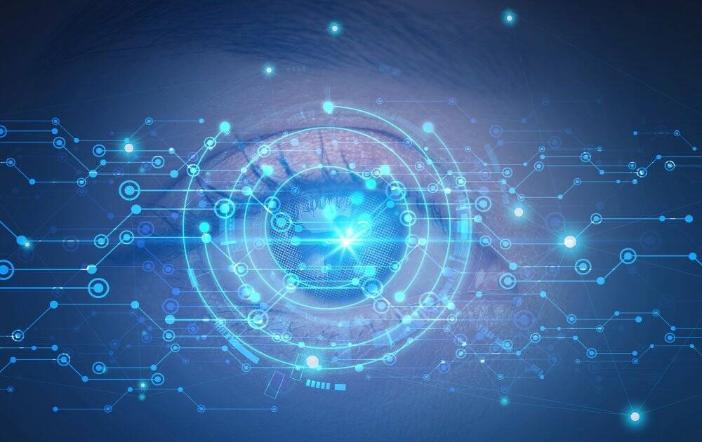

# 什么是元宇宙社交游戏呢？

元宇宙这个概念，说白了就是游戏人生。

给活着的人一次无限逼真的再活一次的机会。

这除了利用互联网和物联网实现无限接近现实的虚拟体验之外，本质就是做游戏。

一个游戏好不好玩的核心竞争力在于玩家群体，基础建设其实是游戏规则。

 

虚拟现实体验，是个噱头。听起来新鲜，其实还在其次。因为人总归不能脱离现实，一切体验都来自于现实。

说的白一点，这种噱头就像一个景点。只要人群里有吸引你的人，去哪里玩，你都可以快乐。
而且人是活的，景点是死的。

今天虚拟现实很火，玩家们在虚拟现实里玩，明天现实世界开了场热闹的花灯会吸引了很多帅哥美女，玩家们的注意力可能又会回到现实里。

这里有价值的点是帅哥美女，这是吸引人群的本质因素。游戏的本质也就是玩家吸引玩家相互交互的过程，其实社会就是这么形成的。

帝门，这个游戏，现阶段就是以网络授课的形式召集玩家。这些玩家全都是交易员，这就让帝门与交易员形成一种垂直关系。

交易员学习交易的目的就是赚钱，帝门身份本身就值钱，入门之后除了可以获取到有价值的信息，还有可以享受各种赢家的随机打赏。长期来看,这个身份一定是可以创造价值的。而且身份还可以转手，由于总数限制，这就让身份的价值随着品牌影响力扩大而增幅。

再加上打榜夺彩，这就让身份具备了竞争性质。而且是良性竞争。

对于一个新手交易员来说，入门之后，又可以接触到业界大佬，又可以不定时得红包，还可以锻炼自己的交易能力，当能力成熟之后还有机会获得投机初始资金，走向人生巅峰。

可以说帝门的存在能解决交易员成长道路上的绝大多数必然经历的问题，门内成员可以比自己闭关交易获得更多这条路上的真相。这就是它的价值体现。

在未来发展成熟之后，内门成员500人将面向全社会提供这种服务。也就给了宗门长期发展的空间和人员就业选择，也促进了身份的流动性。

以后门内还可能举办线下交友聚会活动。门内成员五湖四海，爱旅游的成员可以在陌生城市的遇到素未谋面的老同门。让门内成员的现实生活多一分色彩。

未来还可以落地游戏应用，塑造网络世界。

可以说只要玩家们聚在一起，这个游戏就有无限多元发展的可能性。
