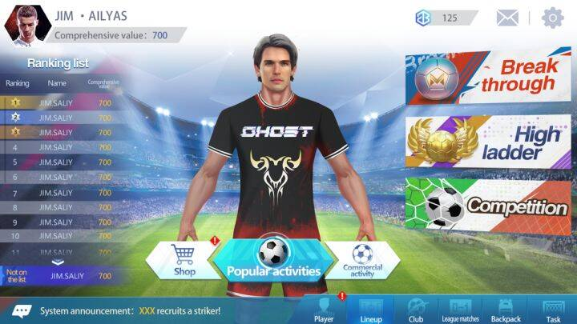
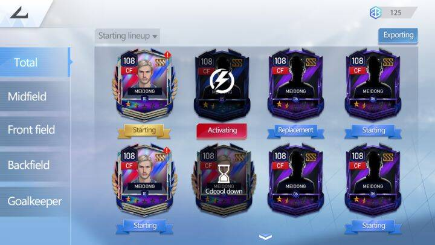
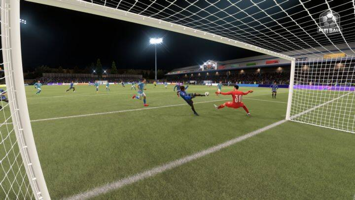

# MeRace旗下首款元宇宙竞技游,FunBall2022年1月20号正式上线

元宇宙竞技生态平台MeRace公布，旗下首款大型3D元宇宙足球竞技游戏FunBall于1月20日开始封闭测试，将面向白名单用户开放资格。游戏于今年3月10日公测，属于FunBall的热潮已经开启。

**专业团队研发 游戏内容丰富**

FunBall是MeRace旗下首款元宇宙概念游戏，区别于市场上较为简单的同概念游戏，FunBall在游戏架构和效果制作上下足了功夫，研发团队来自原EA SPORTS，基于真实足球竞技的场景，采用了PVE、PVP等多种对战玩法。为了打造更具沉浸感的游戏体验，FunBall还将在游戏中引入MU实验室最新科研的VR技术，玩家可以通过VR设备在游戏中进行实时对战，身临其境感受球场踢球的快感。

FunBall的主要模式是玩家组建一支11人球队参与比赛竞技，在单位时间内，通过进攻、防守、战术策略等取得胜利获得奖励，而影响胜利最关键的因素就是球员，玩家可以从商城和盲盒中获取球员。但值得一提的是，FunBall设置了球员总数量上限，这让每个球员在游戏中都有独特的价值，同时角色的稀缺性也具有收藏意义。

**最高10万MER奖励 玩家热情高涨**

提到竞技比赛，就不得不提与之相对应的丰厚奖励。FunBall中设置了多种多样的奖励形式，比如充满激情的天梯模式，玩家需要通过对战来获得称号，每次对战胜利就能获得FBL奖励，拿到称号还有额外奖励。除此之外，游戏中每月会举办日赛、周赛、月赛、赛季狂欢，玩家可通过比赛竞技获得最高10万MER奖励。

FunBall还根据玩家的综合实力值每日更新排行榜，并发放日总额达900万FBL的奖励。也就是说，玩家通过养成高等级高品质的球员，打造战力值更高的球队，在游戏中不仅能从对战中取胜拿到奖金，每天还能额外获得游戏生态激励。丰富又高额的奖励机制，也是此次玩家们热烈讨论的关键内容。

**顶级资本投资 超百家公会建立**

在FunBall封测前一个月，顶级区块链资本BAF、GCC等机构已经对MeRace平台投入数百万美元的资金，一大部分就是用于加大对FunBall的研发力度。机构曾坦露看中了FunBall所打造出的赛事是具有完善体系和经济模式的，可以不断吸引到玩家的兴趣以及注意力。FunBall研发人员也表示，早期的重点工作是与玩家建立伙伴关系，期待能给玩家带去以往不同的游戏体验。

 

看好FunBall的不仅是资本机构，在游戏市场方面也得到了不错的反响。游戏还未正式发布，据专业机构统计，亚太地区已有超过100家相关的游戏公会成立，并且在招募专业的玩家参与，不少专业玩家也充满了期待。可见FunBall不仅满足了市场的胃口，也是市场明智的选择。

FunBall是MeRace游戏生态中的重点力作，未来MeRace还将逐步开放平台、节点、社区等内容，目的是建立元宇宙游戏领域里的标杆，打造真正自主开放去中心化的游戏元宇宙。
