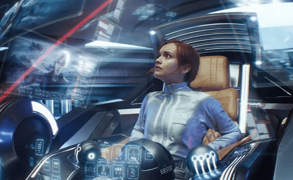
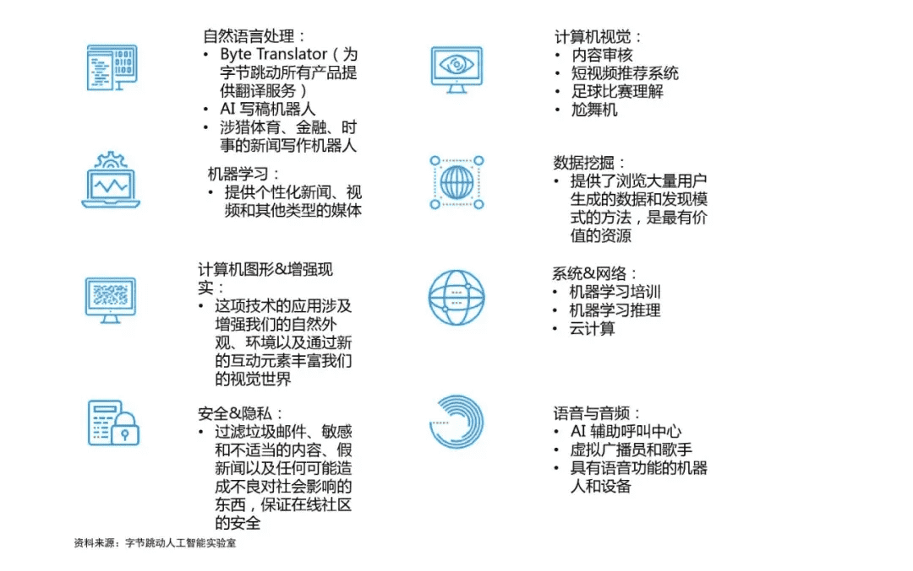

# 电影中的“元宇宙”与现实的“元宇宙”的区别有多大？

我们之前介绍了“元宇宙”为什么是骗局，今天我们来看看另外一面，即元宇宙是如何实现的?

“元宇宙”最近实在是太火了，Facebook改名Meta，国内外各种投资、融资。“元宇宙”的支持者很多，反对者也很多，很多人认为，元宇宙就是一个彻彻底底的骗局，以现有的技术，是不可能实现的。

我们之前介绍了“元宇宙”为什么是骗局，今天我们来看看另外一面，即元宇宙是如何实现的?

### 电影中的“元宇宙”

关于“元宇宙”的同学应该都知道，这一词汇来自科幻作家史蒂文森1992年创作的小说《雪崩》。

在《雪崩》中，作者描述了一个荒诞的赛博朋克世界，以此让人们注意资本主义与无管控的科技进步带来的一系列问题。“元宇宙”概念出现，为人们打开了新世界的大门。

从此，一系列现实与平行虚拟网络世界的概念迅速被作家们采用，并且沿用了史蒂文森对其的称呼“元宇宙。”

元宇宙的概念在随后的几部科幻电影中迅速成熟定型。

1982年由史蒂文·斯伯吉尔指导的《电子世界争霸战》可能是最早的一部元宇宙电影。该作品讲述了主角凯文为了证实公司最热门的电子游戏，是同事从他那里偷走的，被迫进入自己所开发的游戏中作战的故事。

“元宇宙”概念逐渐走进大众视野，被大众所熟知是在电影《头号玩家》上映后。

《头号玩家》描述了一个名为“绿洲”的虚拟世界。2045年现实世界处于濒临崩溃的圆边缘，人们将希望寄托于“绿洲”，只需戴上VR头盔，就能以一个完全不同的身份，进入虚拟世界。

除了以玩家视角切入，描绘“元宇宙”及剧情走向外，还出现了以NPC视角的电影《失控玩家》，故事讲述的是主角发现自己竟是大型游戏的NPC后，揭露游戏厂商老板阴谋，拯救“元宇宙”的故事。

我们不难发现，在众多涉及“元宇宙”概念的电影，对“元宇宙”的描绘都极为相似：

- 用户能快速进入一个与现实世界完全不同，却又与现实世界一样，遵守自定义的规则的秩序，并且沉浸感极强。
- 进入虚拟世界后，会拥有一个全新的身份
- “元宇宙”只是平台，本身不生产也不产生任何东西，所有的“内容”均由用户产生，从而形成一个真正的虚拟社会。

### 现实中的元宇宙

与科幻电影一样，元宇宙公司致力于打造一个类似《头号玩家》中的虚拟世界，但以现在的技术水平，几乎不可能做到，“元宇宙”前途光明但路途遥远。

扎克伯格说：“元宇宙落地，至少要10-15年的时间。”事实可能如此，也可能要更长的时间。目前科技公司能做的，就是以“元宇宙”为大战略方向，努力完善自己的产品，打造元宇宙产品矩阵。

我们以国内两家公司字节跳动和腾讯为例。

### 字节跳动

今年4月20日，字节调动投资手机游戏开发商“代码乾坤”，开始布局元宇宙。

字节跳动经过过年的积累，已经建立庞大的内容运营体系，其产品TikTok已经成为全球最大的短视频平台。其强大的内容运营体系，与元宇宙的内容生产体系较为相似。

此外，字节跳动已经具备探索元宇宙所需的技术储备，根据字节跳动人工智能实验室数据，在自然语言处理、计算机视觉、机器学习、数据挖掘等八个领域，字节跳动已经形成完整的技术闭环。

### 腾讯

以社交和游戏见长的腾讯，在元宇宙的打造上，同样具备很大的优势，同时腾讯还拥有国内用户规模最大的PGC内容平台，20多年的积累，让腾讯已经具备元宇宙的初始形态。

### 从虚拟走向现实

怎么创造“元宇宙”是一个现实难题，一步就位显然不可能，目前可行的方案是，基于自家产品的矩阵，不断优化往“元宇宙”上靠。

例如如何打造一款音乐产品，让用户身临其境，产生与现场看音乐会一样的感觉?社交产品，如何让用户产生面对面交流的感觉?由点及面，实现产品与产品之间的无缝衔接，用户听完一场音乐会，不需要摘掉VR头盔，立马可以与远在异地的朋友，面对面交流?

元宇宙被称为下一代互联网，并非没有道理，如今的互联网已经是元宇宙的低级形态，缺少沉浸感、统一的经济系统，也许十几年或者几十年后，真正的元宇宙才会诞生吧。

 
