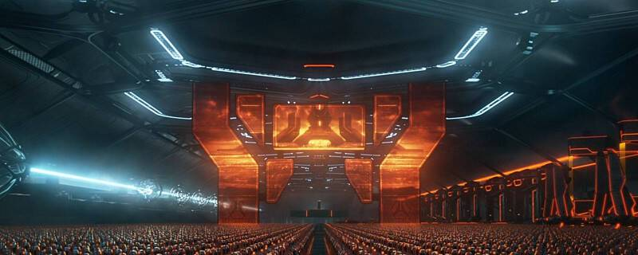
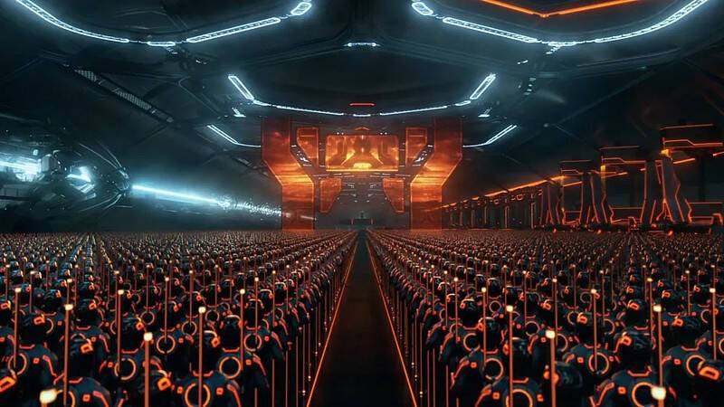
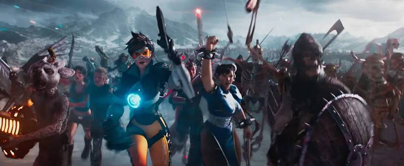
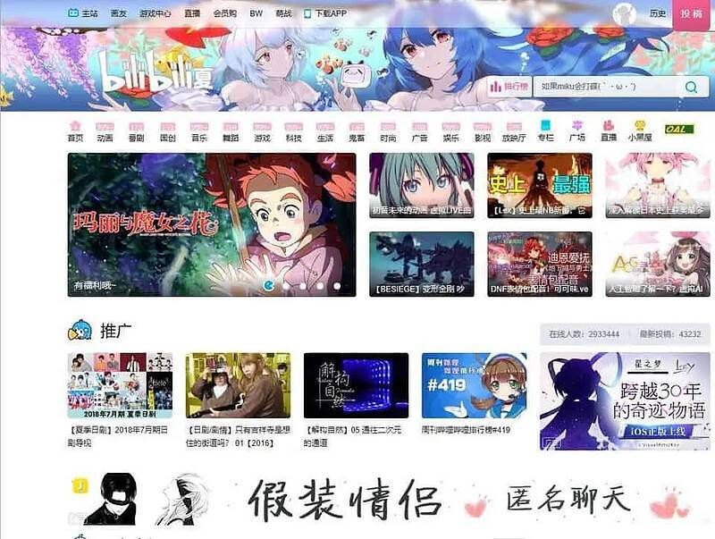
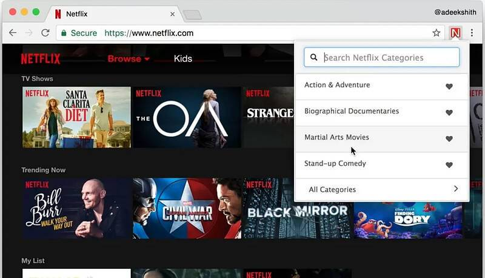
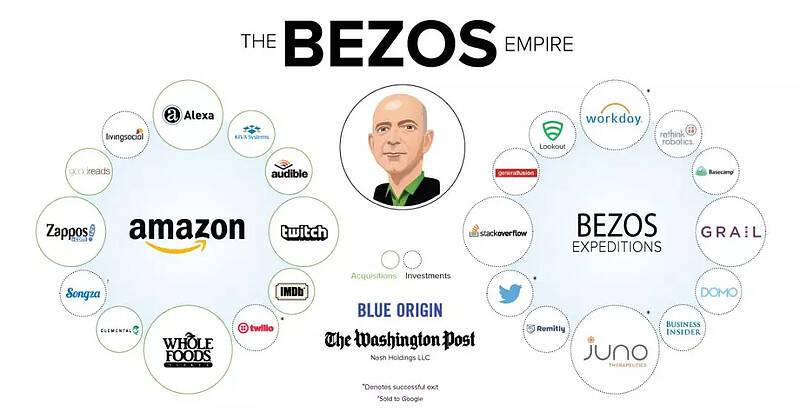
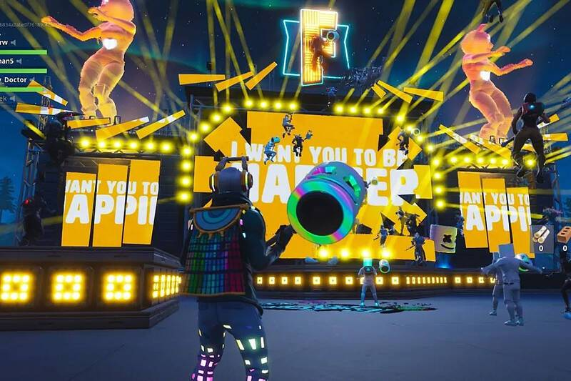

# 元宇宙的投资思考：技术垄断未来

电影《TRON》是将未来的世界描述成了“比特的信息高速公路”。

Mattew Ball在最近的一篇文章《The Metaverse》里总结了一下关于元宇宙的解释：

它永不停止或者重置，不断地进行下去

保持同步和即时性，时间和现实世界一样同步流逝

每一个个体都可以成为元宇宙的一部分，参与特定的事件和活动

一个全面运转的经济体：个人和企业将能够创造、拥有、投资、销售，并因其“工作”而获得回报，这些“工作”产生的“价值”为其他人所认可

跨越数字和物理世界，同时可以拥有私人和公共网络/体验以及开放和封闭平台的体验

在这些体验中提供前所未有的数据、数字物品/资产、内容等。例如，你在CS-GO里的“反击”这套皮肤也可以用来在堡垒之夜里中装饰一把枪，或者通过Facebook送给朋友。同样，一辆专为火箭联盟（甚至是保时捷网站）设计的汽车也可以用在在Roblox工作

由各种各样的贡献者创造和经营的“内容”和“经验”构成，其中一些人是独立的个人，而另一些人可能是非正式组织的团体或以商业为中心的企业

在Matthew看来，有一款游戏是符合众多以上特点的，那就是Epic旗下的《堡垒之夜》。然而堡垒之夜还仍然只是一款游戏，它并没有破壁成功。

“元宇宙”由于它本身特有的乌托邦概念，它足够前卫，足够有前瞻性。它如果出现，就必须是一个颠覆目前互联网的基础设施一般的东西，所有人都会进入它展开活动。

然而这个想法可能永远只能是一个概念。

不过其中一个对目前互联网很有意思的定义吸引了我的眼球：

Metaverse是一种“新的UGC平台”，Metaverse不仅仅是另一个类似YouTube或Facebook的平台，在这个平台上，无数个人可以“创建”、“分享”和“货币化”内容，最受欢迎的内容只占整体消费的最小份额。Metaverse将是一个投资和建立帝国的地方，在这里，资本雄厚的企业可以完全拥有一群客户、控制API/数据、单位经济等。此外，很可能与现在一样，少数大平台拥大量的用户时间、体验、内容等。

我们知道的一点是，很多大型互联网公司的创始人都对Metaverse的概念十分憧憬。抛开个人喜好和个人理想主义的影响来看，Metaverse显然如果被一个集团所拥有的话，它将拥有里面参与的所有人的生杀大权，也可以理解为它就会拥有相当大的商业价值。

有没有类似这样的东西在我们现在的商业社会里呢？答案是有很多。

大多公司都在试图打造一套自己的封闭式的生态圈，一方面是为了获取独占的内容，另一方面也是为了可以垄断这个区域，成为这个范围内的主宰。

显然，Youtube、B站、甚至Netflix都符合这样的描述。

youtube由于UGC和AI推荐的结果，导致最火爆的内容也不会占总流量的大头，仅仅只是其中的一小部分而已。而B站则是由于类似Reddit那样的圈子和圈子的独立作用，多元化以后也没有发生太多矛盾，让原有的圈子依然能尽量保持原样。

这和早年的纯关注模式有巨大的不同，可能几个大V用户就会拥有绝大部分用户的关注度，某一个两个明星的发帖可能会占据几亿的流量。

即使Metaverse存在，依然需要大量的商业和非商业组织去指定规则，引导虚拟社会的经济和社会发展。在这一点上，我们目前看到的平台是类似的。

但B站和Youtube显然都没有完全遵循UGC的内容，而是也会开发一些PGC的内容进行补充。

“UGC”的定义在这个年代开始变得更加宽泛了在我看来。在AI算法推荐的时代，像Netflix这样的公司实际上也可以说运用了UGC的元素，因为它的很多内容实际上都是反向定制的。

之所以某些类型片能积累到足够数据证明一批用户喜欢。这批用户的观影倾向和数据实际上都是他们主动创造的信息，留存在了平台上，并且不断地积累，被机器所收集和学习。Netflix正是这么做的，它不断地学习用户的行为，不断地将用户的反馈作为自己的数字资产，进行反复推荐和测试，提高推荐的成功率（也就是用户的点开率）

用户即是内容，用户即是价值，一切都取决于你怎么做。

从这个意义上来说，哪怕你建个微信群或者开个订阅号也能开始做用户，做内容，做价值，而事实上也是如此。微信公众号平台也是一个新的UGC平台，可惜的是它的交互性并没有那么好，更多的时候它是一个单向的输出，交互很有限，更谈不上即时交互。但这并不妨碍用户的感受，因为他们本身就在微信这个即时通讯工具里，随时可以发起对某篇公众号文章的交互，信息交互需求可以得到即刻的解决，同时成为了这个大生态圈的UGC的一部分。

我们可以认为，越来越垄断的互联网巨头实际上都是一个个Metaverse的雏形，在其中的用户实际上是新的一批互联网居民，就好像最早的万维网诞生后，一大批网站开始在那基础上发展一个道理。

而这些互联网巨头也明白，要和其他独立的Metaverse合作是不现实的，这涉及到商业竞争、数据安全、以及用户体验等等各方面的问题。

所以我们看到亚马逊这样的巨头，不断地扩大着自己的边界，让旗下的会员们不断地享受越来越多的服务，增加用户忠诚度和用户价值，实际上也是一种形式的Metaverse。

根据塔列布的《反脆弱》的逻辑来看，像亚马逊这样收购了一堆公司的意义实际上是在亚马逊这个Metaverse增加反脆弱性。腾讯，在太平洋的另一端，实际上做着同样类似的事情。

对亚马逊和腾讯来说，单个服务的脆弱性是无法承受的，如果一个偌大的帝国只有游戏或者电商一个服务，而没有占据更加底层的数据基础建设，就很容易被颠覆。

就好像拼多多)创始人黄铮说的那样“腾讯有上千个儿子”，拼多多是否成功对于腾讯来说并不是致命性的问题。

来看看反面例子，不论是IBM、Garmin、还是硬盘制造商希捷、或是更久远的柯达，他们都属于某种程度的“存储”行业，并且在那之上提供服务。

问题当然出在他们所处的行业媒介上，他们所处的底层行业最终都被更先进的技术颠覆了，而且这样的颠覆对落后的技术来说是毁灭性的。

无数的投资者会对现在的巨头问同样的问题，他们会不会被颠覆？

答案是很难，这是因为他们不是“底层”，同时还拥有众多的服务和内容，而且这些服务和内容是不会随着底层技术更改而轻易更改的。

如果这个说法很模糊，有一个比方就能让你听懂：

不管未来人是不是进入Matrix生活，你总会需要好的故事满足你对叙事娱乐的需求。比如在《堡垒之夜》里，已经举办过了虚拟的演唱会了，人类的创意并不能被AI替代，至少目前看来AI还不能在技术上达到人的程度（不然就会发生全世界的巨变，而不是简单的投资问题了），所以不管你在哪个层面去思考，好的创意内容型公司都可以轻易地适应新环境，从而找到自己的生存之道。

所以现在的这些巨头的生存和创新能力都比当年的巨头要强得多，以至于他们不太可能像那些老的巨头那样轻易被颠覆了。

因为COVID-19的原因，很多公募基金和ETF持仓比例较大的公司都出现了大幅度的下跌，有些已经甚至接近了2008年的估值水平。

然而你会发现亚马逊、谷歌这种巨头公司是很难跌回去了，不但是因为他们的抗风险能力更强了，而且他们某种程度上都已经成为了Metaverse。

有人说疫情是虚拟世界的助燃剂，我不这么看。我们很容易线性地认为虚拟和现实是两个世界，然而它们的关系并不是内外关系，也不是以前的上线下线关系，它更像是同一个空间状态的不同面而已，疫情不论对虚拟世界还是现实世界都是实实在在的存在，并不会因为你去玩fortnite它就会消失。

思考到这儿，我想说所有的公司必然都会短期内收到巨大损失，但是，也是对某些公司的一次极限压力测试，以及价值观的校准器。

对于那些挺得过来，依然有较好资产，价值观以及社会价值观都能继续为世界贡献的公司，这一次会给投资者一些有趣的机会
