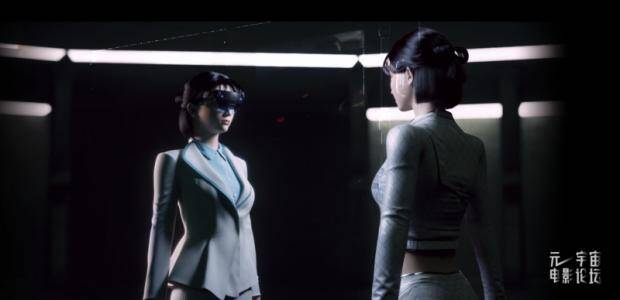
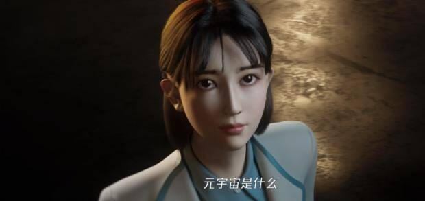

# “元宇宙电影论坛”即将跨时空举办 “技术驼着电影走”

日前，第十二届北京国际电影节相关活动首届“元宇宙电影论坛” 已经完成录制，即将在线上开幕。

针对元宇宙整合多种新技术而产生的新型数实融合的互联网应用和社会形态，将如何改变观影经验？如何激发艺术创造？如何推动影视行业发展？如何影响全民文化娱乐生活？元宇宙+影视行业如何助力国家文化数字化战略的全面落实？相关嘉宾表达了精彩的观点。

元宇宙与影视行业有着天然的联系：一方面，人类对抽象“元宇宙”概念最初的具象感知都来自于科幻电影。另一方面，电影是艺术和科技相结合的产物，每次科技变革都推动电影创新发展。

北京广播电视台北京国际电影节运行中心主任、北京国际电影节组委会办公室执行副主任崔岩在致辞中谈了他对元宇宙的感想：“我相信元宇宙作为多项高新技术的集大成者，必将为电影发展带来更强的驱动力。元宇宙整合了多种新技术产生的新型数实融合的互联网应用和社会形态。”

著名导演尹力作为全国政协委员、中国电影家协会副主席、中国电影导演协会副会长，既是一线电影导演，也是为中国电影整体谋划的重要人物。他认为，面对元宇宙， 电影的样貌发生了变化，人们不会再去争论它是娱乐还是艺术，在多元的边缘性当中，会产生新的艺术形态和新的艺术语言。同时观众和创作者之间的关系也在发生不断的转变，无论互动式的， 沉浸式的，还是观众参与等方式，都有很多可想象的空间。

北京大学中文系教授戴锦华自1987年参与建立中国第一个电影史论专业 以来， 持续深入从事电影研究。面对元宇宙与电影的议题，戴教授提出灵魂三问：“元宇宙真的是电影的未来吗？是电影的纵深吗？是某种电影的可能性吗？ ”在一番精彩的思辨演讲后， 她用一段诗意的表述来结尾：“今天也许我们正在一个奇特的与未来关联的时代： 一边是未来不在远方， 未来已在我们近旁。一边是现代生活方式让我们透支了未来， 以至于我们不再拥有未来。元宇宙所代表的技术实践，元宇宙所提供的想象空间，元宇宙与电影结合所开创的创造力也许可以帮助我们再度赢得未来。”

中国电影文学学会副会长刘毅编剧的电影《战狼》《战狼 2》叫好又叫座，在编剧主业之外他与朋友合开剧本杀公司、虚拟摄影棚。 无论编剧、剧本杀还是虚拟摄影棚，达到的目的都是同一个——过另一种人生，而这与元宇宙概念不谋而合。在刘毅看来，梦是最原始的元宇宙，在梦里面，你是另一个人生，另一种人，另一种身份，你可以不断去体验完全不一样的情感。在元宇宙里，各种技术手段增强观众的体验感，而最强烈的体验感永远是人的情感体验。

中关村大数据产业联盟秘书长、国内首部《元宇宙》学术专著作者赵国栋，从精神内核找到元宇宙与电影的联系：“元宇宙重点满足人的精神需求，电影恰恰是我们精神需求的一种代表，人们看电影为的是内心情绪、情感的释放，为了满足我们精神和情感的需要。从这个角度来讲，电影跟元宇宙的精神内核是高度一致的。”

北京国际电影节元宇宙推介官、腾讯新闻数智知识官梅涩甜以“元宇宙与文学”为主题表演了脱口秀，在梅涩甜看来：“文学驼着电影走，技术也驼着电影走。文学与技术的双峰骆驼， 通往元宇宙的绿洲。而只有技术的单峰骆驼，通往元宇宙的海市蜃楼。”

第十二届北京国际电影节由中央广播电视总台、北京市人民政府主办， 北京市电影局、北京市广播电视局、北京广播电视台、北京市怀柔区人民政府等承办。作为首都最具国际影响力的文化盛事之一， 北影节已发展成为中国电影蓬勃发展的实力见证和享誉国际的文化名片。秉承“共享资源，共赢未来”的办节宗旨， 第十二届北京国际电影节将围绕“同心·笃行”的主题，举办主竞赛单元“天坛奖”评奖、开幕式、北京展映、北京策划·主题论坛、电影大师班、北京市场、电影嘉年华、闭幕式暨颁奖典礼、第 29 届大学生电影节、“电影+”等众多活动。“云上北影节”将设置“云上展映”“云北京市场”“云端直播”等内容。

由北京国际电影节与山魈映画联合主办的“元宇宙电影论坛”，作为首场相关活动为第十二届北京国际电影节拉开序幕， 在元宇宙构建起步的历史性关键时刻， 提出新问题、分享新思路、拓展新方向、引发新思考。借由这些焦点问题的回应与求索，助力十四五时期我国电影强国建设的新时代命题。
