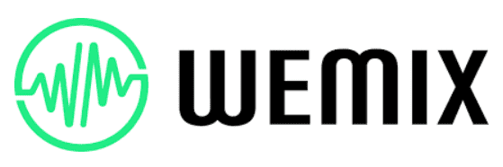
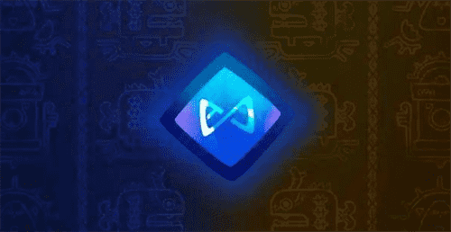
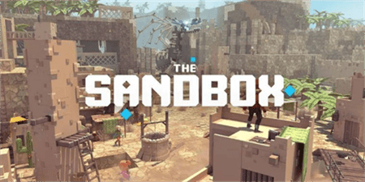

# 元宇宙项目有哪些？热门元宇宙项目名称

随着元宇宙升温，我们看到越来越多的元宇宙项目进入这一领域。本文我们将重点关注目前交易量最高的5个最热门的元宇宙项目。以下按照24小时交易量从低到高排序。

**WEMIX(WEMIX)-3.23亿美元**

WEMIX 是一个基于区块链的游戏平台，由运营 20 多年的韩国游戏公司 WEMADE 开发。WEMADE 最受欢迎的游戏之一是“热血传奇”，该游戏在全球的下载量超过 5 亿次。

WEMIX已经有一个用户可以通过App Store或Google Play下载的游戏列表。虽然他们的游戏确实存在一些漏洞，但这是可以理解的，因为该团队最近才开始开发基于区块链的游戏。

WEMIX的大部分交易量来自Bihumb交易所的WEMIX/KRW。Bihumb是一家韩国交易所。WEMIX在韩国绝对很有吸引力，目前它是市场上第五大最热门的元宇宙项目。

随着 WEMADE 团队继续开发和改进他们的游戏，到 2022 年底 WEMIX 的估值或将翻倍。

**Enjin Coin (ENJ) – 4.99 亿美元**

Enjin 是一个一体化平台，允许用户创建数字资产，并将其集成到各种游戏和应用程序中。最近，Enjin 成立一项1 亿美元的 Efinity 元宇宙基金，旨在帮助加速平台上去中心化元宇宙的开发。

在元宇宙加密项目中，我们看到了两种趋势。要么是游戏开发公司加入，希望制作去中心化的区块链游戏，要么是区块链开发商决定专注于围绕他们的代币和NFT创建一个虚拟世界。

Enjin之所以成为目前最热门的元宇宙项目之一，部分原因是该团队显然能够实现NFT的炒作，创造了一个充满稀有和令人向往的NFT活跃市场。

因此，交易员和投资者都在押注Enjin将成为元宇宙领域的主要竞争者。总体而言，这是一个可靠的项目，团队已经证明了它可以交付。

**Axie Infinity (AXS) – 5.54 亿美元**

Axie Infinity 是一款基于 NFT 的区块链游戏，由一家名为 Sky Marvis 的越南工作室开发。它具有 ERC-20 代币AXS，在 Axie Infinity 平台上用作货币。AXS 允许用户与平台互动，购买、出售和交易 Axies。

Axie Infinity的市场非常活跃，过去24小时的交易额超过2000万美元。

凭借备受期待的 2022 年 Axies 之战，该项目明年的估值很容易翻倍，绝对值得关注。

**The Sandbox（SAND）——27 亿美元**

到目前为止，最受期待的元宇宙游戏是 The Sandbox，这是一个虚拟世界，玩家可以在其中建造、拥有自己的土地，并从中获利。该项目还有用型代币 SAND，允许用户在元宇宙中购买土地和资产。

Sandbox计划于 11 月 29 日推出。在发布之前，用户可以探索 NFT 市场并购买土地，然后他们可以对其进行自定义。

凭借 24 小时27 亿美元的交易量和28 亿美元的市值，Sandbox显然是元宇宙王者之一。随着发布日期的临近，观察市场的反应将是一件有趣的事情。如果发布成功，SAND 价格可能会创下历史新高。

**Decentraland (MANA) – 33 亿美元**

Decentraland是元宇宙项目之王。虽然大多数项目仍在解决代码中的错误，但 Decentraland 自 2020 年 2 月以来一直在运行一个完全可操作的元宇宙。

用户可以轻松地使用MetaMask钱包注册，开始探索 Decentraland 虚拟世界。

最近，Decentraland欢迎巴巴多斯政府加入他们的平台。这个项目领先其他项目几个月，当之无愧地位居榜首。由于2022年对元宇宙来说将是伟大的一年，因此 Decentraland 也有可能创下历史新高。

**总结**

很明显，元宇宙是继NFT和DeFi之后的下一代加密应用。与任何新领域一样，各种可靠的元宇宙项目将争夺其市场份额。看到加密领域的竞争是一件好事，因为竞争会提高质量，而质量会带来更多用户。

