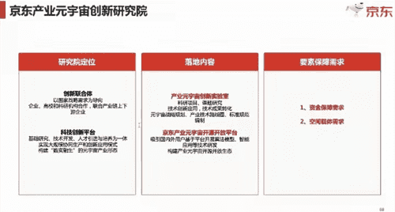

# 京东元宇宙项目准备落户海南 元宇宙项目计划书

4月27日下午，为贯彻落实冯飞省长4月7日关于积极支持京东科技创新，引导支持京东利用自贸港的功能和政策在海南设立国际化研发机构的指示批示精神，接引入京东集团国际研发机构和创新团队在海南落地。省科技厅牵头会同省工信厅、省大数据局和海南省生态软件园等单位，以线上视频会议的形式同京东集团、京东探索研究院、京东科技等开展项目对接洽谈。会议由海南省科技厅厅长谢京主持。

会上，京东探索研究院院长陶大程作了《让实体经济拥抱产业元宇宙的“星辰大海”》专题汇报。省工信厅副厅长闫肃、省大数据局行业应用处总监姚学恒依次围绕前期的一些对接情况作了一一介绍，海南生态软件园张世军副局长分享了软件园就产业元宇宙项目的一些探索和研究情况。

京东探索研究院院长陶大程作了《让实体经济拥抱产业元宇宙的“星辰大海”》专题汇报。

谢京表示，支持和欢迎京东集团来琼布局包括元宇宙项目场景应用、技术研发乃至包括底层理论研究等创新和试点工作。谢京指出，产业元宇宙项目与海南自贸港高新技术产业布局方向和高新技术的发展吻合，同时海南自贸港的数据安全有序自由流动、国家区块链试验区及便利的国际交往、国际合作政策优势，对京东集团拟在海南落地包括产业元宇宙落地和发展具有很好帮助。尤其对于我省是岛屿省份，有诸多完整且容易落地的相关探索和应用场景，先期均可通过此类探索和应用场景，在小范围内将一些相关的政策和行业标准先行先试起来，制定海南省行业标准，逐步发展成为国家行业标准，甚至还会成为国际标准。

谢京提出两点希望：一是希望京东尽快来海南进行实地考察和调研，建立同海南当地更为密切的联系。二是希望京东产业元宇宙创新研究院先行落地海南，通过以创新研究院平台和研究队伍为突破口，将京东方面的相关诉求同海南的需求进行具体对应，同时希望京东尽快提出一个具体的京东产业元宇宙创新研究院组建方案，加快研究院落地海南。

谢京强调，希望以京东产业元宇宙创新研究院为抓手，形成产业政策、探索NFT落地、应用场景、支持政策等落地的载体，充分利用自贸港国际开放的政策优势，抓住国际合作机遇以及人员、资金、交通等自由便利进出等优势，通过创新研究院吸引更多国际人才到海南来。同时希望京东集团要派出最强团队落地海南。

京东集团探索研究院院长陶大程表示，京东集团将按谢京厅长相关建议，研究京东产业元宇宙创新研究院组建方案，加快推动研究院落地海南。同时表示希望疫情好转后尽快来海南，进一步探讨合作事项，更好地服务海南自贸港建设。

最后，谢京表示，海南方团队继续保持同京东方面的对接沟通，待疫情平稳后，希望京东尽快来海南进行实地考察和调研，双方再围绕项目如何落地、双方的需求等进行更为具向的讨论和分析，促成双方达成共识，共同推动项目朝预期目标前进。
