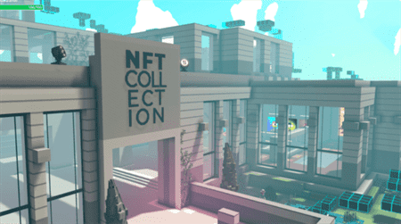
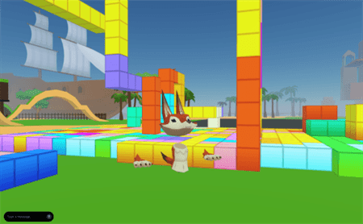
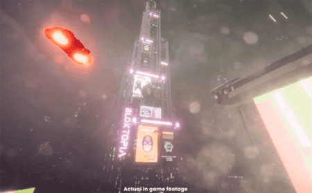

# 元宇宙项目概述 元宇宙区块链项目介绍

元宇宙正在飞速增长。各种元宇宙项目不断发展和连接，以帮助将我们数字生活的更多方面结合到一起。区块链已经在这方面发挥了关键作用。

### 探索币安智能链上的元宇宙项目

在元宇宙方面，币安智能链经历了巨大的发展。项目范围包括拥有现实玩家的卡片收集游戏（如《Top Goal》），以及RPG风格的游戏（如《Cyber Dragon》和《Alien Worlds》)；甚至还有玩家所有的赌场decentral.games，以及经典的元宇宙虚拟现实项目SecondLive。您可以通过阅读我们精选的《5个您应该了解的BSC元宇宙项目》，进一步了解BSC提供的内容。

**什么是《The Sandbox》(SAND)？**

《The Sandbox》是一款区块链游戏，用户可在这个虚拟世界中探索NFT （非同质性代币）、用户创建的环境以及其他内容。《The Sandbox》于2011年作为一款手机游戏推出，现已发展成为一款在以太坊上使用以太币(ETH)和代币SAND来支持其游戏内经济的复杂游戏。

玩家可创建自己的虚拟角色和数字身份，这是元宇宙的一个关键概念。虚拟角色可以与加密钱包关联，以管理玩家的NFT、SAND代币和其他区块链资产。玩家甚至可以使用VoxEdit和Game Maker工具，创建游戏和虚拟物品。

这些强大的程序可以创建复杂和专业的视频游戏资产，随后，您可以将这些资产转换为NFT。由于用户可以交易这些物品，因此形成了边赚边玩的模式，用户可以通过玩《The Sandbox》赚取额外收入。

**什么是《Decentraland》(MANA)？**

《Decentraland》是一个3D世界，玩家在其中开发自己的土地，举办活动，创建内容，并参与其他社交活动。《Decentraland》的核心经济是基于区块链来建立数字身份、所有权以及独特物品的稀有性。这是最知名也是最受欢迎的项目之一，早于2021年末的元宇宙热潮。

成立于2016年，Estaban Ordano和Ari Meilich以一款基本的2D游戏为基础，将其发展成了一个NFT价值达到数十万美元的大世界。该项目也有自己的ERC-20效用代币MANA。

那么，《Decentraland》是如何进入元宇宙的呢？实际上，它包含了许多元宇宙的元素：3D界面、数字经济、社交元素和游戏内事件。随着越来越多的项目连接到《Decentraland》，它也具有了元宇宙中心的特性。

《Decentraland》还以其名为LAND的虚拟房地产NFT而闻名。除了在《Decentraland》的去中心化自治组织(DAO) 中提供投票权外，LAND的价格也出现了大幅上涨，备受交易者和投资者的青睐。

**什么是Enjin(ENJ)？**

Enjin是一个区块链平台，专注于创建用于游戏物品的NFT。此项目已经发布了软件开发工具包(SDK)，让普通用户更易于生成基于以太坊的NFT。由于NFT已成为元宇宙的重要组成部分，Enjin希望为人们打造更安全的铸造NFT的方式。

对于NFT，最常见的一个抱怨是它们具有流动性。您需要为您的NFT，这可能非常耗时。然而，Enjin NFT始终可以被融化以换取ENJ代币。这意味着，只要ENJ的价格不达到零，NFT始终都会有一定价值。由于不需要等待买家，将NFT转换为ENJ可提供即时流动性。通过支持数字收藏性和稀缺性，Enjin看似将成为元宇宙中非常有用的一部分。

**什么是《Bloktopia》(BLOK)？**

《Bloktopia》是另一款设置在21层摩天大楼中的虚拟现实元宇宙游戏。和《Decentraland》和《The Sandbox》一样，《Bloktopia》的目标是成为活动、社交、工作等的中心。21层代表了比特币的最大供应量：2100万比特币。此项目使用Polygon区块链来支持它的四个主要方面：学习、赚钱、娱乐、创造。

1. 学习 - 《Bloktopia》将作为一个门户，让用户了解区块链以及它如何为元宇宙提供支持。它提供了一种更容易访问、互动性更强的方式来学习加密技术。
2. 赚钱 - 《Bloktopia》通过其原生代币BLOK、名为Reblok的虚拟房地产以及Adblok提供的广告机会，欣然采纳了边赚边玩模式。
3. 娱乐 - 用户应能与好友进行在线社交，并享受各种用户创建的游戏和内容。
4. 创造 - 《Bloktopia》为玩家提供了创建环境甚至数字广告空间的工具。

边玩边赚已成为游戏界的热门话题。通过玩游戏以及与游戏互动就可以赚取收入，这是非常有吸引力的想法。《Decentraland》和《The Sandbox》提供了一种出售房地产的简单方法，而《Bloktopia》则更进一步。Reblok的每一层楼都可以租给租户，也可以租给某项活动。当其他玩家投入时间来通过关卡时，用户也可以获得广告收益。

---

元宇宙的发展依然还有很长的路要走如果您亲自体验过这些项目，就会发现其机制、外观和感觉都非常基础。许多项目仍处于计划阶段，甚至无法进行测试。

然而，可以肯定的是，新项目的数量还在不断增加。无论是大型游戏公司还是小型元宇宙加密项目，开发都在如火如荼地进行。上文中提到的项目只是一个开始，因此，请务必定期查看更新和新闻，以跟上不断发展的元宇宙。
