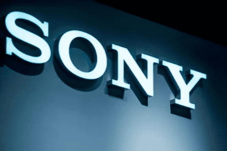

# 索尼——元宇宙也要娱乐至上！

2022年5月18日，索尼在年度企业战略会议上宣布,将以元宇宙领域作为企业业绩增长点之一。这意味着全球电子消费巨头索尼正式投身元宇宙市场，探索元宇宙业务。值得一提的是，在今年1月，索尼电子游戏业务创始人久多良木健曾对元宇宙不以为然，声称身处物理世界很重要，在元宇宙的虚拟世界中实现准现实，看不出这样做的意义。如今索尼高调进军元宇宙，可谓是光速打脸。

索尼态度之所以发生180度翻转，主要是元宇宙的风潮过于强劲，成为众多互联网科技公司挖缺潜力的突破口，在加上近年来，索尼主打的PS主机游戏市场受到移动端游、PC网络游戏的瓜分份额，增长略显疲态，期望在元宇宙中寻找业务增长的新可能。

索尼的元宇宙构想是以游戏为主，结合影视、音乐等娱乐方式，由电子消费制造商转型为元宇宙时代下的新兴娱乐公司。索尼CEO吉田健一郎表示：“元宇宙是一个社交空间和实时网络空间，游戏、音乐、电影和动漫在这里交汇”，从透露的言论中，我们可以窥探到，索尼要打造的是“娱乐元宇宙”！

索尼拥有全世界范围内数一数二的海量IP，其中不乏蜘蛛侠、毒液、勇敢者游戏等明星IP,此外，索尼还拥有规模庞大的主机系列游戏,《战神》、《刺客信条》、《神秘海域》等3A大作。在目前普遍认为元宇宙的最佳应用场景是游戏的情况下，索尼拥有得天独厚的生态优势，这也是公司称索尼将在元宇宙的虚拟世界中发挥主导作用的自信来源之一。在硬件方面，索尼是全球三大VR眼镜企业，其产出的VR设备销量仅次于Meta旗下的行业天花板级别的Oculus，实力不容小觑。其最新推出的PSVR，由主机提供算力，在分辨率、视野、追踪和输入等方面都表现优异，PS VR系列很可能成为索尼布局“娱乐元宇宙”的入门级产品。

不可否认，在如今的泛娱乐时代，“娱乐元宇宙”将会是一个挖缺Z时代和千禧用户群体潜在消费能力不错的细分赛道，而索尼拥有的原生游戏生态内容和海量IP都是煞羡旁人的。但在元宇宙成为人心所向时，索尼的元宇宙布局却显得相对滞后和发力不完全，甚至内部时不时会有一些抗拒的声音出现。在元宇宙全民创作的时代，以一己之力维系庞大的内容生态将可能会被内容协同产出模式所取代。我们期望索尼在规划的“娱乐元宇宙”中看到一些推陈出新的改变，而不是教条的死守老牌IP被时代的海浪埋葬在深深大海。
