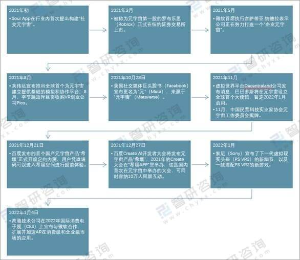
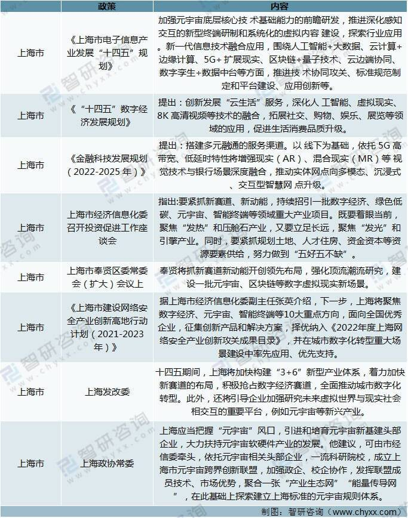
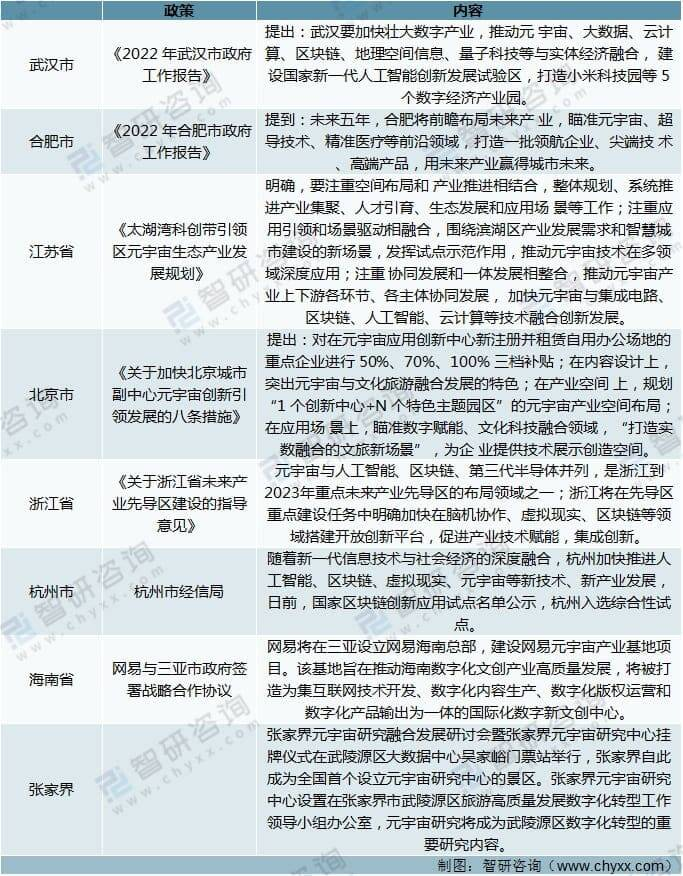
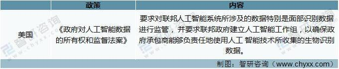
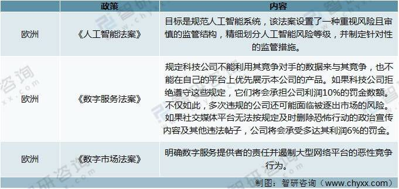
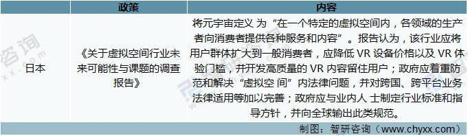
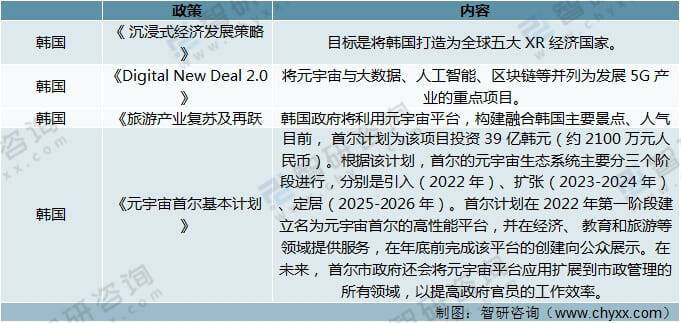

# 2021年中国元宇宙相关政策分析：多地政府产业规划中已出现元宇宙的身影

#### 一、概述

元宇宙（Metaverse）是利用科技手段进行链接与创造的，与现实世界映射与交互的虚拟世界，具备新型社会体系的数字生活空间。

元宇宙始于1992年国外科幻作品《雪崩》里提到的“metaverse（元宇宙）”和“Avatar（化身）”这两个概念。人们在“Metaverse”里可以拥有自己的虚拟替身，这个虚拟的世界就叫做“元宇宙”。 2020年人类社会到达虚拟化的临界点，疫情加速了新技术的发展，加速了非接触式文化的形成。2021年是元宇宙开始爆发的一年，这年VR/AR共发生340起投融资事件，投资金额高达556亿元，同比飙升128%。

二、国家部委元宇宙相关政策

我国一直在推进企业的数字化转型，推动数字经济的发展。2021年我国相继出台了许多政策来引导和扶持区块链等元宇宙相关技术的发展。

国家部委元宇宙相关政策

三、各地方政府元宇宙相关政策

我国目前还没有明确的国家层级的元宇宙政策出台，但是许多地方政策已经出台元宇宙相关的扶持政策。

上海市元宇宙相关政策分析

资料来源：政府官网、智研咨询整理

除上海外，我国其他地方政府也加入到了元宇宙的热潮中。

其他地方政府元宇宙相关的政策

资料来源：政府官网、智研咨询整理

四、国外元宇宙相关政策

美国政府对于元宇宙仍处于观望状态，尚未提出明确的元宇宙建设纲要性文件和官方表态，其对数据安全的担忧及产业巨头垄断风险的警惕暂时占据上风。美国的监管机构重点关注数据安全和隐私保护问题。

美国元宇宙相关政策

 

资料来源：智研咨询整理

欧洲缺乏互联网基因，没有大型的原生态互联网公司，其市场基本都被美国互联网巨头占领。欧洲的诉求是加强互联网企业的监管，防范数字龙头企业利用垄断地位扼杀竞争活力，反感美国科技巨头在欧洲赚取巨额利润却仅缴纳微薄税款。

欧洲地区元宇宙相关政策

资料来源：智研咨询整理

日本寻求扶持元宇宙相关产业，建立新型国家优势。日本经济产业省于 2021 年 7 月发布《关于虚拟空间行业未来可能性与课题的调查报告》，将元宇宙定义 为“在一个特定的虚拟空间内，各领域的生产者向消费者提供各种服务和内容”。

日本元宇宙相关政策

资料来源：智研咨询整理

在全球范围内，韩国政府对元宇宙反应最快，已经成立了元宇宙协会。根据10月份数据，包括三星在内的两百多家韩企已经加入了这个协会。此外，韩国首都首尔市政府近日宣布，将打造“元宇宙平台”，向市民提供公共服务。届时，首尔市政府将成为韩国首个提供元宇宙服务平台的地方政府。韩国政府日前宣布，将在未来培育220家公司和4万名专门从事元宇宙技术的专业人士，并创造50亿韩元（约2642万元人民币）的收入，这是国家下场在政策上提供的对“元宇宙”公司的支持。

韩国元宇宙相关政策

资料来源：智研咨询整理

在俄罗斯现任总统普京看来，元宇宙的价值在于，让人们不论相距多远，都可以一起交流、工作、学习、落实联合创新项目和商业项目，而不是人们从不完美的现实世界逃离的目的地。在他看来，为了让元宇宙发挥应有的价值，必须要这个“全新世界”的经济和社会关系规范。

俄罗斯对元宇宙的态度

