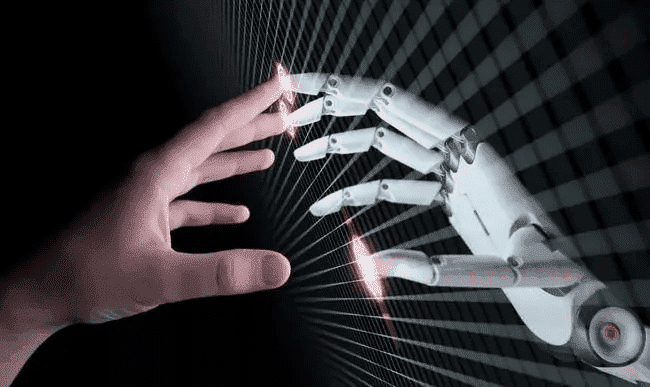
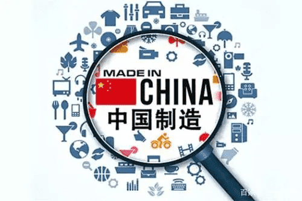

# 中国元宇宙是否已在路上？

在人工智能等设施技术的建设基础上，元宇宙指的是大型的数字化体验和生态系统，从电子商务、娱乐到社交媒体和工作，任何与我们生活息息相关的领域都囊括在内。很难想象，不久之后，元宇宙再也无法定义我们大部分的社会和经济生活。对于那些制定游戏规则，想要大捞一把人来说，这样的机会也恐怕没有了。

事实上，中美都打算建立元宇宙，并且双方都表示不久后元宇宙便可问世。欧洲等其他国家也打算这样做，但他们根本没有掌握到足够的核心技术用于建设元宇宙。

像人工智能、终端用户设备和引领行业发展的超级应用程序)等核心技术与像智能手表和眼镜等相关技术结合在了一起。而掌握这些核心技术，中国在建立未来虚拟化人类体验上有了不可逾越的优势。

## **中国现有的AI优势**

人工智能正在彻底改变包括消费在内的社会生活的方方面面，中国政府早已察觉。人工智能是政府和企业的重中之重。中国政府呼吁，到2025年，实现人工智能重大新突破；到2030年，成为全球人工智能的领导者。

该战略最初是在2017年中国政府的《新一代人工智能发展规划》中提出。自那之后，不仅衍生了许多新的政策，也刺激了各部委、省政府和私营公司投资数十亿美元用于研发。

中国针对人工智能采取的相关政策使美国在该领域的优势持续降低。2017年，美国在该领域的优势是中国的11倍；但到2019年，这一领先优势已降至7倍；到2020年，美国只剩下6倍的微弱领先优势。虽然这个优势还不是很明确，但五角大楼的前首席软件官表示，中国在人工智能和机器学习方面已经有了不可逾越的领先优势。

此外，对于训练数据的可用性，有人对美国提出了质疑。在隐私与公共利益的平衡中，美国倾向于保证隐私；而中国是公民社会，维护公民社会就是维护公共利益，为此中国政府则是选择进行适当干预。

最后，中国作为人口大国，拥有14亿人口，这无疑是一个重要的战略优势，有利于获得大量的数据训练人工智能。

## **中国制造**

长期以来，中国在开发消费类应用方面一直占据着无可匹敌的优势，而这也是中国有能力建设元宇宙的力量基础之一。从智能手机和笔记本到AR和VR头盔，中国开发了种类繁多的消费者访问数字平台和社会体验设备，需求极高。在中国，像深圳一样的许多城市已经拥有了最先进的设计和生产力。

从手机到AR/VR设备，中美制造商的区别就在于产品研究深度。中国的硬件创新者往往比美国同行更具竞争力，这实际上是因为美国对未经测试的产品投资较少。这就意味着，这些投资少的产品可能会分散到更多的中国科技初创公司，经过开发后，成功问世。

最近，脸书改头换面，将自己重新打造为一家元数据公司，但它的雄心壮志却依赖于中国制造的沉浸式头盔。脸书的Oculus Quest系列头盔对中国生产的依赖性很大，以至于2020年初中国新冠疫情防空扰乱了Oculus Quest系列头盔生产。而那个时候，刚好是人们对虚拟旅行和虚拟活动需求最大的时候。现在，脸书的竞争对手字节跳动已经收购了世界上第二大VR头盔制造商Pico。

Pico和NReal是中国尖端AR和VR头盔的典范，与美国最好的头盔公司不相上下。头盔不仅更强大、更高效，还可以使用新兴元空间并保证它的稳定存在，从而为人们提供沉浸式体验。在中国以外的地方生产这样的设备？很难想象。

最后，HTC已经带着它的Viveport Verse加入了这场竞争，预计将在Mozilla的开源Hubs上推出。Hubs可直接在WebXR上运行，用户无需安装程序便可在任何平台上进行访问。这对于创建一个可以相互操作的系统实际上提供了极大便利。.png)

## **中国领跑5G**

传统的沉浸式AR或VR头盔，不仅笨重，功能还不强大。5G带来了新的改变，它将缩小头盔的尺寸，为人们提供一个既舒服又方便的佩戴体验。5G的超快数据传输速度意味着大量的图形体验将在云端渲染完成，这样，即使是眼镜般大小的设备，也能够简单快速地显示图像。

在全球市场竞争上，于中国而言，互联网建设仍旧处于优先地位。在2021年的第14个 “五年计划 “中，中国承诺推出5G网络，目标是在未来五年内实现56%的5G普及率。目前，美国的5G渗透率为15%，预计到2025年将上升到50%。总的来说，预计到2026年，东北亚5G用户将处于领先地位。

根据爱立信移动报告，相比之下，欧洲的5G渗透率起步较慢，持续落后于中国、美国、韩国、日本和海湾合作委员会（GCC）市场。

如果元宇宙是互联网未来的发展趋势，那么谁来建设、如何建设的确会对整个经济和社会产生重大影响。

## **元宇宙“前身”：微信**

有了庞大的客户群、丰富的商业生态系统和已建立的互操作系统，还缺什么呢？

像腾讯这样的中国数字企业集团，它们的与众不同则在于能够把社会大众与不同服务的互操作系统相结合，尤其是支付服务，这也是为何它们的循环应用间经济成为可能的原因之一。事实上，中国互联网行业很大一部分属于腾讯生态系统。

《纽约时报》称其为 “大型娱乐平台”，同时还向世界各地的人们展示了一些世界上最流行的腾讯旗下的视频游戏、数字内容和互动娱乐体验。据腾讯内部报告，腾讯已经投资了800多家公司。重要的是，微信也在它的旗下。

微信是中国唯一拥有超过10亿活跃用户的应用程序，也是世界上仅有的五个具有里程碑意义的应用程序之一。一些人称其为 “中国应用程序的瑞士军刀”，是中国最常用的移动社交媒体平台。微信目前拥有约12.4亿月活跃用户。几乎40%的微信用户在25至35岁之间，超过35%的微信活跃用户在24岁以下。

然而，世界上仍有许多人并不了解微信的潜力有多大。

微信有四个主要部分，即聊天、朋友圈、微信钱包和微信频道。从即时通讯、照片分享到电子商务、娱乐和游戏，社交和商务任君切换。你还可以在微信上预约医生、旅行、投资、转账、订餐、约会、从街头小贩那里买橘子，甚至是提出离婚。

用户产生和传输的数据量大的惊人。但这也只是冰山一角，一旦沉浸式的可持续数字体验出现，元宇宙随之而生了。像微信这样的超级应用程序，在美国和欧洲等市场上仍不常见。它和元宇宙很相似，它不仅整合了令人难以置信的广泛的个人体验，还结合了付费功能。

虽然微信是其广告市场的主要收入来源，但其母公司腾讯拥有许多游戏发行商的股份，包括《堡垒之夜》发行商Epic Games、Activision Blizzard和Ubisoft。它也是任天堂在中国的合作伙伴和经销商之一。微信将数字娱乐、社交媒体和支付功能结合在了一起，这意味着什么？这意味着客户根本离不开微信。

实际上，腾讯和微信所代表的是一个原生态的元宇宙。要把它变成一个成熟的元宇宙，还缺少更智能的人工智能驱动服务，更强大、更实惠的沉浸式设备，以及连接它们的5G高速基础设施。而只有中国才是这些元素汇集最快的市场。

## **有何利害？**

全球会计咨询公司普华永道（PwC）预测，与元数据相关的VR和AR市场将从2019年的455亿美元增长到2030年的1.54万亿美元，约增长34倍。

XR作为下一代数据和通信技术生态系统的重要组成部分，将在推动智能设备、网络传输、云计算设备、电信服务、核心部件和软件的转型和发展中发挥重要作用。

因此，XR的未来发展与网络传输功能息息相关，包括渲染、处理、空间计算、感知和互动等。今天，这些行业中的核心定位是对增长型行业具有支配权，因为它们对未来网络世界功能和经济可行性至关重要。虽然美国打算克服其孤立的、以个人为中心发展障碍，从而建立一个可互操作的虚拟互联网。但似乎很明显，中国的条件更有利于公司对元宇宙的开发。
