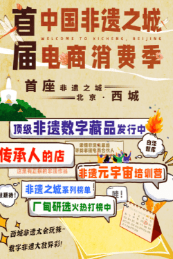

# 元宇宙X数字藏品 | 云游非遗之城北京西城，尽享非遗之“夏”

2022年6月11日是“文化和自然遗产日”。

光明网携手北京市西城区非物质文化遗产保护中心联合举办“首届中国非遗之城电商消费季(北京·西城)”，围绕“激发非遗活力·创造美好生活”主题开展非遗之“夏”系列活动，由“传承人携手铸就顶级非遗数字藏品”、“传承人的店·西城非遗全民电商”、“匠心坚守·非遗好物种草直播”、“读懂非遗生意经·元宇宙电商培训营”、“非遗之城白泽智库”、“非遗电商公益合作伙伴汇聚”、“非遗之城电商合伙人招募”、“厂甸云庙会·夏播”、“厂甸研选·非遗优品火热打榜”等版块组成，推动数字消费，助力复工复产。从6月至8月，这个夏天不NG。

北京市西城区是首都核心区，从古蓟城、唐幽州、辽南京、金中都的所在地，到元明清三朝国都的西半部，是唯一能够体现北京建城建都历史变迁全过程的区域，三千年历史文脉连绵不断，文渊深、文脉广、文气足、文运盛，公布有各级非物质文化遗产项目224项，是名副其实的非物质文化遗产大区。
