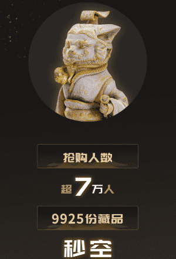

# 数字藏品是什么？元宇宙到底是什么？怎样入坑数字收藏？

数字收藏是由区块链的NFT认证和加密的虚拟产品，通常限量出售。有点像奢侈品牌发行的限量版包。每个看起来都一样，但是每个都有不同的号码。不同的是，前者是虚拟产品，后者是实物产品，但两者都具有独特性和稀缺性，因此具有收藏价值。

所以数字收藏也可以说是一种具有收藏价值的虚拟产品。

NFT是一种叫做区块链的数字分类账的数据单位。每个令牌可以代表一个唯一的数字数据。NFT的概念是由全球首款区块链游戏CryptoKitties的创始人兼CTO迪特·雪莉在2017年正式提出的。它用于表示数字资产的唯一加密货币令牌。

非同质化意味着不可互换和不可复制，因此每个NFT都标识了独特的数字资产，如绘画、声音、电影、游戏中的项目或其他形式的创意作品，它们都是唯一的、不可分割的。尽管文件(作品)本身可以被无限复制，但代表它们的令牌会在它们的基础区块链上被追踪，所有权的证明也会提供给买家。以太坊和比特币等加密货币都有自己的令牌标准来定义NFT的使用。

数字藏品可以归纳为元宇宙的衍生物，粉丝参与:数字藏品不仅仅是藏品或艺术品，精明的品牌意识到，最成功和长期相关的数字藏品将是那些具有持久价值和效用的藏品。例如，数字收藏可以通过提供投票权、独家优惠和获得球队决策奖励的能力，更好地将球迷与他们喜欢的球队或品牌联系起来。

客户关系管理:与实物不同，数字藏品是可追溯的，所以你可以查看它们所在的钱包地址。数字馆藏可以根据与拥有/购买的数字馆藏相关的可追溯因素，开启独特的细分和参与策略。这可能包括所拥有的数字收藏的类型、数量或持有时间。

潜在收入来源:由于数字收藏稀缺，品牌可以出售独家和有限的数字商品。与实物商品不同，数字收藏可以包含智能合同，该合同以内容创建者指定的版税百分比进行编码。因此，数字馆藏的后续销售或拍卖可以为原始数字馆藏的创作者带来收入，并在销售或拍卖期间提供持续的潜在收入流。

那么现在谁在玩数字藏品呢，目前中国各大博物院、腾讯、阿里、百度、都参与了数字藏品的发展。

目前这个行业是站在风口上，但是投资需谨慎，从创造更多市场价值的角度来看，数字收藏不仅限于文化收藏，还有艺术、音乐、食品、服装等各个行业。是数字收藏的一部分。拥有海量版权的企业也可以找到更多优质的应用场景。谁的资源多，谁就更有竞争优势。

区块链技术可以为数字创意作品的确认和流通提供创新的解决方案，保护链上数字创意作品的版权。因此，越来越多的区块链科技企业开始加入到建设数字馆藏平台的大潮中。
