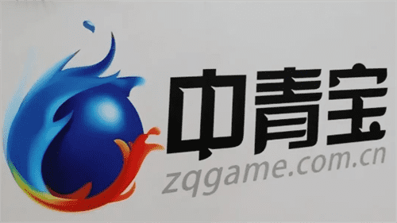

# 国内元宇宙概念股 这4只优质股涨幅有望翻200%

元宇宙的风口只是未来发展趋势的一个预兆，未来，虚拟现实等技术不断发展完善，将不断赋能未来发展，为人们带来更大的商业价值和社会价值。随着元宇宙的持续火热，许多元宇宙概念股应运而生，很多人先知道国内都有哪些优质的元宇宙概念股，本文将为大家介绍。

#### 4大优质个股简介
**一、中青宝（300052）**

连续20日换手率超过10%，成交非常活跃

公司简介：深圳中青宝互动网络股份有限公司是一家具有自主研发、运营能力、代理能力的专业化网络游戏公司。公司的主营业务是网络游戏的开发及运营,由研发中心、运营中心、运维技术中心和综合管理中心构成了清晰完整的业务系统。

**近期趋势**

近期的平均成本为17.95元，股价在成本下方运行。空头行情中，目前正处于反弹阶段，投资者可适当关注。该股资金方面呈流出状态，投资者请谨慎投资。该公司运营状况尚可，暂时未获得多数机构的显著认同，后续可继续关注。

**二、完美世界（002624）**

今日净流进6740.9万元，市场排名第224位

公司简介：完美世界股份有限公司主要从事网络游戏的研发、发行和运营；电视剧、电影的制作、发行及衍生业务；综艺娱乐业务；艺人经纪服务及相关服务业务等。公司主要产品包括PC端网络游戏、移动网络游戏、主机游戏、院线业务等。

**近期趋势**

近期的平均成本为13.45元，股价在成本下方运行。多头行情中，目前处于回落整理阶段且下跌有加速趋势。该股资金方面呈流出状态，投资者请谨慎投资。该公司运营状况良好，多数机构认为该股长期投资价值较高。

**三、中文在线（300364）**

今日净流进2314.6万元，市场排名第566位

公司简介：中文在线数字出版集团股份有限公司的主营业务为提供数字阅读产品、数字出版运营服务和数字内容增值服务。公司的主要产品为文化产品、教育产品。中文在线是中国数字出版的开创者之一，在内容资源、内容生产及分销、资质及内容合规能力、知识产权保护等方面拥有多重优势。

**近期趋势**

近期的平均成本为10.17元，股价在成本上方运行。多头行情中，上涨趋势有所减缓，可适量做高抛低吸。该公司运营状况良好，多数机构认为该股长期投资价值较高。

**四、新国脉（600640）**

今日净流进48.6万元，市场排名第1641位

公司简介：新国脉数字文化股份有限公司主要业务为2C2H端数字娱乐生活领域业务、2B端的数字营销、数字文旅、数字教育培训。公司主要产品包括天翼超高清、天翼云游戏、天翼云VR、数字营销、数字文旅、数字教育培训。公司与华为合作开发的天翼云VR系统平台与应用软件荣获2019年世界VR产业大会VR/AR创新金奖。

**近期趋势**

近期的平均成本为9.79元，股价在成本下方运行。多头行情中，上涨趋势有所减缓，可适量做高抛低吸。该股资金方面呈流出状态，投资者请谨慎投资。该公司运营状况尚可，暂时未获得多数机构的显著认同，后续可继续关注。

