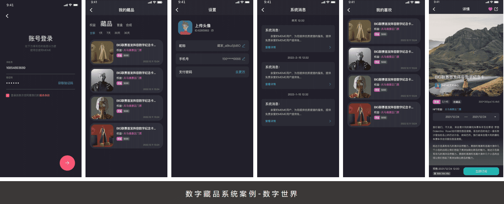
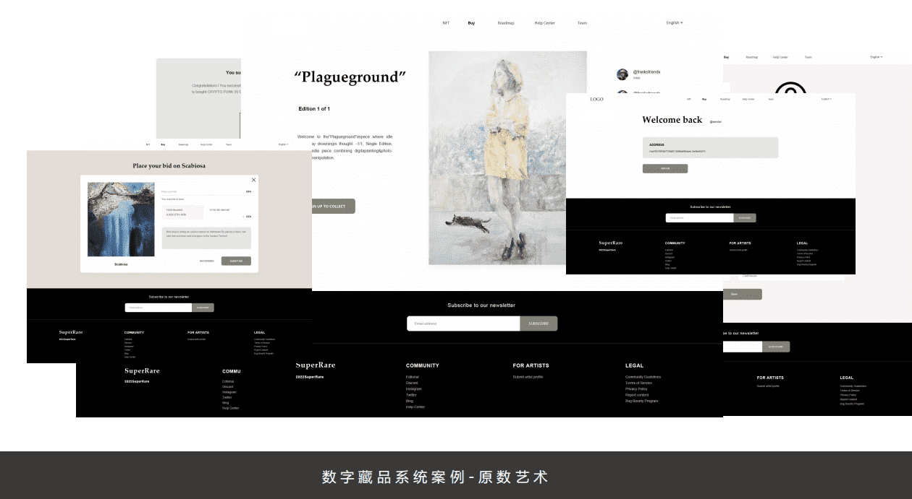
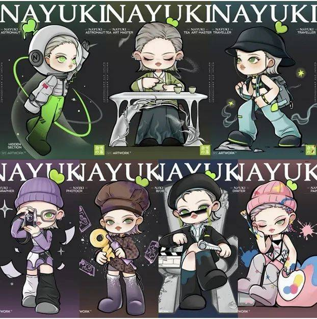

# 元宇宙起点——数字藏品

2022元宇宙火了，火爆程度相比当年web2.0的跨境电商、o2o、共享经济、社区团购任何一场互联网大战都有过之无不及。这个概念的出现让所有人为之兴奋，终于出现了一个可以把区块链、增强现实、数字孪生、5G、人工智能等所有人类技术革命最前沿领域的技术集合一体的概念，这是一个与现实世界平行的虚拟世界。

可以把土地、游戏、社交、艺术、文学、社交、音乐……所有的一切都囊括进去的世界。也许所有人都无法精确的讲清楚什么是元宇宙，但无数个探索已经汹涌而来，各链路上的创造者用自己的方式定义着元宇宙。

律动BlockBeats信息，1月8日，起点读书根据腾讯云服务「至信链」的中国第一个网络小说数字藏品《大奉打更人》番外篇运行公布开售，该数字藏品是阅文进入数字藏品的第一期新项目。依据起点读书APP网页页面表明，这次发售的数字藏品标价158元，根据腾讯云服务「至信链」限量发行2000份，绝不公开增发，每一件收藏品有着「至信链」验证的唯一系列号，不能伪造、不可复制。

数字藏品作为元宇宙时代下的经济产物，更多的是更品牌企业想结合，目前大多数企业发行数字藏品的难点主要在于上链，营销玩法，创意等痛点。元话数藏团队做出国内首款数字藏品SaaS，一站式上链，拖拽式后台搭建，让商家发行数字藏品不再是难点。

现如今元宇宙概念受欢迎，在数字货币上具备唯一的标志和使用权信息内容的数字藏品，变成完成“永久性收藏”目地的优良质粒载体，越来越多年青人早已有着，或最少已经思索如何有着第一件数字藏品。“元宇宙”的人气尽管已经逐步回归分析客观区段，可是愈来愈被群众所熟识的“数字藏品”反倒凭着其不可复制、独一无二的存有特点，以及可以带来的诸多奇特感受和多层面使用价值，更加得到顾客的亲睐。

**国产奥利奥**

推出全球首款白色奥利奥，与经典的黑色款组合成“水墨国风”。“最会玩的小饼干”开创性运用区块链技术，基于线下水墨艺术展同步发行链上数字水墨长卷，并将数字水墨长卷解构成5000块NFO（即Non-fungible OREO），消费者可通过多次购买或分享多位好友获得更多抽奖机会，赢取"永不过期的奥利奥饼干” 。把“砍刀刀”社交裂变与NFT先锋热点巧妙结合，奥利奥将消费者的活动参与热情推向高潮。

**奈雪的茶**

国内经典的鼻祖案例，去年年底奈雪的茶6周年，推出品牌大使——NAYUKI，这个来自美好多元宇宙的IP人物，将在虚拟空间和现实生活中穿梭，探索每一个充满美好的宇宙空间。此次NAYUKI还带来储值卡充100得150的福利，72小时斩获GMV 近2个亿。围绕IP推出线上NFT数字艺术品 ，含隐藏款在内共7款，全球限量发行300份，只在线上以盲盒形式发售，不制作实物。该数字藏品一秒售空。极大的点燃了消费者热情，作为先行者，也制造足了话题。

**bilibili**

面向国内用户，B站先是在官方数字藏品账号“哔哩哔哩数字藏品”发布了一则视频为“干杯”系列数字藏品预热，视频中画面显示该系列NFT与目前主流的头像类NFT一致，有着不同的外表、服饰、神态等元素。同时，出于对数字藏品的炒作风险考量，B站在4月上线了大厂常用的“转赠”功能，规定用户持有数字藏品30天后可以无偿转增实名用户，受赠人持有30天后可以再次转赠

紧接着一个月后，为海外用户授权了发布“Cheers UP”系列NFT，该系列包含在以太坊上发布的 10,000 个头像类NFT。该项目介绍称“干杯”是bilibili最具代表性的社区文化之一。“小电视”形象则是bilibili的官方IP，并预告未来将会有更多的发现和探索。这或是国内互联网大厂的第一批以太坊版本NFT。据悉，该系列NFT在全球最大的区块链生态以太坊网络中发行，总数10000枚，其中团队预留 233个，9767 个面向通过抽奖验证的钱包地址，每一枚售价0.12枚ETH（约合350美元）。

**千禧酒店**

4月份，新加坡千禧酒店及度假村在 Decentraland 开设首家 Metaverse 酒店。千禧酒店及度假村位于Metaverse平台的核心，希望其酒店地理位置优越，适合那些希望在虚拟平台上探索景点的人。该酒店的设计将引人注目，其四个侧面各有一个巨大的“M”，以及玻璃外墙和霓虹粉色装饰。用户可以将他们的化身登记到虚拟酒店，就像他们住在公司的实体一样。千禧国敦酒店有限公司执行主席 Kwek Leng Beng 表示：“M Social 就是要与众不同，成为独一无二的人。“展望未来，我们需要超越传统的待客模式，通过全新的沉浸式体验吸引客人。

**数字藏品的出风口早已到来，“版藏”的精准定位是做“有心态的IP数藏服务平台”，融合外部环境网络资源，研发和经营更具有具体内容生态价值和关注发展潜力的数字藏品，为游戏玩家给予原版、安全的数字藏品，大力支持国家文化智能化发展战略，推动数字文化产业高质量发展。**

