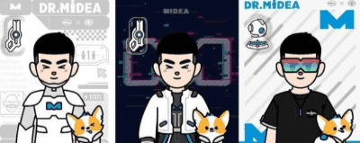
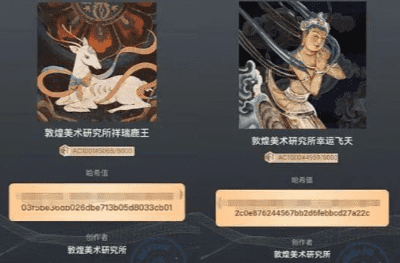

# 元宇宙火了后，到底什么是数字藏品？各品牌做哪些尝试？

2022年春晚舞台上，国潮风浓郁的舞蹈诗剧《只此青绿》成为传统文化破圈的精品佳作。

一个多月后，中国东方演艺集团携手阿里文娱推出《只此青绿》数字藏品纪念票，精选5张剧照和1幅书法题词，设计了6款纪念票，共发售24000张。在保护作品数字版权的基础上，实现数字化发行、购买、收藏和使用。

**这是演出行业首款数字藏品纪念票，上线即被秒罄。**

2020年被称为盲盒营销元年，品牌们疯狂沉浸在盲盒的惊喜中。

**短短一年后，元宇宙概念大火，随之催生出数字藏品。** 

仅2021年一年，海外围绕NFT的交易额就超过了196亿美元，NFT数字藏品共创造超816万总交易量和超65亿美元的总交易额（数据来源：贝壳财经）。国外一位12岁少年通过数字藏品在两个月内赚了34万美元，一副名为《The Merge》的数字藏品更是卖出9180万美元的高价。

**不仅如此，国内的数字藏品也如雨后春笋般涌现。** 

冰墩墩NFT数字藏品两日暴涨近千倍

### 一 什么是数字藏品？

什么是数字藏品？

**很多人说数字藏品就是NFT。NFT的全称是Non-fungible token，是一种基于以太坊区块链的“非同质化代币”。** 

数字藏品其实是NFT的一种应用形式，即使用区块链技术，对应特定的作品、艺术品生成的唯一数字凭证，在保护其数字版权的基础上，实现真实可信的数字化发行、购买、收藏和使用。尽管有时候数字藏品被笼统地成为NFT，但是说NFT就是数字藏品，还是不够严谨的。

既然数字藏品是NFT的一种应用形式，它也就具有NFT的特点——唯一性：因为NFT不可替代的特性，意味着它可以用来代表独一无二的东西，比如博物馆里的艺术作品原画。一件数字藏品通过NFT手段加密后，便拥有了一张专属于自己的“数字证书”，独一无二、不可替代；可确权、可交易：数字藏品被永久存储在区块链上，无法被复制和随意篡改，可以追根溯源，明确版权并进行交易。

**数字藏品的形式多种多样，除了艺术画作，音乐、视频、3D模型、电子票证、游戏道具、表情包、虚拟地产、音乐专辑等等，都可以成为数字藏品。** 

### 二 数字藏品之品牌营销策略

B站发布首款数字艺术头像“鸽德”，数字藏品 VS 品牌年轻化形象** 

2022年1月5日，B站官方认证号“哔哩哔哩数字藏品”发布动态，宣布旗下首款数字艺术头像“鸽德”正式开放报名。

全网限量发行2233个，每个鸽德头像都有独特的编号和样式。该系列头像并不售卖，仅面向2021年每日到访B站的LV6级、年满14周岁的用户开放，且需要完成实名认证。**编号101-2100的头像将随机发放，共2000个，剩余233个编号哔哩哔哩官方将预留，其中还有稀缺限量款。** 

比B站更早的是美的。2022开年第一天，美的官宣发布了“美的2022 Dr.M系列”头像。如果你了解美的，那么对M博不会陌生。M博是美的的虚拟形象，在B站美的官方账号中，作为核心人物出镜。这款以美的IP“M博”为基础创作的数字藏品，同样是免费送给用户，限量1000份。

**数字藏品似乎为各大品牌提供了崭新的玩法：**吉祥物、虚拟人物、LOGO等与品牌形象强相关的元素，以数字藏品的形式包装、发布，利用限量的珍贵属性结合饥饿营销玩法，正在以新的形式与用户发生关联。同时，发行数字藏品这一操作本身，代表了品牌不落俗套、紧跟时代的生命力，以及关注Z世代的年轻感。

**在此种营销策略下，不像传统的数字藏品大多进行拍卖销售，而是限量免费赠送或低价销售，以此降低门槛，俘获大众。**

### 2、小米发布“芯纪元”3D模型，数字藏品VS产品科技力

2021年最后一天，小米12Pro手机在天猫开售，**同时天猫首发了号称“数字龙蛋”的数字藏品——小米 12 芯纪元。**小米12芯纪元是以骁龙芯片和小米12为核心的NFT创意龙蛋，每份龙蛋数字藏品，都拥有独一编码认证，限量 500 份。

不仅是小米，飞利浦、可口可乐、欧莱雅、LV、Burberry、阿玛尼、保时捷、Gucci等品牌都在有重磅新品上线之时，借助数字藏品，或直接发布同款，或是衍生的概念模型，用新的营销形式吸引眼球，借此展现产品科技感与品牌实力。

**当受众厌倦了海报、H5、魔性歌曲等传统的营销手段后，数字藏品不失为一种新花样。**部分售卖的数字藏品，甚至为品牌带来了意想不到的巨额投入。但前提是，品牌能否在数字产品和真正的产品之间找到平衡：是一个冷冰冰的虚拟产品，还是一个赋予了艺术生命力的数字作品。

### 3、阅文集团发布首个网文数字藏品，数字藏品VS文化产业

无论是实体还是虚拟产品，有艺术价值的作品才能让受众买单。一张图片、一幅画作、一首歌……数字藏品为艺术作品提供了新的载体形式，尤其对于文化产业。

**阅文集团推出国内首个可阅读网文IP数字藏品**《大奉打更人之诸天万界》，随机附赠作家手写签名寄语，定价158元，限量2000份。

**视觉中国打造的视觉艺术数字藏品平台**——元视觉官方网站及小程序（元视觉藏品）上线后，首发的数字藏品是著名摄影家解海龙拍摄的照片《我要上学（大眼睛姑娘）》。售价为每件199元，限量10000件。此次交易所得全部捐赠给安徽青少年发展基金会，用于支持希望工程教育事业。

**新华社在2021年发布了中国首套新闻数字藏品，**精选2021年新闻摄影报道并进行铸造，发行11张，每张限量10000份。这套数字藏品凝聚了许多珍贵的历史性时刻，比如新冠疫苗接种突破26亿次、建党百年的盛世时刻和更多具有纪念意义的场景。所有藏品均免费上线。

**文玩国潮也开启了数字化风潮，博物馆通过发行数字藏品，**使传统文化焕发新的活力，故宫博物院、敦煌市博物馆、湖南省博物馆、河南省博物院等纷纷加入。

**在音乐影视领域，数字藏品也大放异彩。**对于音乐迷来说，似乎没有什么比拥有一个虚拟数字唱片更酷的事了。

综上可见，社会文化产业各垂直细分的领域，所诞生出的数字藏品不仅具有独特的文化价值，还丰富了受众的收藏体验，活跃在其中的人群往往也是时尚潮流先锋，他们对于商品售价包容度高、敏感度低，追求新奇的消费仪式感，往往会为品牌或企业带来创造不俗的销售战绩。

所以对于文化产业来说，将合适的艺术作品与数字藏品相结合，把艺术作品变为数字藏品，不失为当下值得探索的营销新路。

### 4、支付宝发布NFT支付码皮肤数字藏品VS虚拟产品

打游戏买皮肤对于年轻人来说并不陌生，年轻一代对虚拟物品的接纳度越来越高。当次元壁进一步被打破，数字藏品的应用范围再一次被拓宽。

2021年6月，支付宝和敦煌美术研究所推出了两款NFT，分别是敦煌飞天、九色鹿支付码皮肤，价格为10个支付宝积分加9.9元，全球限量发行16000份。两款NFT一经推出就遭到了疯抢，发布不久就已售罄，按售价计算共卖出15.84万，闲鱼上的二手交易甚至最高被炒到了150万元一个。

今年3月，支付宝联合云观博再次发售马踏飞燕多场景皮肤数字藏品，共2款，分4个时间段，每款每个时间段5000份，价格为29积分加9.9元。

支付宝的这波操作可以说是数字藏品应用在虚拟商品上的成功案例，虚拟+虚拟也可以为企业带来巨大价值。

数字藏品的核心消费群体基本是千禧一代以及Z世代，为了投其所好，部分品牌在发售数字藏品时将其与盲盒相结合，稀缺性+饥饿营销+盲盒营销，趣味性大大增加。

网易严选瞄准元宇宙、盲盒等消费风口 ，推出品牌旗下首套数字艺术藏品盲盒“新年幸运 多元宇宙”。该盲盒随网易严选虎年年货礼盒随机赠送，限量2022份，抽中的用户将会得到一个独一无二的数字藏品。

在流量越来越贵的当下，品牌更加重视私域营销。支付宝和网易严选的数字藏品案例都是私域引流的尝试之一。**通过引入数字藏品，激活原有存量用户，依托较低的参与门槛与较高的互动乐趣进一步吸引新用户参与，反哺线上销售，达到拉新和促活的双重效果。**

### 5、集五福换数字藏品，数字藏品的营销玩法

支付宝集五福活动进入第7年，每年如何花样翻新都是一个课题。

2022年除了传统的集五张福卡分现金红包外，用户还可以用多余的福卡兑换福字贴、五福定制周边等众多礼品，其中包括山东博物馆的“虎文物”数字藏品“汉虎钮铜錞于”，共计10000份。这是支付宝首次将数字藏品以礼品形式，纳入活动奖励机制中来。

把五福和数字藏品挂钩，借五福给数字藏品带流量。有人说蚂蚁此举是为布局NFT数字藏品交易做准备——让庞大的支付宝用户群体了解数字藏品及数字收藏，这是其他布局NFT的交易机构无法比的。

不论是否如此，支付宝这一举措也为品牌数字藏品营销提供了新的范式：如果不仅仅以售卖为目的，数字藏品还能如何应用？

**动漫、音乐、体育、家电数码、古玩……当数字藏品进入更多企业视野，万物皆可NFT。**

数字藏品所具有的稀缺属性和编码专属的唯一特质，让用户的购买行为被赋予了仪式感和神秘感，从品牌到商品到数字藏品，从而占领用户心智。

诚然，大众对数字藏品的看法褒贬不一，数字藏品作为新兴产物，相关法律法规、交易行为规范等尚未完善，品牌在数字藏品营销过程中同样需要避免风险，以免带来损失。

不过这并不妨碍我们提前布局，继续摸索可能的落地场景，在法律、规范、技术、标准等不断完善的过程中，为品牌营销探寻新的发展之路。
