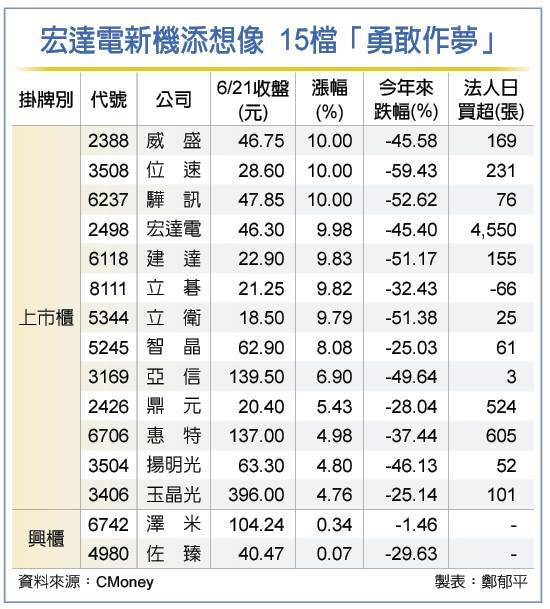

# 元宇宙概念股走势如何？腾讯控股、国内元宇宙指标股宏达电又有新动作

元宇宙又「红」了！外传腾讯控股将成立「扩展现实」（XR）部门，国内元宇宙指标股宏达电（2498）月底也将发表首款支援元宇宙新机，21日涨停庆贺，领军题材股「勇敢作梦」。

威盛（2388）、位速（3508）、骅讯（6237）等齐亮灯，兴柜股泽米（6742）、佐臻（4980）同欢。

国际大厂抢滩元宇宙商机，元宇宙又成功获得市场讨论度，惟法人认为，台股多头氛围已不如去年浓厚，在欠缺基本面支撑下，恐难复制去年底大涨走势。

外媒透露，**腾讯控股20日已向员工宣布正式成立XR部门，国内指标股宏达电28日也将发表首款支援元宇宙手机，**加上台股20日融资余额大减89.9亿元，21日出现跌深反弹，前波跌深的元宇宙概念股也窜出头，**沉寂已久的元宇宙概念股终于大举反攻。**

全球笔电龙头联想，也宣布委任宏达电董事长王雪红，担任独立非执行董事，双方未来是否有扩增实境（AR）／虚拟实境（VR）产品合作也引发揣测，元宇宙指标集团威盛21日气势如虹，威盛、宏达电、立卫、建达全涨停。

法人指出，元宇宙长期获利能力仍待观察，短期业绩不会太快反应，惟相关个股今年来均有双位数跌幅，股价跌深是最大利多。

除威盛集团外，元宇宙供应链包括IC设计、LED、PMOLED，甚至头戴装置所需的光学镜头等热潮再起，位速、骅讯、立碁涨停，智晶、亚信、鼎元、惠特、扬明光、玉晶光也强涨4～9％；至于兴柜市场，AR眼镜大厂佐臻、光学镀膜厂泽米21日也小涨0.34％、0.07％。

佐臻不仅成功打入美国FDA医疗市场，手术导航AR眼镜也启动量产，更开始接洽国内手机品牌大厂；泽米今年为日系大客户开发新式VR装置，针对其中眼球追踪元件，可大幅改善长久来困扰玩家的「3D晕」情况，亦可大幅提高分辨率，为元宇宙发展一大进程。 

