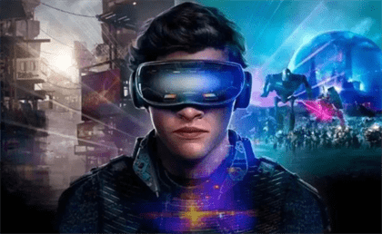
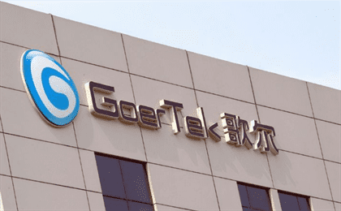
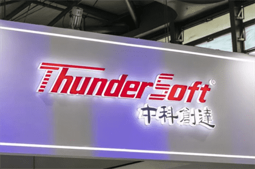
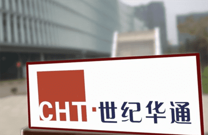

# 抢占元宇宙市场风口！这些绩优元宇宙概念股请收好

相信不少的投资者对于元宇宙的了解，大部分来源于电影，对元宇宙的大概理解为：只要穿戴所有的虚拟设备，就可以进入一个无所不能的领域。

近期，元宇宙概念股抢占市场风口，在大盘持续回调下，还能逆势走高，一度成为两市最靓的仔。有消息称，元宇宙领涨两市主要源于海外巨头切入预期刺激，使得元宇宙概念在A股市场上不断升温。

Facebook创始人马克·扎克伯格正式宣布，公司将更名为“Meta”，来源于“元宇宙”(Metaverse)，此前5月，Facebook便曾表态称，要在5年内转型成为一家元宇宙公司。

梳理A股市场上绩优的元宇宙概念股，以飨读者！三季报净利润增幅超过10%的元宇宙概念股共计有13家。

其中，排在首位的是中青宝，三季报实现净利润1357万元，净利润同比增长730.2%。

其次是共达电声和数码视讯，三季报净利分别同比增长145.7%，102.4%。

需要注意的事，目前市场上的部分元宇宙概念股近期已有较大涨幅，其更多的是蹭概念为主，潮水一旦退了，记得及时下船！

#### 股绩优的元宇宙概念公司

**中青宝：2021年三季报实现净利润1357万元，净利润同比增长730.2%；**

曾经创业板网游板块龙头，主营手游开发运营；公司主要分为互联网游戏与汽车零部件制造，自2020年第三季度始公司增加了IDC数据中心业务板块！

公司旗下点点互动自研的元宇宙游戏登陆全球最大的元宇宙社区Roblox平台，成为国内第一的元宇宙游戏，目前其用户数据还在增长。

**共达电声：2021年三季报实现净利润5850万元，净利润同比增长145.7%；**

公司是专业的电声元器件及电声组件制造商和服务商、电声技术解决方案提供商。

其主营业务为微型电声元器件及电声组件的研发、生产和销售。公司在互动平台称：公司现有的应用于AR/VR方面的技术和产品与元宇宙概念相关。

**数码视讯：2021年三季报实现净利润7348 万元，净利润同比增长102.4 %；**

公司致力于视频领域技术的自主研发及面向各视频需求相关行业应用，核心技术包括视频处理技术、视频调度技术、视频传输技术、食品安全技术、数字资产加密技术、5G技术、AI技术等。

元宇宙领域所形成的大量以NFT为代表的核心数字资产需要流转，公司有能力与平台公司合作、打造平台级应用开发，为元宇宙数字资产交易提供基础设施。

**捷成股份：2021年三季报实现净利润3.94亿元，净利润同比增长92.50 %；**

国内新媒体版权运营龙头的优势地位；公司是一家专业从事新媒体版权运营、影视内容制作与发行、音视频技术服务和数字教育云平台建设的企业。

公司参股世优科技，世优科技官网内容显示是一家致力于快速动画技术（AR&VR）研发与应用的科技公司，提供虚拟IP打造业务。

**歌尔股份：2021年三季报实现净利润43.86亿元，净利润同比增长65.28%；**

声学行业龙头；公司主营业务为精密零组件业务、智能声学整机业务和智能硬件业务。精密零组件业务主要产品为微型麦克风、微型扬声器、扬声器模组、天线模组、MEMS 传感器及其他电子元器件等；

国内领先的消费电子零组件、整机供应商；公司长期布局VR/AR业务，目前在高端VR/AR设备整机代工领域中市占率接近80%。

**利亚德：2021年三季报实现净利润5.21 亿元，净利润同比增长65.09 %；**

小间距领域世界龙头；公司的主营业务为LED显示技术开发及LED显示产品的生产及服务。

公司拥有100%股权的Natural Point公司的光学动作捕捉技术和产品可以应用在虚拟现实包括元宇宙的相关场景。

**凯撒文化：2021年三季报实现净利润2.42亿元，净利润同比增长61.23%；**

公司主营业务是文化娱乐业务，文化娱乐业务具体包含版权运营、网络游戏研发与运营等业务。主要产品是成品服装、游戏分成、版权运营。

公司在互动平台称：代号为“动物星球”的游戏背景环境完全按照元宇宙的模式设计，具备时间、环境、生态三大维度要素，还引入了NFT技术。

**中科创达：2021年三季报实现净利润4.50亿元，净利润同比增长54.24%；**

公司主营业务是智能操作系统产品和技术提供商。公司主要产品分为软件开发、技术服务、软件许可和商品销售四种业务模式。

公司在互动平台称：公司在AR/VR领域提供操作系统及人工智能相关技术。这些技术可以应用于沉浸式体验元宇宙。

**风语筑：2021年三季报实现净利润3.91亿元，净利润同比增长42.27%；**

数字展示行业龙头，拥有行业内最大的设计主创团队和最多元的数字科技应用人才；公司是中国领先的数字化体验服务商。

公司在互动平台称：VR/AR数字视觉内容和VR/AR 虚拟现实技术整体解决方案广泛应用于公司数字化体验业务，公司擅长运用VR/AR等虚拟现实技术营造数字化场景、打造沉浸式体验，数字化内容和场景搭建是“元宇宙”相关产业发展的重要环节。

**顺网科技：2021年三季报实现净利润1.55亿元，净利润同比增长32.80%；**

公司为网吧管理软件龙头，连续举办国内最大的草根电竞品牌中国网吧超级赛(ISS)；公司主营业务是互联网技术平台即服务。

公司目前已有超过10000台商业运营的高算力GPU服务器，并在互联网侧向超过80万用户提供云电脑服务，利用优势的技术和创新赋能元宇宙Metaverse。

**超图软件：2021年三季报实现净利润1.90 亿元，净利润同比增长31.53%；**

国产GIS平台龙头，智慧国图龙头；地理信息系统基础平台软件提供商和整体方案解决商，涵盖GIS应用工程全系列的产品；

元宇宙需要建立一个虚拟的、孪生的世界，而这个世界是需要把真实的地理空间映射到虚拟空间里边，这需要三维GIS实现地理空间映射。超图在2017年已经支持了Oculus Rift和HTC Vive 的VR头盔设备，实现三维GIS的沉浸式体验；

**中文在线：2021年三季报实现净利润5740 万元，净利润同比增长23.82 %；**

中国数字出版的开创者之一，也是全球最大的中文数字出版机构之一；公司的主营业务为提供数字阅读产品、数字出版运营服务和数字内容增值服务

作为数字内容公司，本质是生产内容、打造IP、连接人群、丰富娱乐、学习和社交。文字创作和阅读仅存在于2D，但随着元宇宙的到来通过AR/VR等技术可以让人沉浸式体验新世界，而公司拥有海量的库存将会有力地支持构建平行的互动阅读世界。

**世纪华通：2021年三季报实现净利润27.29亿元，净利润同比增长11.58%；**

公司主要分为互联网游戏与汽车零部件制造，自2020年第三季度是公司增加了IDC数据中心业务板块。

---

注意：上述公司根据业绩报表等公开资料整理归纳，仅作为分享以及交流学习，不作为买卖依据。

