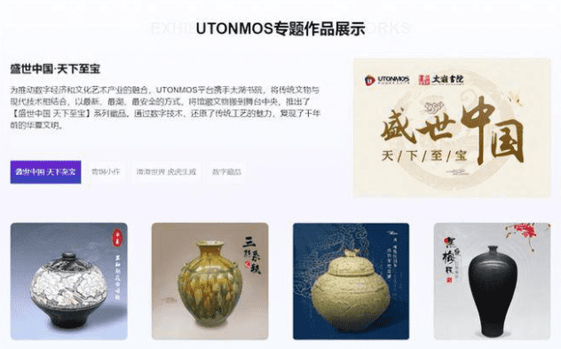

# 元宇宙是什么?数字藏品是什么?元宇宙与数字藏品有什么关系? 

对于元宇宙这一概念，相信“1000个人心中有1000个哈姆雷特”，谈到元宇宙，我们就要知道它的3个发展阶段。

**（1）数字孪生阶段：**

这个阶段简单来说，就是将现实世界，映射到虚拟世界中。

**（2）数字原生阶段：**

这个阶段，创作者本身已经在数字世界里面了，而产品的本身，也是从虚拟世界中产生。

**（3）虚实共生阶段：**

这个阶段，可以说是虚拟世界和现实世界二者合一，界限也是比较模糊的。

**数字藏品和元宇宙的关系**

上面提到了元宇宙的三个阶段，从一个概念，到逐渐地应用落地，元宇宙必然需要时间的累积以及相关技术的更新革命。元宇宙是一个映射了现实世界，但是又独立于现实世界的虚拟世界空间。

在元宇宙的世界里，现实世界中的所有事物都将会被数字化，而数字藏品的出现，也实现了元宇宙世界里虚拟事物的数字化、资产化。所以数字藏品是元宇宙中的资产确权保障，而元宇宙也为数字藏品提供了丰富的应用场景。数字藏品实现了虚拟事物的交易，可以为数据内容实现价值流转。

数字藏品是一种基于区块链技术的数字化凭证，具有唯一、不可分割和可追溯等特性，可用来标记特定资产的所有权。其之所以能迅速“出圈”，是因为在现有的一些应用场景中，**人们捕捉到数字藏品可能给生活带来的改变**：当数字藏品遇上绘画、音乐等艺术品时，艺术创作领域长期面临的知识产权保护难题能得到较好的解决；当数字藏品遇上金融时，各类金融票据不仅能够确权认证，还便于跟踪追溯；当数字藏品遇上元宇宙时，虚拟空间便拥有了丰富的、独一无二的数字资产。

无论是对于平台方还是玩家而言，数字藏品都还有许多的潜力可以被挖掘，因此，了解干货、掌握最新动态、跟紧风向，有利于我们在投资收藏过程中保障自己的权益！
