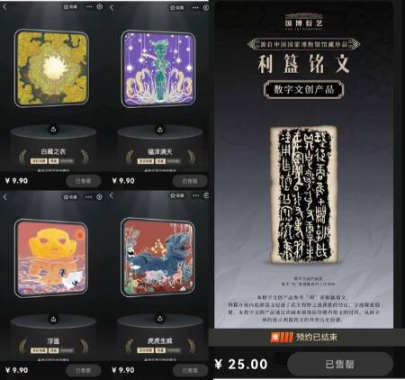
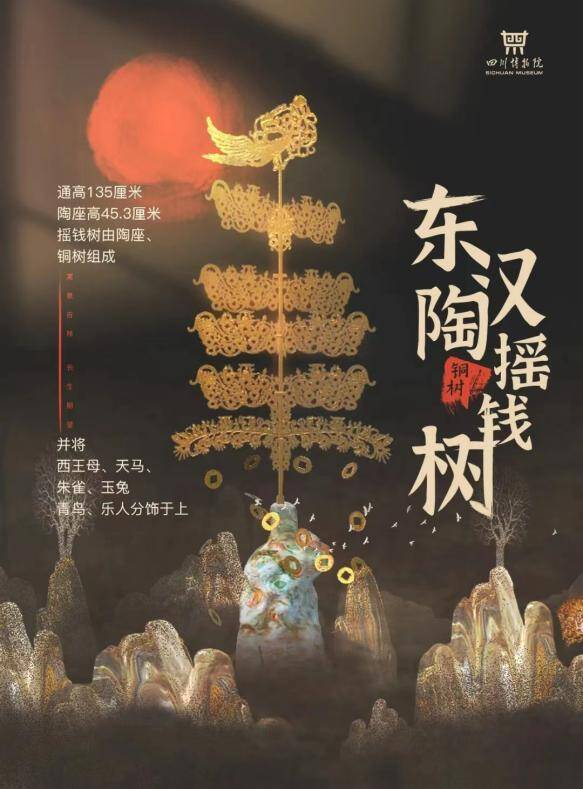

# 把文物“装进”元宇宙 数字藏品打造文创新业态 

乘着元宇宙的东风，2022年大热的“数字藏品”成为博物馆和年轻人的“新宠”。

数据显示，在刚刚过去的“国际博物馆日”，国内外十家博物馆、图书馆在天猫推出20款数字藏品，总量达2.5万件；同一天，广东多家博物馆陆续在不同平台上线21款数字藏品，合计发行量超6万份。

在博物馆传统文化IP加持下，这些数字藏品如此抢手：四川博物院的东汉陶狗、河北省博物院的长信宫灯、秦始皇帝陵博物院的秦陵彩绘铜车马……几乎每一款都是“爆款”，一经发售便售罄。

“数字文创是当下市场认可度较高的一种博物馆文创产品，让馆藏文物突破藏品时间、空间、展示形式的局限，拉近了传统文化和社会公众之间距离。”今年年初，率先尝试探索“数字文创”后，四川博物院文旅融合产业发展部主任钟郛在接受《每日经济新闻》记者电话专访时表示。

从“文创雪糕”到“考古盲盒”，再到“数字藏品”，博物馆积极主动拥抱互联网。如今，基于区块链技术的数字藏品正成为中国数字文创新形态之一，文博数字化加速进入内容时代。

> 元宇宙中“装进”文物，数字藏品打造文创新业态

“没想到以往只能在博物馆里看到老物件，现在也可以成为自己的新‘收藏’啦”。今年“国际博物馆日”，面对十大博物馆推出文物数字藏品，不少文物爱好者感叹。

作为数字经济与元宇宙发展的产物，数字藏品是具有收藏价值和现实资产属性的数字资产。疫情影响下，当走进博物馆大门成为“奢望”时，各大博物院已然掀起了数字藏品热潮。

早在去年，就有博物馆陆续试水“数字藏品”。2021年10月，河北省博物馆镇馆之宝“越王勾践剑”数字藏品上线发布，限量1万份，短短3秒钟便被“一抢而空”；十几天后，金沙遗址博物馆首款数字文创产品在支付宝平台上线即售罄，实现销售额近40万元。

金沙遗址博物馆、中国国家博物馆等推出数字文创产品 图片来源：鲸探截图

今年春节期间，据不完全统计，至少有24家博物馆发行了文创数字藏品，吸引更多年轻人了解传统文化，加入收藏行列。蚂蚁集团旗下的数字藏品平台鲸探也上线多款数字文创藏品，并在去年推出针对文博领域的“宝藏计划”。截至目前，西安、甘肃、河北、四川、河南、安徽等地博物院均已推出多款由镇馆之宝衍生出的数字藏品。

通过科技赋能博物馆文创，将文物元素“数字化”，二次转化设计后形成新的数字文创，售价均在18元~30元之间，现已开售的数字文创基本显示售罄。其受到不少消费者喜欢的原因在于：只需要十几元，就能够收藏一个属于自己的、拥有独一无二序号标注的数字文创。

“数字文创能够很好地满足博物馆文创产品价格的普惠性和收藏的稀缺性。”钟郛坦言，相比实体文创，数字文创拥有很好的社交性，能满足当下消费者的社交需求，从而实现传统文化以公众喜爱的方式的传播和弘扬。

每经记者注意到，数字藏品的火爆离不开元宇宙的大热，而在这背后，是传统文化正在借助数字技术“破圈”。

当下，随着年轻人正成为传播传统文化的主力军，受年轻人追捧的数字藏品，既能让消费者在收藏中近距离触达传统文化，又能创造出新的商业化增量，进一步激发了文创市场创新活力。

> 不再局限实体文创“三件套”，数字化让文物飞入“寻常百姓家”

“我们最早关注到数字藏品是在2021年6月，当时支付宝和敦煌美术研究院发行的两款皮肤几秒内售罄，我们就意识到数字文创是一种市场认可度比较高的新型文化业态。”钟郛回忆。

从那一刻起，四川博物院开始尝试将自己的馆藏文化资源与数字技术结合起来。

5月19日，四川博物院发布了以馆藏文物“东汉陶摇钱树”为原型二次创意的数字文创。在早些时候，年初四川博物院联合科技公司推出的第一批数字藏品中，选择了三件文物：两件青铜器，一件陶器。其中，东汉陶狗的数字藏品呆萌有趣，吸引了众多消费者。

四川博物院“东汉陶摇钱树”的二次数字化创作 图片来源：四川博物院公众号

对于博物馆而言，如何在众多馆藏中挑选出适合的文物进行二次数字化创作是遇到的第一道考验。“我们希望推出既能蕴含独特的巴蜀文化，又能深受公众喜爱，进而形成线上线下联动，为弘扬巴蜀文化贡献博物馆力量，这是我们的出发点。”钟郛坦言。

《中国文博文创消费调研报告》显示，文创消费年轻化趋势明显，其中“95后”占比达30%，他们更注重文博文创产品的体验感与个性化。她举例到，东汉陶狗之所以备受追捧，一方面它本身是一件网红文物，在公众中的认知度高；另一方面，它能够生动形象传达出文物背后的故事，体现汉代时期巴蜀和平、稳定和富饶的景象。

身处行业，钟郛也感受到传统文化消费趋势的变化。“公众希望传统文化不再局限于实体文创‘三件套’，而是运用多元的载体和创新表达，满足公众对文创产品社交性、不可复制和稀缺性等的要求。”在钟郛看来，用公众喜欢的方式将文物背后的故事呈现出来，让公众去欣赏去购买去传播，传统文化才能“飞入寻常百姓家”。

不过，在目前市场环境中，数字藏品仍处于发展早期，仍面临一系列风险和挑战。

今年4月，国家文物局相关部门召开数字藏品有关情况座谈会，提出“文博单位不应直接将文物原始数据作为限量商品发售”“消费者要远离因盲目炒作产生的风险”等。

钟郛强调，在数字文创的开发方面，四川博物院会顺应时代的发展，积极地对话公众，不断地让公众的文化需求得到了更加多元的满足。同时，博物馆也要加强内部知识产权的管理，遴选优质的数创方、发行方和平台方合作，并签订严谨的合作协议。

“目前各大平台对数字藏品是禁止交易的，这在很大程度上是压缩了投机炒作的风险的。随着高新技术的不断发展，博物馆行业迎来了数字化时代，博物馆向公众提供的文化服务也被赋予了更多元和开放的属性。我们既要合理利用好数字技术赋能传统文化，不断满足公众多层次、多元化的精神文明需求，同时也要尽量避免新生事物带来的弊端和风险。”
