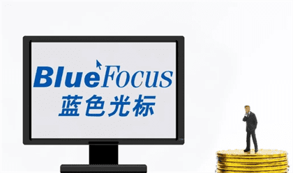

# 万亿巨头加码元宇宙，五大XR元宇宙概念股分享

腾讯控股周一向其员工宣布正式成立“扩展现实”(XR)部门，正式将赌注押在虚拟世界的元宇宙概念上。消息人士称，“该部门的任务是为腾讯建立包括软件和硬件在内的扩展现实业务，并将成为该公司互动娱乐事业群(IEG)的一部分。”

腾讯方面当时称XR业务是公司为应对全真互联网而大力建设的全新业务，目标是在行业领军人物的带领下打造世界一流的硬科技团队，争夺硬科技时代的下一张门票。

所谓XR，中文名称为“扩展现实”，是指将现实与虚拟结合起来进行人机互动的可穿戴设备，目前主流的XR包括了VR虚拟现实、AR增强现实、MR混合现实等。事实上，不仅是腾讯，截止目前多家互联网科技巨头都在发力XR，因此相关XR元宇宙概念股也颇受关注，下文介绍五大XR概念股分享。

**润建股份（002929）**

公司亮点：通信信息与电力基础设施综合服务提供商

主营业务：网络的设计、建设、维护、优化、数据处理、增值服务等，涉及通信网络IDC数据网络、信息网络、能源网络。公司参股的旗鱼科技是一 家以人工智能应用(AI)、混合现实(MR)和数字孪生(DT)为发展方向的高新技术企业，目前已面向B端客户提供XR产品的业务格局。

短期策略：股价走势整体向上，短期均线组合多头排列，MACD红柱连续多日放大, MACD各项指标处于上升趋势，KDJ在买入区形成金叉,总体而言技术面表现较好。近期的平均成本为33.76元，股价在成本下方运行。多头行情中，并且有加速上涨的趋势。

**新国脉（600640）**

公司亮点：中国电信旗下统一的互联网文娱业务平台

主营业务：2C2H端数字娱乐生活领域业务、2B端的数字营销、数字文旅、数字教育培训。公司推出的盘古计划是我司联合合作伙伴，以XR为重点,不断丰富和完善VR/AR数字内容、 MEC数字李生、数字文博等场景应用

短期策略：股价向上波动明显,短期均线组合多头排列，MACD红柱连续多日放大，MACD各项指标处于上升趋势，RSI指标呈多头排列且连续多日处于上行趋势，个股所在板块受游资追捧，总体而言技术面表现较好。近期的平均成本为10.59元，股价在成本上方运行。多头行情中，并且有加速上涨的趋势。

**海信视像（600060）**

公司亮点：中国最大的彩电生产基地之一，拥有中国最先进数字电视机生产线

主营业务：显示器产品的研发、生产和销售，以及云平台服务。公司发布了聚好看云XR原型产品，基于在AI、图形图像领域的技术积累，突破了3D高精度重建、驱动等核心基础技术。

短期策略：股价走势整体向上，出三个白武士形态,短期均线组合多头排列，MACD出现水上金叉，总体而言技术面表现较好。近期的平均成本为12.47元，股价在成本上方运行。多头行情中，并且有加速上涨的趋势。已发现中线买入信号。

**蓝色光标（300058）**

公司亮点：以提供公共关系服务为基础的品牌管理服务的现代服务企业

主营业务：公共关系咨询服务和广告服务,其核心业务是为企业提供品牌管理服务以及广告设计、制作、代理、发布业务,承办展览展示活动等。公司与当红齐天的合作主要基于虚拟数字人与虚拟空间领域的技术和产品研发，共同探索XR在营销场景下更广泛的应用与落地。

短期策略：股价向上波动明显，短期均线组合多头排列，KDJ指标呈多头排列且连续多日处于上行趋势，总体而言技术面表现较好。近期的平均成本为6.73元，股价在成本下方运行。多头行情中，上涨趋势有所减缓，可适量做高抛低吸。该股资金方面受到市场关注，多方势头较强。

**太龙股份（300650）**

公司亮点：主营商业照明整体解决方案配套产品，十大优秀供应商

主营业务：提供集照明设计、开发制造、系统综合服务于一体的商业照明整体解决方案及半导体分销服务。公司称旗下太龙视觉的XR扩展现实系统可以适用于多种应用场景

短期策略：股价向上波动明显，走出三个白武士形态,短期均线组合多头排列，KDJ和RSI指标呈多头排列且连续多日处于.上行趋势,总体而言技术面表现较好。近期的平均成本为11.39元，股价在成本上方运行。多头行情中，并且有加速上涨的趋势。
