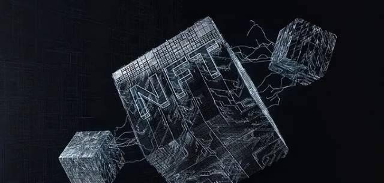
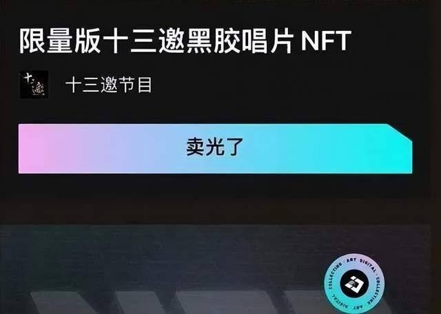
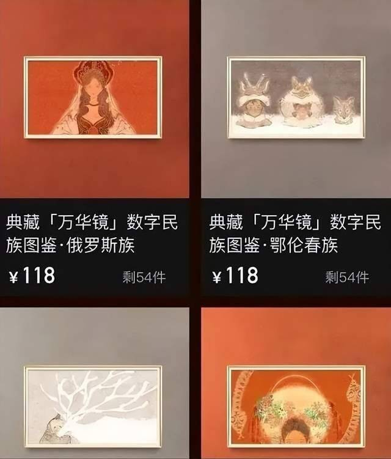
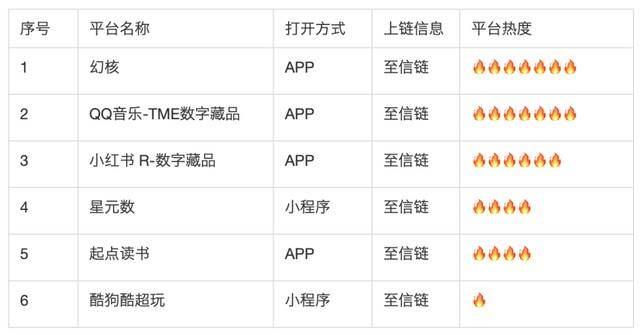
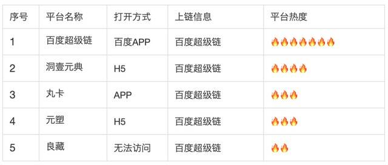
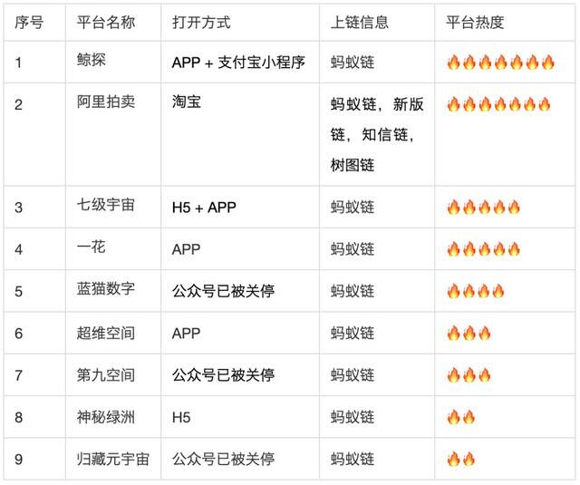
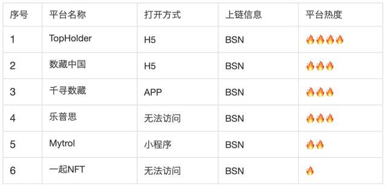
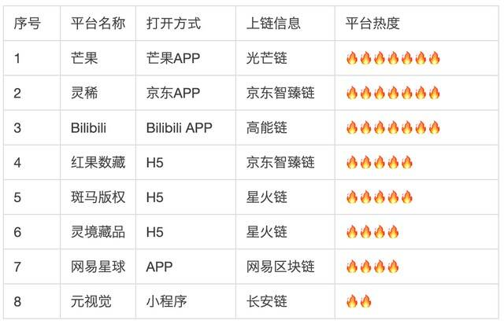
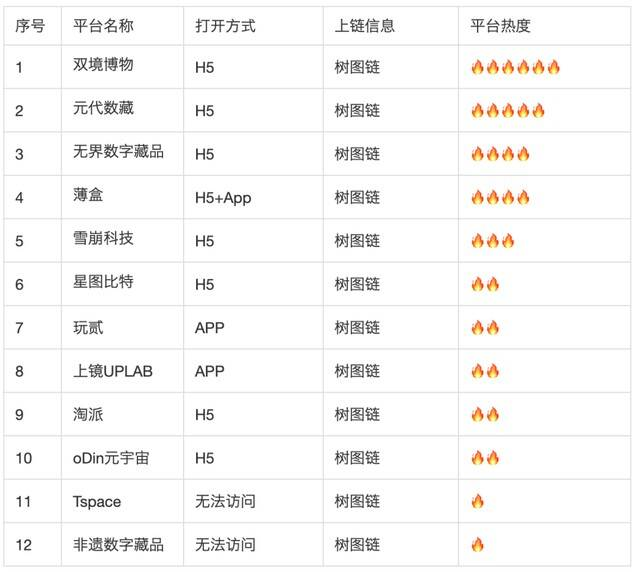
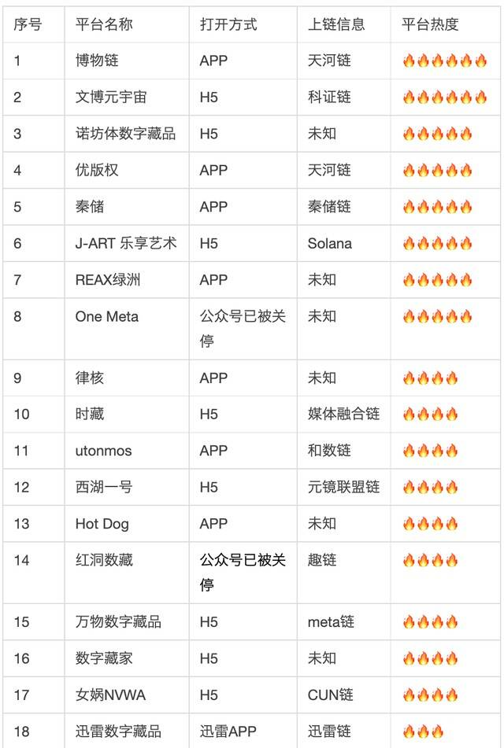

# 元宇宙数字藏品必读 | 一文梳理国内100家数字藏品平台！

近日，大批数字藏品平台的微信公告号被曝突然被封禁，此前腾讯微信官方则刚刚下架了多个数字藏品平台小程序。

虽然海外NFT藏品在2021年创下了超230 亿美元交易额的记录，但由于在监管尺度和性质标准上，NFT在全球范围内都存在争议。且在国内存在炒作、洗钱和金融产品化等风险，因此，目前国内平台数字藏品的重点均在于收藏属性，而不是金融属性。

其实数字藏品就是现在很多的 NFTs 在国内的名字，由于缺乏相关法律条文，出现了很多市场乱象。编者认为这是好事，任何一个市场，要是一点都不受监管，是没办法长久发展下去的。

**NFT是什么？**

NFT的全称是Non-Fungible Tokens，中文常翻译为“不可同质化代币/不可替代代币”。简单地说，NFT是区块链的一个条目，而区块链是类似于比特币等加密货币的去中心化数字账本技术。

因为NFT不可替代的特性，这意味着它可以用来代表独一无二的东西，比如博物馆里的**蒙娜丽莎**原画，或者一块土地的所有权。

什么是数字藏品？

数字藏品，又称非同质化代币，是一种基于区块链发行的数字商品，最早是用于代表元宇宙世界的物权。

2021年6月23日，阿里旗下的平台鲸探（原蚂蚁链粉丝粒），发行了一批“NFT”版付款码皮肤，每款数字藏品限量8000份，售价为10支付宝积分+9.9元，每日分两批抢购。

活动一发出，发售的数字藏品就被一抢而空。

鲸探未开放二级市场交易，持有180天后可转赠实名好友，第二次转赠需2年以后。

但是当时的闲鱼等二手平台上出现了天价买卖数字藏品的现象，连黄牛都介入，并直接在闲鱼发帖：

“高价回收支付宝数字藏品敦煌美术研究所数字藏品编号0001或者6666的，十万一张，其他编号500一张。”

网传闲鱼同款数字藏品最高标价已到150万元。

成交情况如何不得而知，因为在第二天，闲鱼官方就迅速下架了所有数字藏品商品，[蚂蚁集团]也发出官方通告强调不会给予任何炒作空间。

目前鲸探的交易方式主要是通过qq微信群联系交易，交易的藏品也是已到期解锁的藏品（去年发行的藏品慢慢都会陆续解锁），还有部分人搞电子合同进行交易，但目前来看最靠谱的还是qq群群主担保。

2021年7月30日，QQ音乐称将推出数字藏品加密艺术品服务“TME数字藏品”，向用户发行虚拟的收藏品，开启内测，后续该项平台技术或将在TME内各家产品中同步上线。

8月9日，QQ音乐上线了首只音乐数字藏品——胡彦斌二十周年黑胶数字藏品《和尚》。该专辑限量发售2001张，发售前预约人数超过了4万。

8月2日，号称国内首个数字藏品交易平台的“幻核”正式上线APP。首个数字藏品收藏品是访谈节目《十三邀》的“限量版十三邀黑胶唱片数字藏品”，总数量为300枚，售价18元人民币，开售时也是瞬间售罄。

三个月后，幻核操刀了腾讯23周年庆的数字藏品，加入了熟悉企鹅形象，不过仅对内部员工发放。

12月17日，京东旗下数字藏品发行平台“灵稀”已上线京东APP中的小程序，首批以京东吉祥物“Joy”为设计原型的数字藏品开售就迅速售罄。

12月6日，B站推出了一批头像类数字藏品，据悉，该系列头像并不售卖，用户需要报名，条件是B站用户等级达到6级，且2021全年每日使用哔哩哔哩的用户，总量2233个。

最后是动作稍慢的网易，除了早先旗下游戏《永劫无间》发行了数字藏品外，旗下网易星球也在2021年下半年上线。

**大厂数字藏品平台特点总结：**

**内容层面：**

毕竟是有背书的大厂，上线的IP自然也是知名的，内容一般以随机盲盒、趣味视频、3D模型等类型为主。当前阶段，腾讯和阿里主要通过联合艺术家以及知名IP发售数字藏品，可以做到保真和确权，很大程度解决了传统藏品市场盗版横行等痛点。

**限制层面：**

相比区块链原生领域将NFT命名为「非同质化代币」，大厂们则将其描述为「非同质化权益证明」，在命名上有意避免了「币」字，显示出两家企业对监管的谨慎态度。

这就意味着这些藏品、艺术品、原创内容虽然上链确权了，但这些数字藏品依然存在流通渠道单一、市场不透明、价格发现不足等问题，简单讲，大伙最关心的炒作空间，官方基本没有提供。

**优势层面：**

大厂数字藏品系列的优势在于可直接用法定货币购买，省去了用加密资产兑换的复杂环节。

**接下来就带大家一起看一遍市面上的百家数字藏品平台！**

注：平台热度仅为观察到的平台用户量，不代表平台的技术水平、资方背景等任何能力。

**至信链**

至信链是由腾讯公司、中国网安以及北明软件发起建立的基于数字文化内容场景的司法应用生态服务平台。目前依托至信链所开发的数字藏品平台基本都是由腾讯公司审核过的或是腾讯内部其他部门的产品，质量，安全性相比其他链更有保障。

**百度超级链**

超级链是百度现已开源、自主研发的区块链底层技术，拥有链内并行技术、可插拔共识机制、一体化智能合约等多项国际领先技术，具备全球化部署能力。

**蚂蚁链**

蚂蚁链是[蚂蚁集团]代表性的科技品牌，致力于打造数字经济时代的信任新基建。在蚂蚁上搭建的平台是通过蚂蚁审核的，不过蚂蚁似乎更希望做一个中心化的平台，曾有过新闻报道说蚂蚁链关停其他在其链上所搭建的平台。

**BSN**

BSN由国家信息中心进行顶层规划，中国银联和[中国移动](http://quote.eastmoney.com/SH600941.html)运用相关区块链技术及已有网络资源和数据中心进行自主研发并成功部署，是跨公网、跨地域、跨机构的全国性区块链服务基础设施平台。

**大平台数字藏品平台**

以下藏品平台创建在由知名企业所搭建的底层联盟链之上。

**树图链**

Conflux 要做成一个属于中国、面向全世界的开放安全的世界服务器。创始人龙凡，以及团队首席科学家姚期智等长期在科研一线战斗。

树图链主打开放，是真正希望做一个去中心化的链，任何用户直接写一个H5页面即可在树图链上创建平台，这一点导致其链上平台质量参差不齐，容易有不法分子在该链上进行违法行为。

**以太坊**

以下平台大部分依托于以太坊Layer2侧链。以太坊作为开放的公链，同样是对在其生态上搭建的藏品平台没有任何审核机制。

**自有联盟链，未知链及其他**

以下平台部分为自己搭建的联盟链，部分没有公开说明自己所依托的链，部分可能没有依托区块链技术，投资者要注意防范风险。

近日，微信不断关停部分涉嫌违规平台，在此提醒各位数字藏品投资者，尽量选择有知名企业背书的数字藏品平台。
